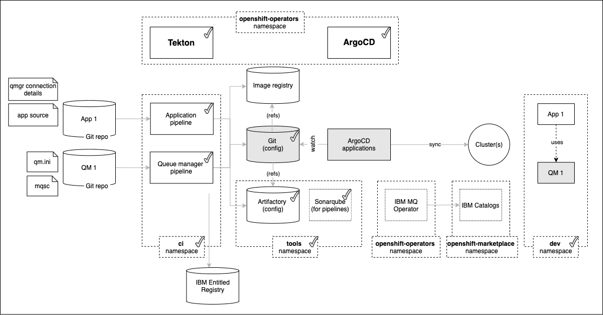
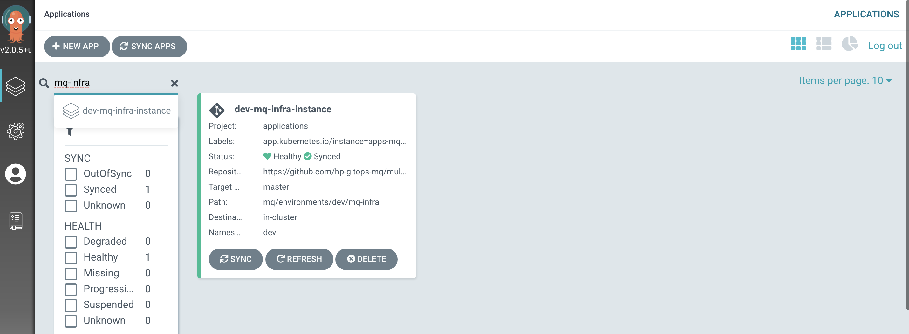
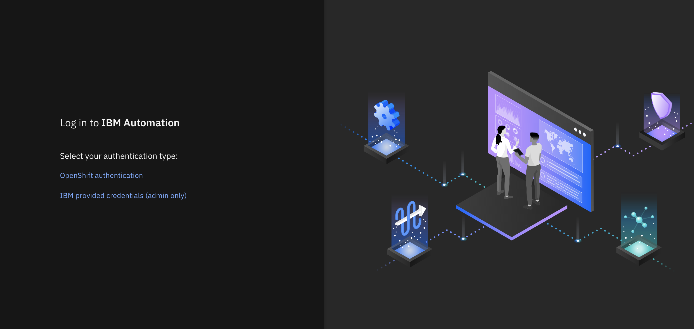
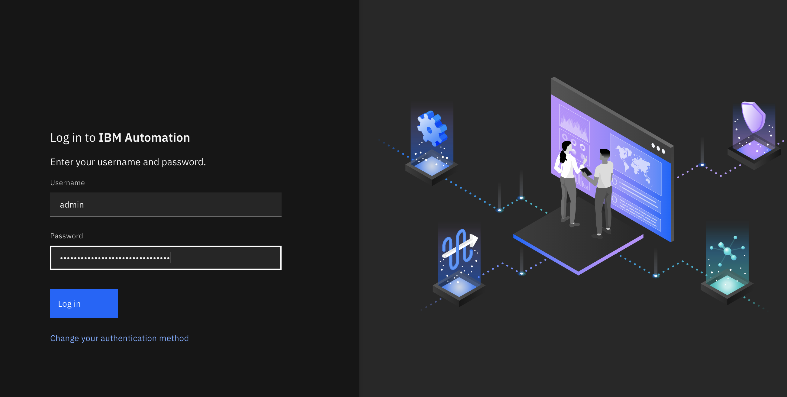
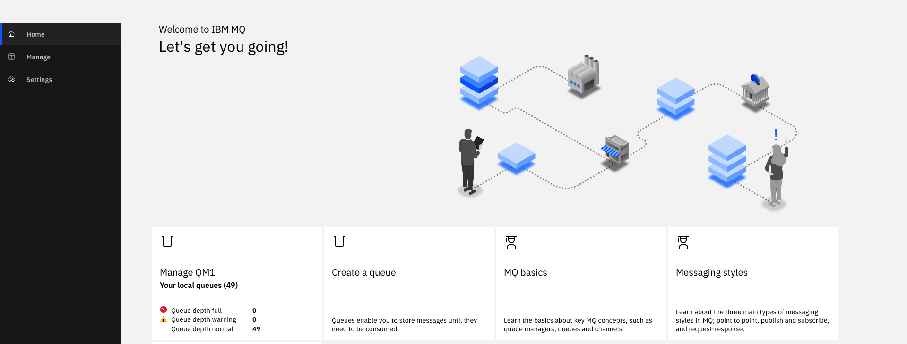
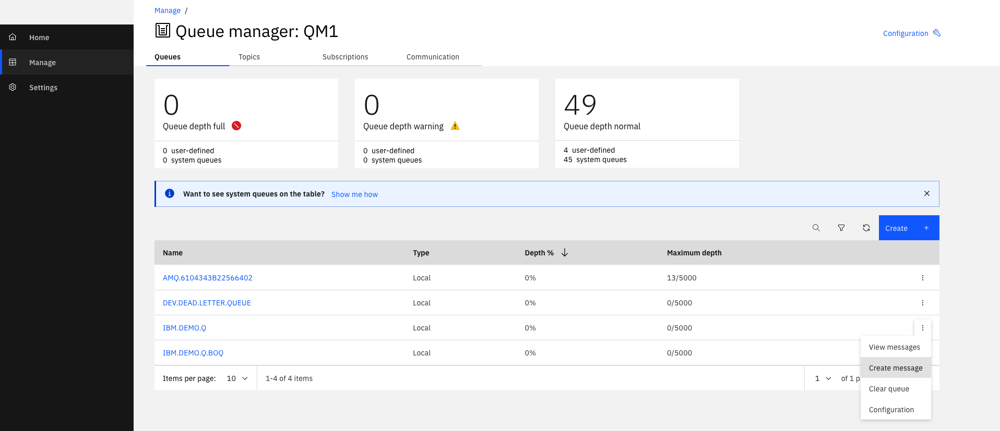
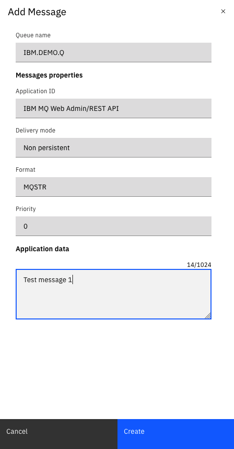
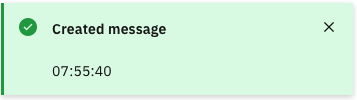

# Deploying and using the queue manager

<!--- cSpell:ignore  pipelinerun mqsc msqc runmqsc dockerconfigjson queuemanager QMID podman ibmgaragecloud cntk cnkt eventid gitrevision gitrepositoryurl odowdaibm MQSC replicaset eventlistener triggerbinding triggertemplate mqcicd qmgr Artifactory configmaps OIDC CHLAUTH templating sealedsecret -->


## Overview

In the [previous topic](../qmgr-pipeline/topic2.md) of this chapter, we ran the queue pipeline
using the source repository for `QM1`.  The pipeline successfully built and
tested the queue manager as well as creating versioned resources in the image
registry, Artifactory and the GitOps repository.

In this topic, you will set up continuous deployment for `QM1` that will use the
resources created by the pipeline run. We'll examine the activated ArgoCD application
that will watch the GitOps folder containing the Helm chart for `QM1` and use it
and its dependent resources to deploy a running queue manager to the `dev`
namespace in the cluster.

Look at the following diagram:



We've highlighted the components we're going to explore in this topic:

* The `GitOps repository` is used by ArgoCD applications to determine what
  should be active in the cluster. It contains the latest good deployment
  configuration for `QM1` accessed via its GitOps Helm chart.
* An `ArgoCD application` specific for `QM1` will monitor a GitOps
  folder where its Helm chart is held. Whenever a this folder is updated, this
  ArgoCD application will apply these updates to the cluster, resulting in a new
  deployment of `QM1`.
* The instance of `QM1` running in the cluster is active development queue
  manager ready for use by MQ applications under development.

In this topic, we're going to:

* Examine the activated ArgoCD application that deploys the `QM1` configuration to the
  cluster.
* Explore the Kubernetes resources that have been deployed to the cluster for
  `QM1`.
* Interact with the deployed queue manager `QM1`.


By the end of this topic we'll have a fully functioning queue manager deployed
to the cluster with which we will have interacted.

---

## Pre-requisites

Before attempting this topic, you should have successfully completed the
[previous topic](../qmgr-pipeline/topic2.md).

---

## ArgoCD application for `QM1`

We're now going to move from the **integration** of `QM1` to its **deployment**.

The result of our previously successful `mq-infra-dev` pipeline run was to
create a Helm chart in a GitOps folder for `QM1`. This Helm chart brings
together all the necessary Kubernetes components for the deployment  of `QM1`.

We're now going to examine the activated ArgoCD application that uses this Helm chart
to manage the deployment of `QM1` to the `dev` namespace.

1. *The ArgoCD application for* `QM1`

      `QM1` has its deployment to the cluster managed by a dedicated ArgoCD
      application called `dev-mq-infra-instance`. This follows the  **separation of
      concerns** pattern where one ArgoCD application manages a set of related
      Kubernetes resources deployed to a cluster; in this case, all those resources
      associated with queue manager `QM1` in the `dev` namespace.

      Make sure you are within the GitOps application repository folder:

      ```bash
      cd $HOME/git
      cd multi-tenancy-gitops-apps
      ```

      Issue the following command to show the ArgoCD application details:

      ```bash34
      cat mq/config/argocd/dev/dev-mq-infra-instance.yaml
      ```

      which shows a YAML file typical of those we've seen before:

      ``` { .yaml .no-copy }
      apiVersion: argoproj.io/v1alpha1
      kind: Application
      metadata:
        name: dev-mq-infra-instance
        annotations:
          argocd.argoproj.io/sync-wave: "300"
        finalizers:
          - resources-finalizer.argocd.argoproj.io
      spec:
        destination:
          namespace: dev
          server: https://kubernetes.default.svc
        project: applications
        source:
          path: mq/environments/dev/mq-infra
          repoURL: https://github.com/hp-gitops-mq/multi-tenancy-gitops-apps
          targetRevision: master
          helm:
            valueFiles:
            - values.yaml
        syncPolicy:
          automated:
            prune: true
            selfHeal: true
          syncOptions:
            - Replace=true
      ```

      See how the Helm chart we explored in the [previous section](#understanding-the-qm1-helm-chart) of this topic is referenced by `path: mq/environments/dev/mq-infra`:

      ``` { .text .no-copy }
      mq/environments/dev/mq-infra
      ├── Chart.yaml
      ├── requirements.yaml
      └── values.yaml
      ```

      The ArgoCD application applies this Helm chart to
      the cluster to instantiate `QM1` as a set of cluster resources.

2. *Look at active* `QM1` *ArgoCD application*

      Let's examine `QM1` and its Kubernetes resources using the ArgoCD UI.

      In the ArgoCD UI search the **Applications** view with the keyword `mq-infra`:

      (*You may need to launch the ArgoCD UI again. Refer to [these
      instructions](../cluster-config/gitops-tekton-argocd.md).*)

      {: style="max-height:600px"}

      We can now see the below ArgoCD Application:

      * A new `dev-mq-infra-instance` ArgoCD application that is managing `QM1`
        resources deployed to the cluster.

3. *View the new* `QM1` *Kubernetes resources*

      We can look at the deployed instance of `QM1` and its dependent kubernetes
      resources.

      Click on the `dev-mq-infra-instance` ArgoCD application:

      {: style="max-height:800px"}

      We can see that `QM1` is comprised of many Kubernetes resources.  We'll
      explore them in more detail later, but for now notice:

      * The `QM1` queue manager comprises two main Kubernetes components:

        * the `mqsc-configmap` configmap resource that holds the MQSC definitions
          applied to `QM1` when it started.
        * the `qm-dev` `queuemanager` custom resource that represents the running
          queue manager.

      The `qm-dev` custom resource has a rich structure comprising:

      * a `qm-dev-ibm-mq-0` pod where the `QM1` binaries are running
      * a `qm-dev-ibm-mq-qm` route to the queue manager
      * a `qm-dev-ibm-mq-qm-web` route to the MQ web console
      * a `qm-dev-ibm-mq` service
      * a `qm-dev-ibm-mq-metrics` metrics service
      * a `qm-dev-ibm-mq` service account
      * a `qm-dev-ibm-mq` stateful set
      * many other resources including secrets, configmaps, endpoints and more

      These queue manager components are managed by the `IBM MQ` operator which
      takes the `QM1` YAML and creates (and maintains) these Kubernetes resources.

      Feel free to click on these components to get an idea of their contents. It's
      not important to understand this structure in detail -- but it helps to
      appreciate what's going on when we deploy `QM1`. If you're used to running MQ
      outside of Kubernetes, you may find it interesting to map these Kubernetes
      resources to MQ components with which you're familiar.

---

## Explore the deployed Kubernetes resources for `QM1`

Let's spend a few moments exploring the two Kubernetes resources that have been
deployed: the `queuemanager` custom resource named `qm-dev`, and its MQSC
configuration stored in the configmap named `mqsc-configmap`.

1. *Exploring the deployed queue manager using the command line*

      We will explore the `qm-dev` `queuemanager` resource from the `oc` command
      line. The extensible nature of Kubernetes allows us to examine the new
      `queuemanager` custom resource added by the `IBM MQ` operator.

      Issue the following command:

      ```bash
      oc describe queuemanager qm-dev -n dev
      ```

      Notice how `API Version: mq.ibm.com/v1beta1` and `Kind: QueueManager` identify
      this as an IBM MQ queue manager.

      ``` { .yaml .no-copy hl_lines="1 6 7 25 36-41" }
      Name:         qm-dev
      Namespace:    dev
      Labels:       app.kubernetes.io/instance=ibm-mq-dev-instance
      Annotations:  argocd.argoproj.io/sync-wave: 300
                     helm.sh/hook-weight: 300
      API Version:  mq.ibm.com/v1beta1
      Kind:         QueueManager
      Metadata:
         Creation Timestamp:  2021-07-29T17:20:26Z
         Finalizers:
            finalizer.queuemanagers.mq.ibm.com
         Generation:  2
         Managed Fields:
         ...
      Spec:
         License:
            Accept:   true
            License:  L-RJON-BN7PN3
            Metric:   VirtualProcessorCore
            Use:      NonProduction
         Queue Manager:
            Availability:
            Type:             SingleInstance
            Debug:              false
            Image:              image-registry.openshift-image-registry.svc:5000/ci/mq-infra:0.0.1
            Image Pull Policy:  Always
            Liveness Probe:
            Failure Threshold:      1
            Initial Delay Seconds:  90
            Period Seconds:         10
            Success Threshold:      1
            Timeout Seconds:        5
            Log Format:               Basic
            Metrics:
            Enabled:  true
            Mqsc:
            Config Map:
               Items:
                  config.mqsc
               Name:  mqsc-configmap
            Name:      QM1
            Readiness Probe:
            Failure Threshold:      1
            Initial Delay Seconds:  10
            Period Seconds:         5
            Success Threshold:      1
            Timeout Seconds:        3
            Resources:
            Limits:
               Cpu:     1
               Memory:  1Gi
            Requests:
               Cpu:     1
               Memory:  1Gi
            Route:
            Enabled:  true
            Storage:
            Persisted Data:
               Enabled:  false
            Queue Manager:
               Type:  ephemeral
            Recovery Logs:
               Enabled:  false
         Security Context:
            Init Volume As Root:  false
         Template:
            Pod:
            Containers:
               Env:
                  Name:   MQSNOAUT
                  Value:  yes
               Name:     qmgr
               Resources:
         Termination Grace Period Seconds:  30
         Tracing:
            Agent:
            Collector:
            Enabled:    false
            Namespace:  
         Version:      9.2.2.0-r1
         Web:
            Enabled:  true
      Status:
         Admin Ui URL:  https://qm-dev-ibm-mq-web-dev.odowda-cloudmq-1-d02cf90349a0fe46c9804e3ab1fe2643-0000.eu-gb.containers.appdomain.cloud/ibmmq/console
         Conditions:
         Endpoints:
            Name:  ui
            Type:  UI
            Uri:   https://qm-dev-ibm-mq-web-dev.odowda-cloudmq-1-d02cf90349a0fe46c9804e3ab1fe2643-0000.eu-gb.containers.appdomain.cloud/ibmmq/console
         Name:    QM1
         Phase:   Running
         Versions:
            Available:
            Channels:
            Versions:
               Name:    9.2.2.0-r1
            Reconciled:  9.2.2.0-r1
      Events:          <none>
      ```

      (We've abbreviated it slightly to exclude the `Managed Fields:` YAML detail.)

      Here are a few things to note:

      * `Spec.Queue Manager.Name` identities the name of the queue manager as
        `QM1`
      * `Name:` identifies the name of the Kubernetes resource as `qm-dev`. Note
        how it incorporates the fact that the queue manager is running in the
        `dev` namespace. (This name should really be `qm1-dev`!)
      * `Spec.Queue Manager.Image:` identifies the image stored in the image
        registry that this queue manager is running.
      * `Spec.Queue Manager.Mqsc:` identifies the name of the config map `mqsc-config` map.

      Notice how we cannot see the internal structure of the queue manager. Instead
      we can see the YAML that was built from the `QM1` Helm chart and applied to
      the cluster.

      For more details on this configuration, see the [API reference for the `QueueManager` (mq.ibm.com/v1beta1)](https://www.ibm.com/docs/en/ibm-mq/9.2?topic=mqibmcomv1beta1-api-reference-queuemanager).

2. *Exploring the MQSC configuration for* `QM1`

      Let's now look at the MQSC configuration for this queue manager. As we've seen, it's contained in the `mqsc-configmap` configmap.

      Issue the following command

      ```bash
      oc get configmap mqsc-configmap -n dev -o yaml
      ```

      to show the MQSC commands that are applied to the queue manager when it
      starts:

      ``` { .yaml .no-copy }
      apiVersion: v1
      data:
         config.mqsc: |
            DEFINE QLOCAL(IBM.DEMO.Q) BOQNAME(IBM.DEMO.Q.BOQ) BOTHRESH(3) REPLACE
            DEFINE QLOCAL(IBM.DEMO.Q.BOQ) REPLACE
            * Use a different dead letter queue, for undeliverable messages
            DEFINE QLOCAL('DEV.DEAD.LETTER.QUEUE') REPLACE
            ALTER QMGR DEADQ('DEV.DEAD.LETTER.QUEUE')
            DEFINE CHANNEL('IBM.APP.SVRCONN') CHLTYPE(SVRCONN)
            ALTER QMGR CHLAUTH (DISABLED)
            REFRESH SECURITY TYPE(CONNAUTH)
      kind: ConfigMap
      ...
      ```

      Recall that this MQSC configuration was built by the Helm configmap template
      when the `security: false` value is set in `values.yaml`.

      Now that we have a fully operational queue manager, we can try it out.

---

## Try out the deployed queue manager `QM1`

Now that we have a deployed instance of `QM1` running in the `dev` namespaces,
we can use it. In this section, we're going to use both the MQ web console and
`oc` command line to interact with `QM1`.

1. *Locating the MQ web console*

      You can interact graphically with all the MQ queue managers in a cluster using
      the MQ web console. Access to the console is achieved via an OCP route.

      Issue the following command:

      ```bash
      oc get qmgr qm-dev -n dev -o=jsonpath='{.status.adminUiUrl}'
      ```

      to show the web console route, for example:

      ```{ .text .no-copy }
      https://cpd-tools.xxxxx.containers.appdomain.cloud/integration/messaging/dev/qm-dev-ibm-mq
      ```

      Copy the URL into your browser to launch the MQ web console.

      (You can safely ignore any browser certificate warnings.)

2. *Authenticating to the MQ web console*

      All IBM Cloud Pak products provide the option to use OpenID Connect (**OIDC**)
      for secure authentication and authorization. If you'd like to know more about
      why OpenID Connect is important,  watch this [short
      video](https://www.youtube.com/watch?v=t18YB3xDfXI).

      When `QM1` was deployed, it registered with the OpenID Connect provider for
      the cluster. For example, if your cluster is provisioned using IBM Cloud, it
      will use the IBM Cloud OIDC provider to provide both secure authentication and
      secure authorization.

      As the console launches, you will be presented with two authentication
      options.

      {: style="max-height:700px"}

      Select `IBM provided credentials (admin only)` to log in with your IBM Cloud OIDC
      credentials.

      Login as `admin` and retrieve the password as follows:

      ```bash
      oc extract -n ibm-common-services secrets/platform-auth-idp-credentials --keys=admin_username,admin_password --to=-
      ```

      {: style="max-height:700px"}

      (*You may have to login to your OIDC provider, such as IBM Cloud, if your
      browser has not recently logged in.)

      We'll discuss MQ security in more detail in the security
      chapter

3. *Using the MQ web console*

      Once you've logged in to your OIDC provider, you'll be presented with the MQ
      web console home page for `QM1`. This console will allow you to perform most
      MQ operations such as querying queues and channels, or putting and getting
      messages.

      The web console will look like this:

      

      We're going to use the console to view a queue that was originally defined in
      the `QM1` source repository. Then we're going to put a message to this queue.

4. *Viewing the* `IBM.DEMO.Q` *queue on* `QM1`

      In the MQ console you can interact with any queue manager that is connected to
      this console. We're going to interact with `QM1`.

      Click on the `Manage` tab, or select `Manage QM1` tile:

      

      You can see a list of all the queues defined on `QM1`.

      Notice the `IBM.DEMO.Q` for example. See how `Maximum depth` is `0/5000`;
      there are no messages in this queue.

      See how you can select different operations for each queue such as `Create
      message` or `Clear queue`.

5. *Put a message to* `IBM.DEMO.Q`

      Let's put a message to a the empty queue `IBM.DEMO.Q`.

      Select `Create message` for queue `IBM.DEMO.Q` to see the `Add Message`
      dialogue box:

      

      Type `Test message 1` in the `Application data` box.

      Press `Create` to put the message to the queue.

      You'll see a confirmation message:

      

      Notice that the queue depth for `IBM.DEMO.Q` is now `1/5000`:

      

6. *Viewing the MQ pod in OpenShift web console*

      When we interact with `QM1` via the MQ web console, we're interacting with a
      regular MQ queue manager running in a container managed by Kubernetes. You may
      have noticed the pod `qm-dev-ibm-mq-0` when we explored the Kubernetes
      resources that comprised `QM1` using the ArgoCD UI.

      Issue the following command:

      ```bash
      oc get pods -n dev
      ```

      to see the queue manager pod for `QM1`:

      ```{ .text .no-copy }
      NAME              READY   STATUS    RESTARTS   AGE
      qm-dev-ibm-mq-0   1/1     Running   0          2d15h
      ```

      We can see a single  pod `qm-dev-ibm-mq-0` in the `READY` state. Each
      `queuemanager` custom resource has a single pod. Within this pod is a single
      container inside which the queue manager `QM1` is running.  We'll examine this
      structure in a little more detail in the next section.

7. *Connect to the queue manager pod*

      Let's connect to this container, so that we can explore the queue manager
      `QM1`.

      Issue the following command:

      ```bash
      oc exec -n dev qm-dev-ibm-mq-0 -it -- /bin/bash
      ```

      to connect you to the pod default container, where you'll see the `bash`
      prompt:

      ```{ .text .no-copy }
      bash-4.4$
      ```

      Your terminal is now connected to the container running the queue manager.


8. *Use MQ command line*

      The container we've connected to has a fully running instance of the `QM1`
      queue manager configured according to the YAML generated by the Helm chart. We
      can use regular MQ commands to verify that this is a regular queue manager.

      Issue the following command:

      ```bash
      dspmq -o all
      ```

      to see a full list of the queue managers running in the container:

      ```{ .text .no-copy }
      QMNAME(QM1) ... STATUS(Running) DEFAULT(yes) STANDBY(Permitted) INSTNAME(Installation1) INSTPATH(/opt/mqm) INSTVER(9.2.0.0)
      ```

      We can see that `QM1` is running, it's the default queue manager, where it's
      installed in the container file system, and it's version.

      See how a container is actually a full execution environment; in principle, we
      could have multiple queue managers executing within this container, although
      this is not good practice.

      Feel free to issue other MQ commands.

9. *Display queue manager properties*

      We can also run an MQSC command to display the queue manager properties.  These properties were defined in the MQSC file.

      Issue the following command:

      ```bash
      runmqsc QM1 <<< "dis qmgr"
      ```

      to see the full set of queue manger properties for `QM1`:

      ```{ .text .no-copy }
      5724-H72 (C) Copyright IBM Corp. 1994, 2020.
      Starting MQSC for queue manager QM1.
            1 : dis qmgr
      AMQ8408I: Display Queue Manager details.
         QMNAME(QM1)                             ACCTCONO(DISABLED)
         ACCTINT(1800)                           ACCTMQI(OFF)
         ACCTQ(OFF)                              ACTIVREC(MSG)
         ACTVCONO(DISABLED)                      ACTVTRC(OFF)
         ADVCAP(ENABLED)                         ALTDATE(2021-07-30)
         ALTTIME(17.17.48)                       AMQPCAP(NO)
         AUTHOREV(DISABLED)                      CCSID(819)
         CERTLABL( )                             CERTVPOL(ANY)
         CHAD(DISABLED)                          CHADEV(DISABLED)
         CHADEXIT( )                             CHLEV(DISABLED)
         CHLAUTH(DISABLED)                       CLWLDATA( )
         CLWLEXIT( )                             CLWLLEN(100)
         CLWLMRUC(999999999)                     CLWLUSEQ(LOCAL)
         CMDEV(DISABLED)                         CMDLEVEL(920)
         COMMANDQ(SYSTEM.ADMIN.COMMAND.QUEUE)    CONFIGEV(DISABLED)
         CONNAUTH(SYSTEM.DEFAULT.AUTHINFO.IDPWOS)
         CRDATE(2021-07-30)                      CRTIME(17.17.44)
         CUSTOM( )                               DEADQ(DEV.DEAD.LETTER.QUEUE)
         DEFCLXQ(SCTQ)                           DEFXMITQ( )
         DESCR( )                                DISTL(YES)
         IMGINTVL(60)                            IMGLOGLN(OFF)
         IMGRCOVO(YES)                           IMGRCOVQ(YES)
         IMGSCHED(MANUAL)                        INHIBTEV(DISABLED)
         IPADDRV(IPV4)                           LOCALEV(DISABLED)
         LOGGEREV(DISABLED)                      MARKINT(5000)
         MAXHANDS(256)                           MAXMSGL(4194304)
         MAXPROPL(NOLIMIT)                       MAXPRTY(9)
         MAXUMSGS(10000)                         MONACLS(QMGR)
         MONCHL(OFF)                             MONQ(OFF)
         PARENT( )                               PERFMEV(DISABLED)
         PLATFORM(UNIX)                          PSMODE(ENABLED)
         PSCLUS(ENABLED)                         PSNPMSG(DISCARD)
         PSNPRES(NORMAL)                         PSRTYCNT(5)
         PSSYNCPT(IFPER)                         QMID(QM1_2021-07-30_17.17.44)
         REMOTEEV(DISABLED)                      REPOS( )
         REPOSNL( )                              REVDNS(ENABLED)
         ROUTEREC(MSG)                           SCHINIT(QMGR)
         SCMDSERV(QMGR)                          SPLCAP(ENABLED)
         SSLCRLNL( )                             SSLCRYP( )
         SSLEV(DISABLED)                         SSLFIPS(NO)
         SSLKEYR(/run/runmqserver/tls/key)       SSLRKEYC(0)
         STATACLS(QMGR)                          STATCHL(OFF)
         STATINT(1800)                           STATMQI(OFF)
         STATQ(OFF)                              STRSTPEV(ENABLED)
         SUITEB(NONE)                            SYNCPT
         TREELIFE(1800)                          TRIGINT(999999999)
         VERSION(09020000)                       XRCAP(NO)
      One MQSC command read.
      No commands have a syntax error.
      All valid MQSC commands were processed.
      ```

      Note how `CHLAUTH(DISABLED)` has been set. This was set in the MQSC file
      configuration for `QM1` in via the `mqsc-configmap` configmap.

      Feel free to run other `runmqsc` commands to explore the queue manager
      properties.

10. *Exit from queue manager container*

      When we're finished exploring the queue manager container, we can exit it.

      Issue the following command:

      ```bash

      exit
      ```

      to return to your local machine's command prompt:

      ```bash
      exit
      .../git/multi-tenancy-gitops-apps
      ```

      Now that you've tried out the deployed queue manager, let's look at the
      deployed Kubernetes resources for `QM1` in a little more detail.


!!! success "Congratulations!"
      You've completed set up continuous deployment for the queue manager `QM1` and deployed an instance of it to the `dev` namespace in the cluster.  You've interacted with this queue manager using the command line as well as the MQ web console.  You've also explored the key resources Kubernetes resources deployed to the cluster for `QM1`.

      In the next and final topic of this chapter we're going to make a change to the queue manager, and verify that the change is continuously integrated and deployed to the cluster.
