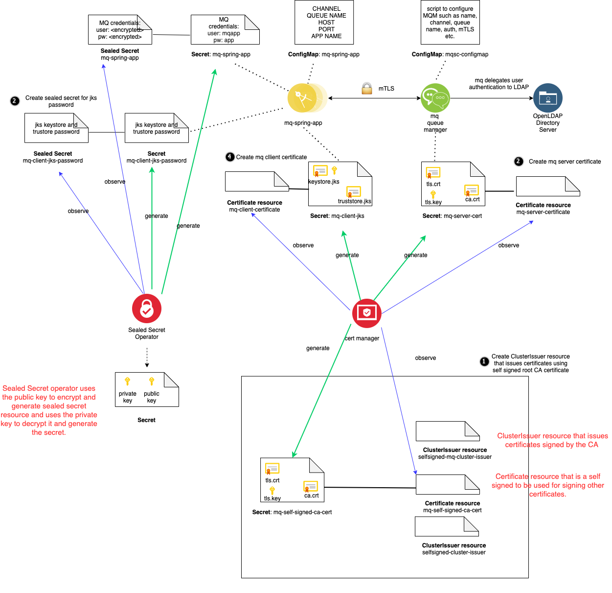

# mTLS Security

This section will explain mTLS (mutual TLS) security between the `mq-spring-app` and the `mq` queue manager.
Mutual TLS encrypts the data in motion between the app and the queue manager by exchanging and validating each others certificates that are issued by a certificate authority.  The `mq` manager also authenticates the `mq-spring-app` leveraging the `OpenLDAP` directory server.

The diagram below shows the key components in the solution.



The key parts of the solution are as follows:

* ``OpenLDAP`` - Directory server for authenticating users and applications. See: https://www.openldap.org/
* ``cert-manager`` -  a Kubernetes add-on operator to automate the issuance and management of TLS certificates from various issuing sources. See: https://github.com/jetstack/cert-manager
* ``sealed-secrets`` - a Kubernetes add-on operator to securely manage kubernetes secrets.  See: https://github.com/bitnami-labs/sealed-secrets
* ``mq-self-signed-issuer`` ClusterIssuer resource - Issues certificates to the `mq` manager and the `mq-spring-app` components.  It is configured to use the `mq-self-signed-ca-cert` to sign the issued certificates.
* ``mq-self-signed-ca-cert`` Certificate resource - generates the self signed root CA certificate. This certificate is used to sign all certificates issued by `mq-self-signed-issuer`.
* ``mq-server-certificate`` Certificate resource - cert-manager custom resource that generates the `mq-server-cert` secret that contains certificate, private key and CA cert. This is used by the `mq` queue manager to establish the mTLS connection with the `mq-spring-app`.
* ``mq-client-certificate`` Certificate resource - cert-manager custom resource that generates the `mq-client-cert` secret that contains keystore and truststore jks files.  The keystore.jks file contains the certificate used by the `mq-spring-app` to establish the mTLS connection with the `mq` queue manager. The truststore.jks file contains the certificate used validate that a certificate is signed by the root CA.
* ``mq-client-jks-password`` sealed secret -  generates `mq-client-jks-password` secret that contains the password to access the jks files.  This is used by the `mq-spring-app` microservice.
* ``mq-spring-app sealed secret`` resource - sealed secret that generates the user and password credentials in the `mq-spring-app` secret for the client app to authenticate with the `mq` queue manager.
* ``mq-spring-app`` - Spring Boot java application that has REST endpoints to interact with the `mq` queue manager.
* ``mq`` - IBM MQ queue manager
* ``mqsc-configMap`` - configMap resource that contains mqsc commands that configures the queue manager. From a security perspective, the MQ manager is configured to delegate authentication to the OpenLDAP server as well as configuring the the `mq` queue manager to allow mTLS connections.   

During the establishment of the mTLS connection between the `mq-spring-app` and the `mq` manager, the `mq-spring-app` validates the `tls.crt` certificate that it receives from the `mq` manager.  The `mq-spring-app` is able to validate the certificate using the `truststore.jks` file it has access to via the `mq-client-jks` secret. The `truststore.jks` file has the ca certificate of the issuer.  Similarly, the `mq-spring-app` sends the `mq` manager its certificate which is stored within the `keystore.jks` file in the `mq-client-jks` Secret.  The `mq` manager is able to validate it using the ca certificate of the issuer (ca.crt value in `mq-server-cert` secret).

In addition, the `mq` manager is configured to allow connections for user `mqapp`.  The `mq-spring-app` has a secret configured that contains values for the `mqapp` user and the corresponding password.  The `mq` queue manager delegates the user authentication to the OpenLDAP server.  The spring app gets these values injected via the application.yml file as follows:
```
ibm:
  mq:
    user: ${USER}
    password: ${PASSWORD}
```
