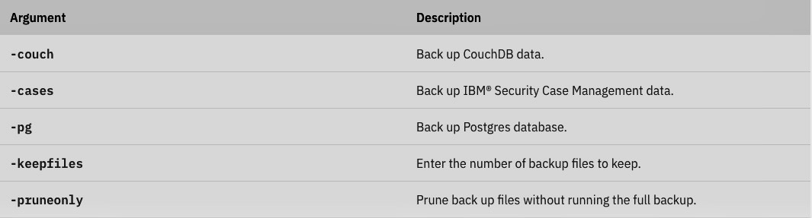
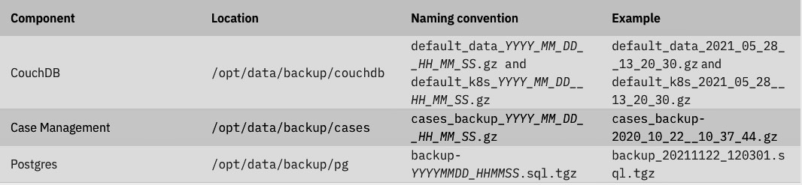
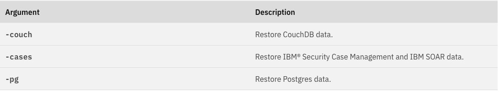

### Upgrading IBM Cloud Pak® for Security

The steps to upgrade are the same as the steps to install. The process automatically detects an older version and initiates an upgrade. Ensure that when filling in the parameters, the following parameters matches what you have in the version of IBM Cloud Pak® for Security currently installed in your cluster:

If you are upgrading from IBM Cloud Pak® for Security 1.8.X, use the following procedure to retrieve the values for the parameters you need to pass in during the upgrade.

- Login to your Red Hat OpenShift web console.
- Go to Operators > Installed Operators and ensure that the Project dropdown is set to the namespace where IBM Cloud Pak® for Security 1.8.X was installed.
- In the list of installed operators, click IBM Cloud Pak for Security.
- Navigate to the Threat Management tab and click on the threatmgmt instance.
- From the Threat Management Overview page, make note of the value currently set for the following parameters:
    - Admin User
    - Domain
    - Storage class
    - Enable ROKS Authentication

If you are upgrading from IBM Cloud Pak® for Security 1.7.2.0, use the following commands to retrieve the values for the parameters you need to pass in during the upgrade.

namespace - Provide the namespace where IBM Cloud Pak® for Security 1.7.2.0 was installed.
adminUser - The admin user ID set during the IBM Cloud Pak® for Security 1.7.2.0 installation. You can verify the value by running the following command:

```bash
oc get deploy isc-entitlements -o yaml -n <CP4S_NAMESPACE> | grep "name: ADMIN_USER_ID" -A1
```

domain - The current domain being used by {{site.data.keyword.isc}} can be retrieved by running the following command:

```bash
oc get route isc-route-default -o jsonpath='{.spec.host}' -n <CP4S_NAMESPACE>
```

storageClass - Set the storage class to the same storage class being used in IBM Cloud Pak® for Security 1.7.2.0 which should be default storage class. You can run the following command to verify the default storage class in the cluster:

```bash
oc get sc
```
roksAuthentication - Set this to the same value you used in the cp4sOpenshiftAuthentication parameter when installing IBM Cloud Pak® for Security 1.7.2.0. Verify the value that you used by running the following command:
```bash
oc get cm platform-auth-idp -n ibm-common-services -o jsonpath='{.data.ROKS_ENABLED}'
```

### Backup and restore
To recover from any data loss that might occur, regularly back up the data in your IBM Cloud Pak® for Security and integrated databases. You can use the backup and restore process to support a disaster recovery that requires a redeployment of your environment.

### Prerequisites
Cluster administrator level privileges are required to complete the backup and restore process.

To install Cloud Pak for Security, you configure a suitable storage class in the cluster. You support the configuration with one or more persistent volumes of suitable size. For more information about storage, see [Persistent storage requirements](https://www.ibm.com/docs/en/SSTDPP_1.9/docs/security-pak/persistent_storage.html)

You provide secure storage for the backups that is mounted as a Persistent Volume Claim (PVC) in a pod. The backup and restore process uses a Backup and Restore pod, which contains all of the necessary utilities that are required for the backup and restore process. The Backup and Restore pod is deployed automatically as part of the installation or upgrade of Cloud Pak for Security.

For the backup data, you can opt to provision your own storage instead of using the default specified for installation. For more information, see [Creating the backup and restore PVC](https://www.ibm.com/docs/en/SSTDPP_1.9/docs/scp-core/backup-prereq.html)

## Backing up Cloud Pak for Security
To back up your databases for IBM Cloud Pak® for Security, you must run the backup scripts from within the Backup and Restore pod.

Before you begin
The OpenShift® command-line interface tool must be connected to the cluster. The Backup and Restore pod must be running on the cluster.

To ensure that the Backup and Restore pod is running, type the following command in the Cloud Pak for Security namespace.
```bash
oc get pods | grep cp4s-backup-restore
```

Verify that the command completes and take note in the output of the full pod name, in the following example the name of the pod is cp4s-backup-restore-8ffb54b4f-lfblg.
cp4s-backup-restore-8ffb54b4f-lfblg                           1/1     Running                      0          8m53s
In the following procedure, replace <backup_restore_podname> with the value that you noted from the output of the previous command.

### Procedure
Back up all of the Cloud Pak for Security data stores by typing one of the following commands in the Cloud Pak for Security namespace.
```bash
oc exec <backup_restore_podname> -- /opt/bin/backup-cp4s.sh -p <encryption_password>
```

The backup script automatically prunes older backups to preserve disk space on the PVC. The number of backups to keep can be set by using the keepfiles parameter. The default is 7.

When the command is run without scoping arguments, it backs up all of the data stores. Command-line scoping arguments can be used to back up individual components, or combinations of components, as required.



For example, the following command backs up CouchDB and Cases data only with an encryption password:
```bash
oc exec <backup_restore_podname> -- /opt/bin/backup-cp4s.sh -couch -cases -p <encryption_password>
```

Backup files are stored in the Persistent Volume Claim that is mounted on the pod under /opt/data/backup/<folder_name>, where <folder_name> indicates the data store. The file naming conventions are outlined in the following tables.




It is good practice to maintain a copy of the backup files in a secure alternative location outside of the Cloud Pak for Security cluster. After you complete the backup procedure, the backup files can be copied to your local system by typing the following command.

```bash
oc cp <backup_restore_podname>:/opt/data/backup ./backup
```

The result is a copy of the complete backup directory structure on your local system, in your current directory, in a new subfolder called backup. This folder can then be transferred to an appropriate secure storage location. 

### Scheduling Cloud Pak for Security backup

IBM Cloud Pak® for Security provides a support action that enables you to schedule Cloud Pak for Security backup.

### Before you begin
To access the schedule_cp4s_full_backup action, you must install the command-line interface (CLI) utility cpctl from the cp-serviceability pod. For more information, see [Installing the cpctl utility](https://www.ibm.com/docs/en/SSTDPP_1.9/docs/security-pak/support_install_utility.html)

### Setting up the backup schedule
### Procedure
To set up the schedule, type the following command.
In an online environment
```bash
cpctl tools schedule_cp4s_full_backup --token "$(oc whoami -t)" --password <add-any-password-of-your-choice> --schedule <your schedule>
```
In an air-gapped environment
```bash
cpctl tools schedule_cp4s_full_backup --token "$(oc whoami -t)" --password <add-any-password-of-your-choice> --schedule "schedule" --airgap <local-docker-registry:5000>
```

### Disabling scheduled backup
### Procedure
To disable the scheduled backup, use the disable flag.
```bash
cpctl tools schedule_cp4s_full_backup --token "$(oc whoami -t)" --password <add-any-password-of-your-choice> --disable
```

### Configuring the number of backup files maintained
### Procedure
When running a backup, the oldest backups are deleted to save space on the PVC. The default can be changed by using --keepfiles.
```bash
cpctl tools schedule_cp4s_full_backup --token "$(oc whoami -t)" --password <add-any-password-of-your-choice> --keepfiles 3
```

### Restoring Cloud Pak for Security
When the restore process is completed, data is restored and the system returns to the state at the time of the backup. The corresponding databases are restored in the appropriate persistent volume of the IBM Cloud Pak® for Security instance.

### Before you begin
The OpenShift® command-line interface tool must be connected to the cluster. The Backup and Restore pod must be running on the cluster.

To ensure that the Backup and Restore pod is running, type the following command in the Cloud Pak for Security namespace.
```bash
oc get pods | grep cp4s-backup-restore
```

Verify that the command completes and take note in the output of the full pod name. In the following example, the name of the pod is cp4s-backup-restore-8ffb54b4f-lfblg.
```bash
cp4s-backup-restore-8ffb54b4f-lfblg                           1/1     Running                      0          8m53s
```

In the following commands, replace <backup_restore_podname> with the value that you noted from the previous command.

For more information about the process and what is restored, see [Backup and restore](https://www.ibm.com/docs/en/SSTDPP_1.9/docs/scp-core/backup-intro.html)

### Procedure

Copy backup data, which is stored outside of the cluster, into the toolbox PVC from your local system by typing the following command in the Cloud Pak for Security namespace.
```bash
oc cp <localpath>/backup <backup_restore_podname>:/opt/data
```
<localpath>/backup is the backup folder name and full path location on your local system.

Restore all of the Cloud Pak for Security data stores by typing one of the following command in the Cloud Pak for Security namespace.
```bash
oc exec <backup_restore_podname> -- /opt/bin/restore-cp4s.sh -p <encryption_password>
```

The encryption password that is used in the restore command must be the same as the one used to back up the data.

When the command is run without any scoping arguments, by default it completes a full restore of all of the data stores. The following command-line arguments can be inserted in the command to restore individual components, or combinations of components.



After the restore is complete, allow up to 15 minutes for the pods to complete the restart operation. If the first attempt at restoring the system is not successful for any reason, the full restore procedure can be run again without any impact.

Run the validate action to ensure that Cloud Pak for Security is restored successfully.

```bash
cloudctl case launch --case ibm-cp-security --namespace <cp4s_namespace> --inventory ibmSecurityOperatorSetup --action validate -t 1
```
--namespace	The namespace where Cloud Pak for Security is installed.

The following sample command restores CouchDB by using the default file and an encryption password.
```bash
oc exec <backup_restore_podname> -- /opt/bin/restore-cp4s.sh -couch -p <encryption_password>
```

The following sample command restores CouchDB and Cases by using a specific backup file for Cases and the default backup file for CouchDB, and an encryption password.
```bash
oc exec <backup_restore_podname> -- /opt/bin/restore-cp4s.sh -p <encryption_password> -couch -cases -cases-file /opt/data/backup/cases/cases_backup_2020_10_22__10_38_17.gz
```

