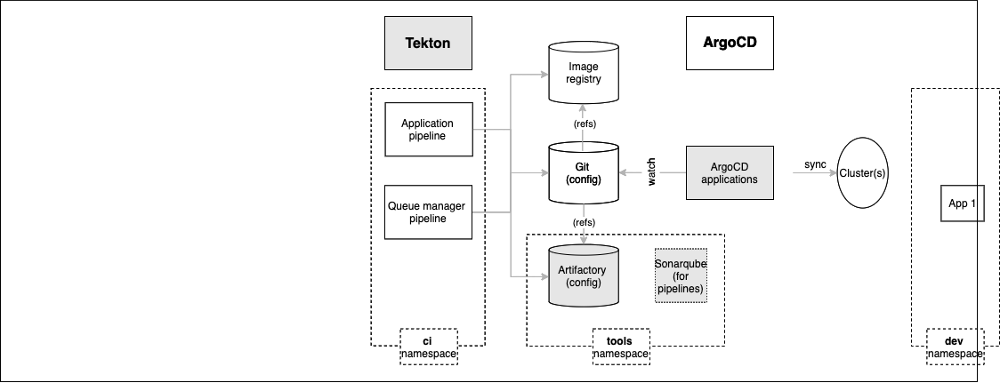

# Installing services with ArgoCD

<!--- cSpell:ignore Progesssing Artificatory resyncs rolebindings configmaps CICD qube cntk autoplay allowfullscreen webkitallowfullscreen msallowfullscreen Walkthrough walkthrough-->

## Overview

In the [previous section](gitops-config.md) of this chapter, we used GitOps to
create the ArgoCD applications that installed and managed the `ci`, `tools` and
`dev` namespaces in the cluster.

In this section we're going complete the installation of all the necessary
services required by our CP4S CICD process:

{: style="max-height:500px"}

We'll examine these highlighted components in more detail throughout this
section of the tutorial; here's an overview of their function.

* `Tekton` is used for Continuous Integration. Often, the Tekton pipeline will
  perform its changes under a pull-request (PR) to provide an explicit approval
  mechanism or through a push based on the requirements for cluster changes.
* `Artifactory` will provide a store for CP4S application and queue manager
  build artifacts such as Helm charts. It is used in conjunction with the GitOps
  repository and image registry.
* `Sonarqube` is used by the CP4S application pipeline for code quality and
  security scanning. It helps ensure the quality of a deployed application.
* `ArgoCD applications` will be created for each of these resources.
  Specifically, ArgoCD applications will keep the cluster synchronized with the
  application and queue manager YAML definitions stored in Artifactory and Git.

Note how these application services are installed in the `ci` and `tools`
namespaces we created in the previous topic.

This section will reinforce our understanding of GitOps. We will then be ready
to create CP4S applications that use the infrastructure we
previously created and these services we are going to install further.

In this topic, we're going to:

* Deploy services to the cluster using GitOps
* Explore the ArgoCD applications that manage these services
* Explore how more complex services work using `Artifactory` as an example
* Review how ArgoCD projects work
* See how `infra` and `services` ArgoCD applications manage the
  **infrastructure** and **services** layers in our architecture.

By the end of this topic we'll have a fully configured cluster which is ready
for us to deploy CP4S applications and queue managers.

---

## Pre-requisites

Before attempting this section, you must have completed the following tasks:

- You have created an OCP cluster instance.
- You have installed on your local machine the `oc` command that matches the
  version of your cluster.
- You have installed `npm`, `git` and `tree` commands.
- You have completed the [tutorial section](gitops-tekton-argocd.md) to customize the GitOps repository,
  and install ArgoCD.
- You have completed the [tutorial section](gitops-config.md) to create the `ci`, `tools` and `dev`
  namespaces using GitOps.

Please see the previous sections of this guide for information on how to do
these tasks.

---

## Video Walkthrough

This video demonstrates how to install Tekton. It also shows how to use the
GitOps repository to set up different service related components.

<iframe src="https://ibm.ent.box.com/embed/s/hgabk92a5c0un9yfm05ei7oth0itjwq4?sortColumn=date&view=list" width="500" height="400" frameborder="0" allowfullscreen webkitallowfullscreen msallowfullscreen></iframe>

This is a video walkthrough and it takes you step by step through the below sections.

---

--8<-- "gitops-cluster-post-tasks.md"

---

--8<-- "gitops-install-tekton.md"

---

--8<-- "gitops-deploy-services-cp4s.md"

---

--8<-- "gitops-argocd-features.md"

!!! success "Congratulations!"
    You've installed tekton and configured the key services in the cluster to support continuous integration and continuous delivery. We installed them into the `tools` namespaces we created previously.
    
    This chapter is now complete. 
