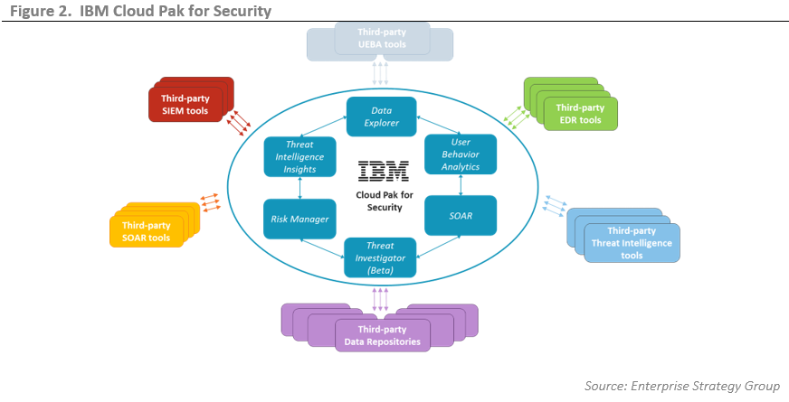

# Target architecture

**Audience**: Architects, Application developers, Administrators

<!--- cSpell:ignore CNCF qube cntk autoplay allowfullscreen -->

## Overview

In this topic we're going to:

* Examine a system context diagram for an CP4S deployment
* Identify the components used to build a cloud native deployment
* Describe the role of each component
* Explore a typical architecture overview diagram that includes these components
* Describe the GitOps model for CP4S

By the end of this topic you'll understand the architectural design of a typical
cloud native CP4S system, its primary components and their function.

---

## System context

A [system context](https://en.wikipedia.org/wiki/System_context_diagram) diagram
helps us understand how our system interacts with its different users and
other systems.

{: .center}

IBM Cloud Pak® for Security can securely access IBM and third-party tools to search for threat indicators across any cloud or on-premises location. Connect your workflows with a unified interface so you can respond faster to security incidents. Use IBM Cloud Pak® for Security to orchestrate and automate your security response so that you can better prioritize your team's time.

---

## Component diagram

The following diagram shows the technical components used in a typical CP4S production
deployment.

{: .center}

IBM Cloud Pak® for Security includes the following offerings.

- IBM® Security Threat Intelligence Insights is an application that delivers unique, actionable, and timely threat intelligence. The application provides most of the functions of IBM X-Force® Exchange.
- IBM® Security Data Explorer is a platform application that enables customers to do federated search and investigation across their hybrid, multi-cloud environment in a single interface and workflow.
- IBM® Security Case Management for IBM Cloud Pak® for Security provides organizations with the ability to track, manage, and resolve cybersecurity incidents.
- IBM® Security Orchestration & Automation application is integrated on IBM Cloud Pak® for Security to provide most of the IBM Resilient Security Orchestration, Automation, and Response Platform feature set. If you have an Orchestration & Automation license, you can choose between the stand-alone version on a virtual appliance, or the application on Cloud Pak for Security.
- IBM® QRadar® is offered as a stand-alone on-premises solution and delivers intelligent security analytics, enabling visibility, detection, and investigation for a wide range of known and unknown threats. Event analytics ingest, parse, normalize, correlate, and analyze log and event data to detect indicators of threats. Flow analytics collect, extract, and normalize valuable network flow data and packet metadata to augment log-based security insights.
- IBM® QRadar® Proxy application provides communication between IBM Cloud Pak for Security and IBM QRadar or QRadar on Cloud. This communication uses APIs to pull powerful QRadar data into the QRadar Security Information and Event Management (SIEM) dashboards.
- IBM® QRadar® User Behavior Analytics is an application for detecting insider threats in your organization. User Behavior Analytics, used in conjunction with the existing data in your QRadar system, can help you generate new insights around users and user risk.
- IBM® Security Risk Manager application provides early visibility into potential security risks by correlating insights from multiple vectors so that you can prioritize risks to take appropriate remedial actions.
- IBM® Security Threat Investigator is an application that automatically analyzes and investigates cases to help determine the criticality of exposure, how many systems are at risk, and the level of remediation effort that is required.
- IBM® Security Guardium Insights is a stand-alone collaborative, robust data security platform that is designed help to unify and modernize the security operations center (SOC). Collected data can be shared with Cloud Pak for Security.
- IBM® Security Guardium Data Protection is a data activity monitoring and compliance reporting solution that is purpose-built to protect sensitive data stored across platforms.
- IBM® Security Guardium Vulnerability Assessment solution identifies threats and security holes that might be used by malicious actors to access sensitive data. The solution recommends concrete actions to strengthen security.
- IBM® Detection and Response Center (Beta) provides a unified overview of your organization’s security posture through use cases from different security tools and platforms, saving you hours of gathering the same insights by using individual tools.

---

## IBM Security Data Explorer

IBM Security Data Explorer is an application that enables customers to do federated search and investigation across their hybrid, multi-cloud environment in a single interface and workflow. Data Explorer enables users to complete investigations in a timely manner without compromising visibility. Core underlying services and capabilities include:

- Federated data search to unite silos of security data and provide complete visibility across security solutions (for example, Security Information and Event Management (SIEM), Endpoint Detection and Response, Data lake), and cloud infrastructures (for example, Azure, Amazon Web Services (AWS))
- Single, unified interface and workflow to investigate threats and Indicators of Compromise into user-selected data sources
- In-context data enhancements from Connected Assets and Risk data sources and IBM Security Threat Intelligence Insights
- Workflows to track, append, create security cases from the native platform case management system.

---

## Detection and Response Center (Beta)

IBM Detection and Response Center (Beta) provides a unified overview of your organization's security posture through use cases from different security tools and platforms, saving you hours of gathering the same insights by using individual tools.

The Beta version supports rules and use cases from IBM QRadar and the Sigma Community. Sigma rules, enhanced by STIX patterns, are used by Threat Investigator in its investigations. You can also run the STIX patterns in Data Explorer.

Core features of the Beta version include:
- Exploring rules through visualization and reports
- Running STIX patterns from Sigma rules in Data Explorer
- Visualizing threat coverage across the MITRE ATT&CK framework

---

## IBM Security Case Management
IBM Security Case Management for IBM Cloud Pak for Security provides organizations with the ability to track, manage, and resolve cybersecurity incidents. With IBM Security Case Management, Security and IT teams can collaborate across their organization to rapidly and successfully respond to incidents. Case Management is a subset of the IBM Security Orchestration & Automation application and is available without an extra license on IBM Cloud Pak for Security. 

---

## IBM Security Global Case Management (Beta)
IBM Security Global Case Management (Beta) lists active cases that are associated with all the Standard accounts you belong to under your Provider account. As a managed security service provider, you can view IBM Security Case Management active cases, sort and filter to identify the highest priority cases, and investigate case details.

---

## IBM Security Orchestration & Automation
IBM Security Orchestration & Automation requires a license and is available as an application that is fully integrated in IBM Cloud Pak for Security.

Orchestration & Automation provides the following benefits:

- Create response plans that are based on industry standards and best practices.
- Integrate more easily with security and IT tools, and orchestrate responses to events and incidents.
- Collaborate across the organization, equipping various stakeholders with the tools to fulfill their roles and tasks as part of an incident response effort.

The application that is integrated on Cloud Pak for Security provides most, but not all, of the IBM Security Orchestration, Automation, and Response Platform feature set. For more information for more information about this application, see Orchestration and Automation.

If you have an Orchestration & Automation license, you can choose between the application on Cloud Pak for Security or the stand-alone version on a virtual appliance. The stand-alone virtual appliance version provides the full feature set of IBM Security Orchestration, Automation, and Response Platform. 

## IBM Security Risk Manager
IBM Security Risk Manager for Cloud Pak for Security is an application that automatically collects, correlates, and contextualizes risk insights across the IT and security ecosystem of your organization. These risk insights are presented in a business-consumable dashboard to prioritize and remediate security risks. Risk Manager provides the following key features:

- Unified view of disparate security risk metrics from multiple vectors, such as data, identity, and infrastructure that helps risk prioritization.
- Standard risk scoring framework for consistent and common risk definition that is easily understood by all stakeholders.
- Risk remediation management by using workflow management systems.

The basic features of Risk Manager are freely available to all Cloud Pak for Security. The Risk Manager Advanced application provides differentiated capabilities for licensed users, such as, recommendations to implement remedial actions, risk trend to view and track risk progression over time, and custom risk configuration to compute the risk score.

---

## IBM Security Threat Intelligence Insights
IBM Security Threat Intelligence Insights is an application that delivers unique, actionable, and timely threat intelligence. The application provides almost all of the functions that IBM X-Force® Exchange provides:

- IBM-derived threat intelligence that crosses threat activity, threat groups, malware, and industries.
- Continuous and automated Am I Affected searches that cross connected data sources to proactively identify your most relevant threats.
- Analytical and adaptive threat-scoring to help prioritize threats for further investigation and response.

---

## IBM Security Threat Investigator
IBM Security Threat Investigator automatically analyzes and investigates cases to help you make more informed decisions. By showing potential threats and the assets that are impacted, Threat Investigator can help determine the criticality of exposure, how many systems are at risk, and the level of remediation effort that is required. By viewing the historical timeline of threats within your organization, you can better understand dwell times and the stage of the threat.

---

## ArgoCD

ArgoCD is used for the continuous deployment of software components to the
Kubernetes cluster. ArgoCD watches a Git repository for new or changed
Kubernetes resource definitions, and applies them to a cluster. In this
way, ArgoCD ensures that the component configuration stored in GitHub always
reflects the state of the cluster.

For example, we will use ArgoCD to deploy and maintain queue managers, MQ
applications and the other cloud native components in our architecture.

ArgoCD also has the added benefit of being able to monitor resources that it has
deployed to ensure that if they drift from their desired values, they will be
automatically restored to those values by ArgoCD.

---

## Tekton

Tekton is used to automate manual tasks using the concept of a pipeline. A
pipeline comprises a set of tasks that are executed in a specified order in
order to accomplish a specific objective.

We use pipelines as part of the continuous integration process to build, test
and deliver queue managers and MQ applications ready for deployment by ArgoCD.
We also use pipelines to run performance tests, and to promote queue managers
and applications from dev to stage and production environments.

---

## Open LDAP

Most existing MQ on-premise deployments use LDAP for access control. Our
architecture provides an OpenLDAP to help migration of existing MQ estates.

While LDAP is an excellent technology, most cloud native systems have started to
use certificates for authentication, identification and authorization. Indeed,
MQ has added the ability to use the identify from certificate for access
control. This removes the need for LDAP, and removes a single point of failure.
Many customers will want to exploit the [Cert manager](#cert-manager) components
to help move to certificate based authorization.

---

## Kustomize

Kubernetes resources such as queue managers and applications, have their
operational properties defined using YAMLs. As these resources move through
environments such as dev stage and prod, Kustomize provides a natural way to
adapt (*customize*!) these YAMLs to these environments.  For example, we might
want to change the CPU or memory available to a queue manager in a production
environment compared to a development environment.

Because [Kustomize](https://kustomize.io/) is built into the `kubectl` and `oc`
commands via the `-k` option, it makes configuration management both easy and
natural.

---

## Kubernetes Cluster

This is the "operating system" used to orchestrate our CP4S Cloud Pak, Kubernetes is portable across on-premise and cloud systems and allows us to easily scale our workloads across
these environments as required.

You'll be learning a lot more about Kubernetes in this tutorial; it's the foundation upon which everything else is built.

---

## GitOps model

In our AOD, we've emphasized the two main components that are essential to a
production-ready MQ cloud native deployment:

* A Kubernetes cluster containing:
    * Cloud native components such as Tekton, ArgoCD, Kibana and Grafana.

* GitHub as a source of truth for the cluster runtime containing:
    * Configuration information for the cloud native components running in the
      cluster

Notice the set of users who interact with these components:

* IT or system administrators
* Managed Security Service Providers (MSSP)
* Security business leaders
* Security analysts

In this tutorial, we'll see how these users work within this environment. All users
will follow the  [GitOps
model](https://www.openshift.com/blog/introduction-to-gitops-with-openshift). In
this model, Git holds the entire specification for the system -- hardware,
cluster, build, test and deploy components, queue managers and applications.
Whenever the system needs to be changed, whether by a developer, administrator,
SRE or architect, they use Git and git operations such as **Pull requests** to
make a change. A change must pass a full set of tests (stored in git) to ensure
the change is correct. If successful, it is merged into the current system either
automatically or after approval, if required.

In the GitOps model, Git is at the heart of every operational change performed
to every component of the system; you'll learn more about this model throughout
the tutorial by using it.

---

