# Enabling mTLS security and delegated authentication using LDAP

<!--- cSpell:ignore  selfsigned -->


## Overview

In this guide, we will setup mTLS to secure the data in motion between the `mq-spring-app` and the `QM1` queue manager.
We will also setup an LDAP server to configure the system to delegate authentication of mq users (system and human) to an OpenLDAP server.

The details of the solution are described here [mq security](../information/mtls.md).

## Prerequisites

You have a cluster provisioned with the `mq-spring-app` deployed and interacting with the `QM1` queue manager without any security configured (i.e. no TLS and no LDAP for delegated authentication).

You have cloned the git repositories for:
* multi-tenancy-gitops (https://github.com/cloud-native-toolkit/multi-tenancy-gitops)
* mq-infra (https://github.com/cloud-native-toolkit/mq-infra)
* mq-spring-app (https://github.com/cloud-native-toolkit/mq-spring-app)

## Configure mTLS and Delegated Authentication

1. *Create openldap project*

    Go to the `multi-tenancy-gitops` folder where the local copy of the repo is:
    ```
    cd multi-tenancy-gitops
    ```
    Edit file `0-bootstrap/single-cluster/1-infra/kustomization.yaml` and uncomment the line:
    ```
    - argocd/namespace-openldap.yaml
    ```
    Commit the change and push it back to the repo.
    ```
    git add .
    git commit -m "create openldap project"
    git push origin master
    ```
    This will create the `openldap` project in the cluster.


2. *Install the OpenLDAP Server*

    Edit file `0-bootstrap/single-cluster/2-services/kustomization.yaml` and uncomment the line:
    ```
    - argocd/instances/openldap.yaml
    ```


    Commit the change and push it back to the repo.
    ```
    git add .
    git commit -m "enable OpenLDAP to be installed"
    git push origin master
    ```
    This will create the `openldap` Argo application and install OpenLDAP into the cluster in namespace `openldap`.

    In ArgoCD, when you search for the `openldap` application, you should see a screen that look like this:

    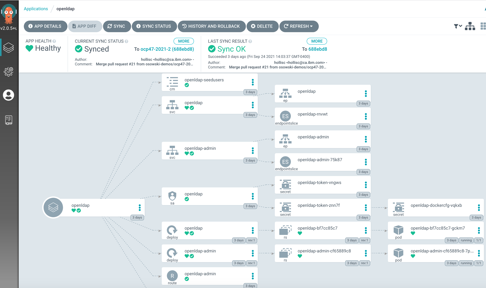

    Once, ArgoCD Synchs with the OpenShift cluster, you will see two deployments in the `openldap` project as follows:

    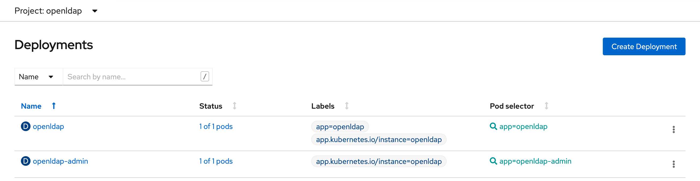

    OpenLDAP has a admin UI to manage the users.

    Get the route and open the admin UI in a browser:
    ```
    oc get route openldap-admin -n openldap -o jsonpath='{ .spec.host }'
    ```

    The OpenLDAP admin UI will appear as follows:

    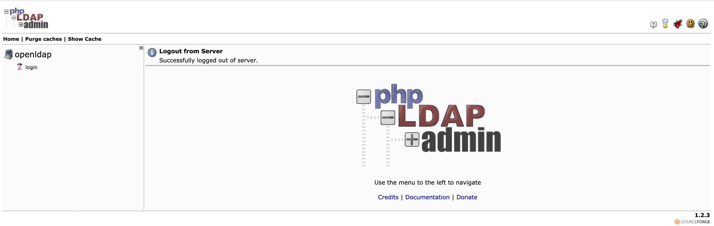

    Login using `Login DN` credentials:
    ```
    cn=admin,dc=ibm,dc=com
    ```

    and `password`:
    ```
    admin
    ```

    Once, you login, you will see several users in the directory including the `mqapp` user which we will use in this guide.

    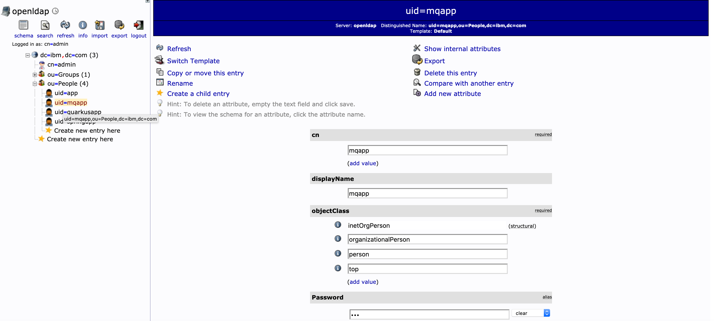

3. *Activate cert-manager Operator*

    Edit file `0-bootstrap/single-cluster/2-services/kustomization.yaml` and uncomment the line:
    ```
    - argocd/operators/cert-manager.yaml
    ```

    Commit the change and push it back to the repo
    ```
    git add .
    git commit -m "enable cert-manager operator"
    git push origin master
    ```

    The cert-manager ArgoCD application will be created:

    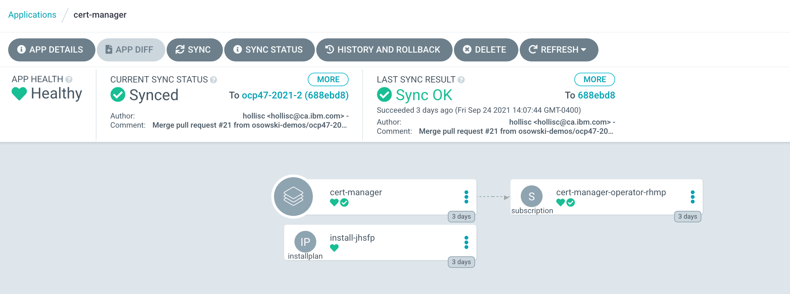

    The cert-manager operator will show up in the OpenShift cluster.

    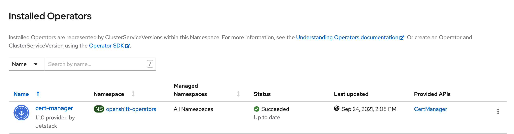


4. *Activate cert-manager instance*

    Edit file `0-bootstrap/single-cluster/2-services/kustomization.yaml` and uncomment the line:
    ```
    - argocd/instances/cert-manager-instance.yaml
    ```

    Commit the change and push it back to the repo
    ```
    git add .
    git commit -m "enable cert-manager instance"
    git push origin master
    ```

    The cert-manager instance ArgoCD application will be created:
    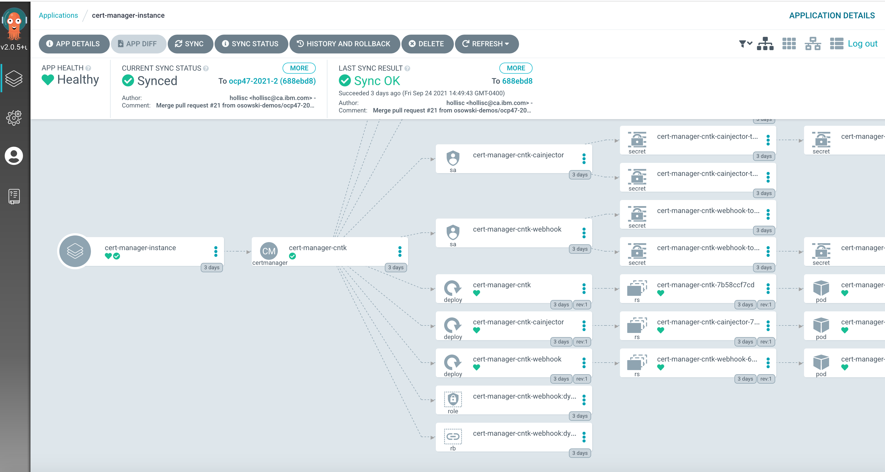

    The cert-manager instance will show up in the OpenShift cluster.

    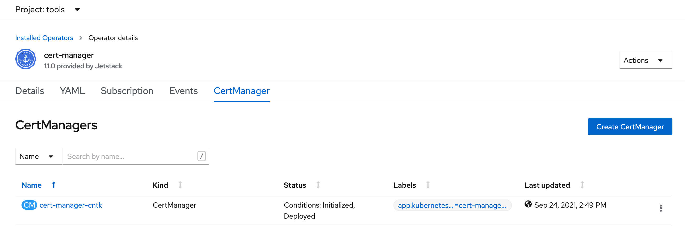

5. *Activate Certificate Issuer and Certificates*

    NOTE:  ??? CHECK WITH HOLLIS.  IS THIS GITOPS STRUCTURE STILL CORRECT????

    Edit file `0-bootstrap/single-cluster/3-apps/kustomization.yaml` and uncomment the line:
    ```
    - argocd/mq/tools.yaml
    ```

    Commit the change and push it back to the repo
    ```
    git add .
    git commit -m "enable certificate issuer"
    git push origin master
    ```

    Creates the following resources in the cluster:

    | Resource type   | Resource name |
    | -------------   | ------------- |
    | ClusterIssuer   | selfsigned-cluster-issuer |
    | Certificate     | mq-self-signed-ca-cert |
    | ClusterIssuer   | self-signed-mq-cluster-issuer |

    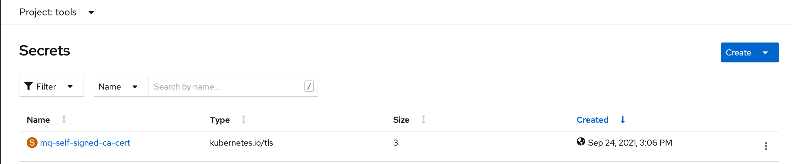

6. *Create JKS password secret*

    NOTE: master branch now has the script and the sealed secret yaml to generate the mq-client-jks-password secret.
    https://github.com/mqpdg2/multi-tenancy-gitops-apps/tree/master/mq/environments/ci/secrets
    So I believe this step does not need to be in this guide.
    I believe that the secret will exist at this point at least in the ci namespace.  Not sure of the other namespaces.

7. *Activate Certificates in ci namespace*

    Edit file `mq/environments/ci/kustomization.yaml and uncomment the line:
    ```
    - certificates/ci-mq-client-certificate.yaml
    - certificates/ci-mq-server-certificate.yaml
    ```

    Commit the change and push it back to the repo
    ```
    git add .
    git commit -m "create the mq client and server certificate in the ci namespace"
    git push origin master
    ```

    Verify that the certificate was created successfully and the secret was generated by cert-manager.

    ```
    oc get certificate -n ci
    ```

    You should see the certificates with a `Ready` status of `True` as follows:
    ```
    NAME                READY   SECRET           AGE
    ci-mq-client-cert   True    mq-client-jks    5d16h
    ci-mq-server-cert   True    mq-server-cert   5d16h
    ```

    The cert-manager operator generates the secrets from these certificates.  Lets verify the secrets were generated correctly. Run the command:

    ```
    oc get secret mq-client-jks -n ci
    ```

    You should see the secret with a `Data` value of `5` representing 5 key value pairs as follows:
    ```
    NAME            TYPE                DATA   AGE
    mq-client-jks   kubernetes.io/tls   5      5d16h
    ```

    Run the command:

    ```
    oc get secret mq-server-cert -n ci
    ```
    You should see the secret with a `Data` value of `3` representing 3 key value pairs as follows:
    ```
    NAME             TYPE                DATA   AGE
    mq-server-cert   kubernetes.io/tls   3      5d17h
    ```

8. *Activate Certificates in dev namespace*

    Edit file `mq/environments/dev/kustomization.yaml and uncomment the line:
    ```
    - certificates/dev-mq-client-certificate.yaml
    - certificates/dev-mq-server-certificate.yaml
    ```

    Commit the change and push it back to the repo
    ```
    git add .
    git commit -m "create the mq client and server certificate in the dev namespace"
    git push origin master
    ```

    Verify that the certificate was created successfully and the secret was generated by cert-manager.

    ```
    oc get certificate -n dev
    ```

    You should see the certificates with a `Ready` status of `True` as follows:
    ```
    NAME                READY   SECRET           AGE
    dev-mq-client-cert   True    mq-client-jks    5d16h
    dev-mq-server-cert   True    mq-server-cert   5d16h
    ```

    The cert-manager operator generates the secrets from these certificates.  Lets verify the secrets were generated correctly. Run the command:

    ```
    oc get secret mq-client-jks -n dev
    ```

    You should see the secret with a `Data` value of `5` representing 5 key value pairs as follows:
    ```
    NAME            TYPE                DATA   AGE
    mq-client-jks   kubernetes.io/tls   5      5d16h
    ```

    Run the command:

    ```
    oc get secret mq-server-cert -n ci
    ```
    You should see the secret with a `Data` value of `3` representing 3 key value pairs as follows:
    ```
    NAME             TYPE                DATA   AGE
    mq-server-cert   kubernetes.io/tls   3      5d17h
    ```

9. *Deploy/Create an mq manager instance with security enabled*

    Edit the values.yaml file in the source `mq-infra` repo and change the value of the `security` to true as follows:
    ```
    security: true
    ```

    Commit the change and push it back to the repo
    ```
    git add .
    git commit -m "Build and deploy the mq manager with security enabled"
    git push origin master
    ```

    Run the `mq-infra-dev` pipeline.  From the OpenShift console, go to Pipelines and set the Project to `ci`.
    You should see the `mq-infra-dev` pipeline as follows:

    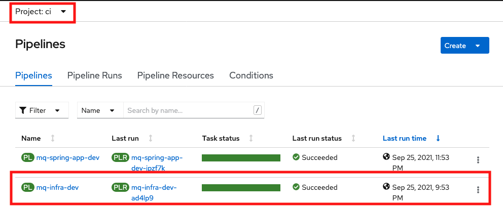


    Click on the `mq-infra-dev` pipeline link.
    Click on the `Actions` drop-down and select `Start` as follows:

    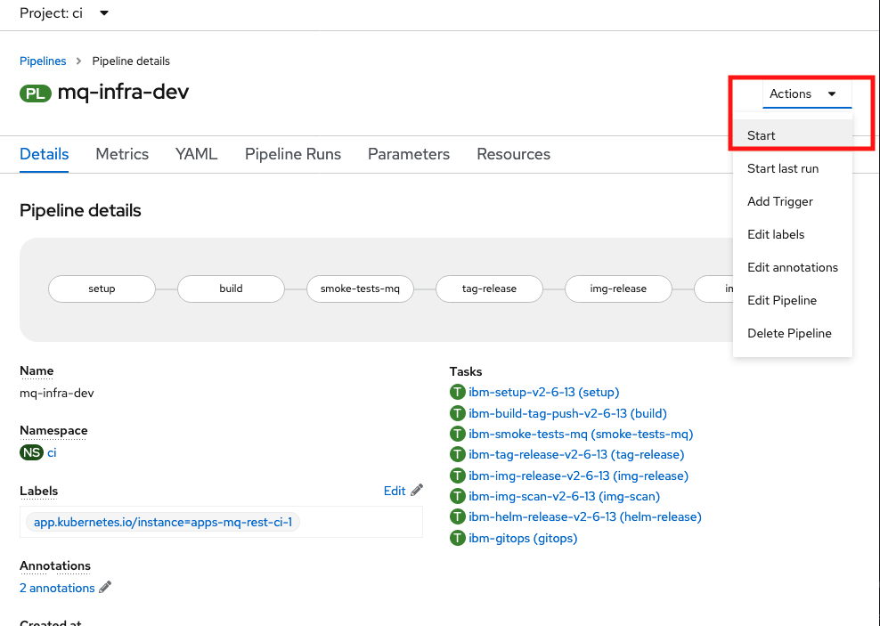

    The `Start Pipeline` screen will pop up.  Fill the `git-url` field and use the defaults for the other fields.
    Then click the `Start` button.

    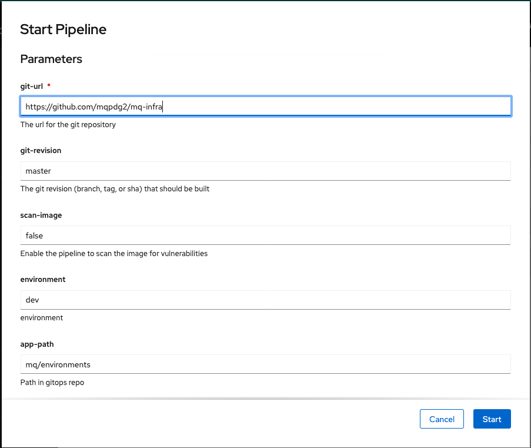

    Wait till the pipeline completes successfully.

    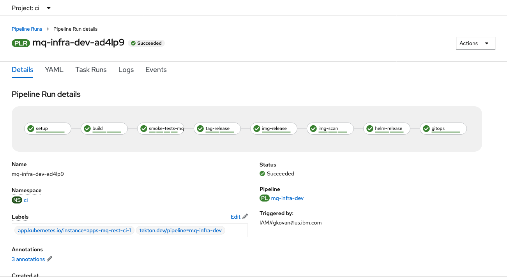

    The final stage of the pipeline will update the gitops repo: `multi-tenancy-gitops-apps/mq/environments/dev/mq-infra/` which will force ArgoCD to deploy the secure MQ manager to the `dev` project.

    Note: It may take a few minutes for ArgoCD to synch with the OpenShift cluster.

10. *Deploy mq-spring-app with security enabled*

    Edit the values.yaml file in the source `mq-spring-app` repo and change the value of the `security` to true as follows:
    ```
    security: true
    ```

    Commit the change and push it back to the repo
    ```
    git add .
    git commit -m "Build and deploy the mq-spring-app with security enabled"
    git push origin master
    ```

    Run the `mq-spring-app-dev` pipeline.  From the OpenShift console, go to Pipelines and set the Project to `ci`.
    You should see the `mq-spring-app-dev` pipeline as follows:

    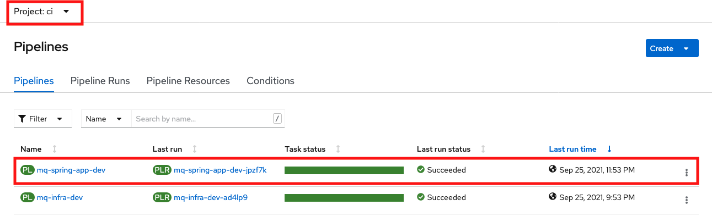

    Click on the `mq-spring-dev` pipeline link.
    Click on the `Actions` drop-down and select `Start` as follows:

    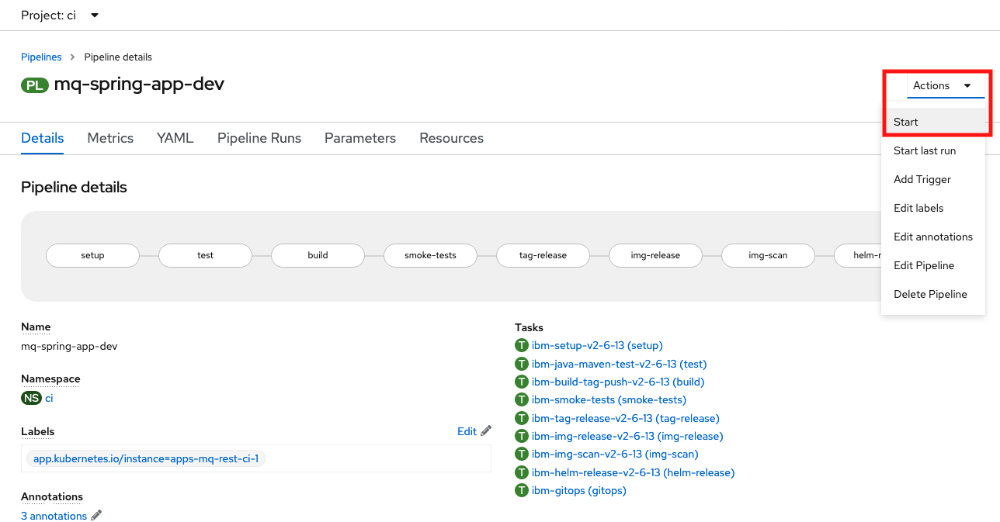

    The `Start Pipeline` screen will pop up.  Fill the `git-url` field and use the defaults for the other fields.
    Then click the `Start` button.

    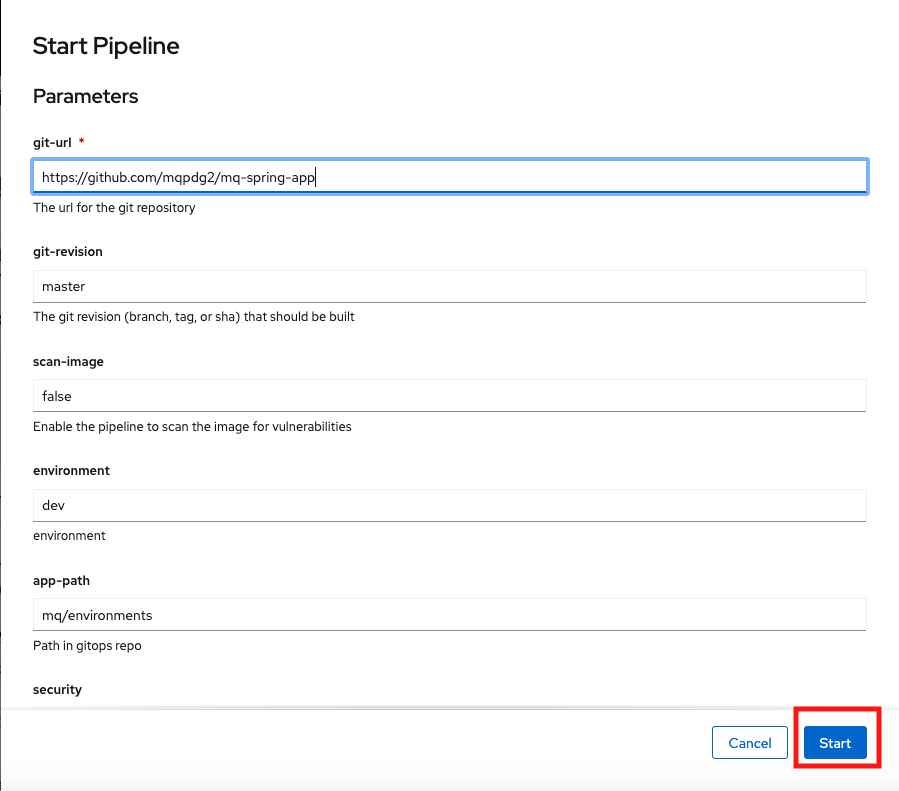

    Wait till the pipeline completes successfully.

    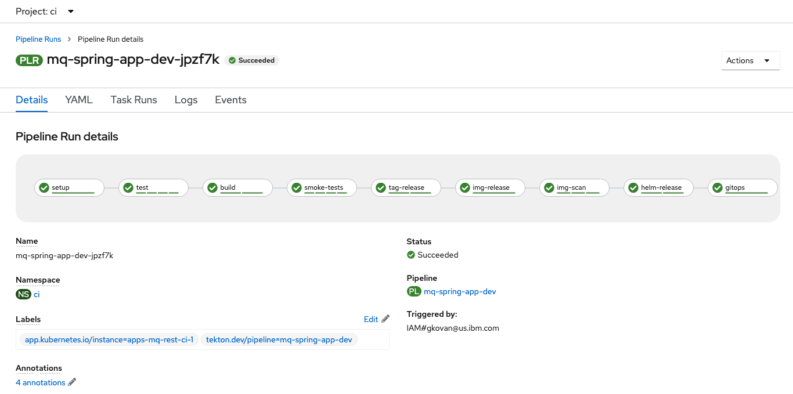

    The final stage of the pipeline will update the gitops repo: `multi-tenancy-gitops-apps/mq/environments/dev/mq-spring-app/` which will force ArgoCD to deploy the secure mq-spring-app client app to the `dev` project.

    Note: It may take a few minutes for ArgoCD to synch with the OpenShift cluster.

10. *Test the mq-spring-app*

    Check the health of the app:
    ```
    export APP_URL=$(oc get route -n dev mq-spring-app -o jsonpath="{.spec.host}")
    curl -X GET https://$APP_URL/actuator/health
    ```

    Invoke the api to put a message onto the queue:
    ```
    curl -X GET https://$APP_URL/api/send-hello-world
    ```

    Invoke the api to get a message from the queue:
    ```
    curl -X GET https://$APP_URL/api/recv
    ```

    To view the swagger docs of the `mq-spring-app` app, you can open a browser and enter the $APP_URL value.
