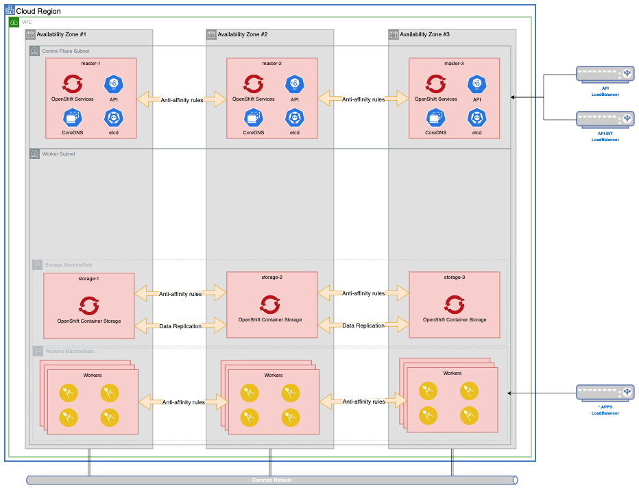

<!--- cSpell:ignore ceph -->

# AD05 - Storage

[< Back to architecture decision registry](../../ad/)
  
## Storage  

***
|  **Subject Area:**      |
|-------------------------|
|    Topology             |

***

### Issue or Problem Statement

When deploying CloudPak workloads on top of OpenShift, some components may require a storage class that provides `ReadWriteMany` (RWX) access mode:  that is, a `PersistentVolumeClaim` (PVC) that can be mounted on multiple pods.  By default, OpenShift cluster only provide storage classes with `ReadWriteOnce` (RWO) access modes.  The use of OpenShift Container Storage/OpenShift Data Foundation is the recommended storage solution to provide a consistent hybrid story across all CloudPak components and Cloud Providers.

***

### Givens & Assumptions

* Your workload components require a `ReadWriteMany` or `ObjectBucket` PVC.
* Your cloud provider does not support a RWX storage class

***

### Motivation

Provide a RWX-ready storage class to OpenShift Clusters when deploying components that depend on RWX storage classes.

***

### Alternatives

#### 1. NFS

**Considerations**:  
\+ Pro 1: Widely understood

\+ Pro 2: Integrates easily with OpenShift

\- Con 1: Tends to be slow

\- Con 2: Issues with file locking may arise

#### 2. rook-ceph
  
**Considerations**:  
\+ Pro 1: Available as an Operator in OperatorHub
  
\- Con 1: No enterprise support.  Support only thru community channels.

\- Con 2: Can only provide a single RWX-enabled PVC unless experimental features are enabled.
  
***

### Justification

OpenShift Data Foundation is a Software Defined Storage solution that leverages existing RWO storage classes on your OpenShift Cluster.  Since the Storage Nodes are deployed as <a href="../ad04-machinesets/">MachineSets</a>, it is by default highly available.  OpenShift Container Storage also replicates data across nodes in multiple Availability Zones, so data redundancy is built right on top of the solution.

### Implications

N/A

| Derived requirements |
|----------------------|
| N/A                  |

| Related decisions    |
|----------------------|
|  N/A                 |
