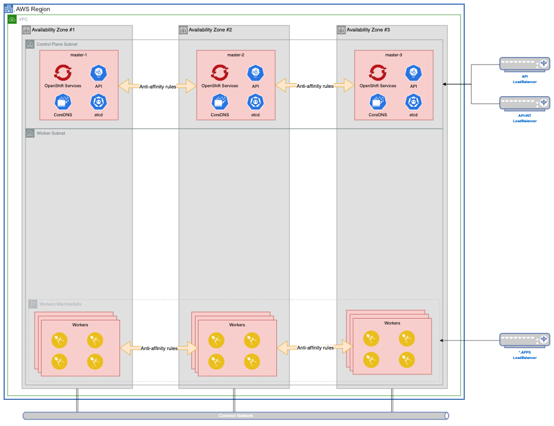
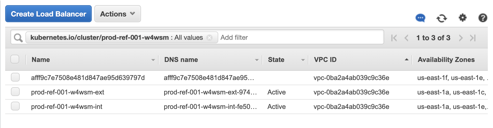
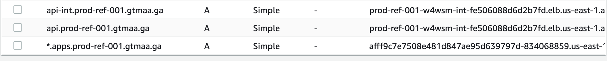

# Production Deployment Guide for OpenShift on Amazon Web Services (AWS)

<!--- cSpell:ignore qube cntk autoplay allowfullscreen -->


<!--- cSpell:ignore qube cntk autoplay allowfullscreen cloudpak yamls clusterid machineset VNET Loadbalancer loadbalancer loadbalancers ipaddresses xlarge dnsrecords -->

## Golden Topology

Before reading this document, familiarize yourself with the <a href="../golden-topology/">Golden Topology</a> section of this Production Deployment Guide.  Unless otherwise stated, all the items in that section apply to the Cluster Infrastructure we will provision on AWS.

Read Red Hat's documentation on [Installing a cluster quickly on AWS](https://docs.openshift.com/container-platform/4.7/installing/installing_aws/installing-aws-default.html) to deploy a cluster with no modifications.

Deploying a cluster with `openshift-install` will provide the following topology.  


---

## MachineSets

The following templates can be used to generate your infrastructure, cloudpak and storage MachineSets

=== "MachineSets"

    !!!note
        Click on each tab above for sample yamls to create your infrastructure

=== "Infrastructure"

    Infrastructure MachineConfigPool

    ```yaml
    apiVersion: machineconfiguration.openshift.io/v1
    kind: MachineConfigPool
    metadata:
      name: infra
    spec:
      machineConfigSelector:
        matchExpressions:
        - key: machineconfiguration.openshift.io/role
          operator: In
          values: 
          - worker
          - infra
      nodeSelector:
        matchLabels:
          node-role.kubernetes.io/infra: ""
    ```

    Infrastructure MachineSet

    Create 3 Infrastructure MachineSets,  the $ami, $region, $zone and $clusterid variables in the sample below.  `zone` should be a, b, c and so-on, respectively, on each machineset yaml file.  The default node type is m5.xlarge (4CPU, 16GB memory), if your infrastructure needs are bigger, you can increase it to a bigger node type, or increase the replica count per Availability Zone. 
    
    - To obtain your Cluster ID, you can run the following command.

      ```bash
      $ oc get -o jsonpath='{.status.infrastructureName}{"\n"}' infrastructure cluster
      ```

    - To get your AMI id for your region, you can run the following command (change the OpenShift version accordingly).

      ```bash
      curl -s https://raw.githubusercontent.com/openshift/installer/release-4.7/data/data/rhcos.json | jq -r '.amis."us-east-1".hvm'
      ```

    If you [Bring Your Own Network](#bring-your-own-network), change lines 56-65.

    ```yaml linenums="1"
    apiVersion: machine.openshift.io/v1beta1
    kind: MachineSet
    metadata:
      labels:
        machine.openshift.io/cluster-api-cluster: $clusterid
        machine.openshift.io/cluster-api-machine-role: infra
        machine.openshift.io/cluster-api-machine-type: infra
      name: $clusterid-infra-$region$zone
      namespace: openshift-machine-api
    spec:
      replicas: 1
      selector:
        matchLabels:
          machine.openshift.io/cluster-api-cluster: $clusterid
          machine.openshift.io/cluster-api-machineset: $clusterid-infra-$region$zone
      template:
        metadata:
          labels:
            machine.openshift.io/cluster-api-cluster: $clusterid
            machine.openshift.io/cluster-api-machine-role: infra
            machine.openshift.io/cluster-api-machine-type: infra
            machine.openshift.io/cluster-api-machineset: $clusterid-infra-$region$zone
        spec:
          taints:
          - effect: NoSchedule
            key: infra
            value: ""
          metadata:
            labels:
              node-role.kubernetes.io/infra: ""
          providerSpec:
            value:
              ami:
                id: $ami
              apiVersion: awsproviderconfig.openshift.io/v1beta1
              blockDevices:
              - ebs:
                  encrypted: true
                  iops: 0
                  kmsKey:
                    arn: ""
                  volumeSize: 200
                  volumeType: gp2
              credentialsSecret:
                name: aws-cloud-credentials
              deviceIndex: 0
              iamInstanceProfile:
                id: $clusterid-worker-profile
              instanceType: m5.xlarge
              kind: AWSMachineProviderConfig
              metadata:
                creationTimestamp: null
              placement:
                availabilityZone: $region$zone
                region: $region
              securityGroups:
              - filters:
                - name: tag:Name
                  values:
                  - $clusterid-worker-sg
              subnet:
                filters:
                - name: tag:Name
                  values:
                  - $clusterid-private-us-east-2a
              tags:
              - name: kubernetes.io/cluster/$clusterid
                value: owned
              userDataSecret:
                name: worker-user-data
    ```

    Infrastructure Component Placement

    Follow the <a href="../golden-topology/#image-registry">Golden Topology Guidelines</a> to control placement of infrastructure components.

=== "Storage"

    Storage MachineConfigPool

    ```yaml
    apiVersion: machineconfiguration.openshift.io/v1
    kind: MachineConfigPool
    metadata:
      name: storage
    spec:
      machineConfigSelector:
        matchExpressions:
        - key: machineconfiguration.openshift.io/role
          operator: In
          values: 
          - worker
          - storage
      nodeSelector:
        matchLabels:
          cluster.ocs.openshift.io/openshift-storage: ""
          node-role.kubernetes.io/storage: ""
    ```

    Storage MachineSet

    Create 3 Storage MachineSets, the $ami, $region, $zone and $clusterid variables in the sample below.  `zone` should be a, b, c and so-on, respectively, on each machineset yaml file.  The default node type is m5.4xlarge (16CPU, 64GB memory), 
    - To obtain your Cluster ID, you can run the following command.

      ```bash
      $ oc get -o jsonpath='{.status.infrastructureName}{"\n"}' infrastructure cluster
      ```
    - To get your AMI id for your region, you can run the following command (change the OpenShift version accordingly).

      ```bash
      curl -s https://raw.githubusercontent.com/openshift/installer/release-4.7/data/data/rhcos.json | jq -r '.amis."us-east-1".hvm'
      ```

    If you [Bring Your Own Network](#bring-your-own-network), change lines 56-65.

    ```yaml linenums="1"
    apiVersion: machine.openshift.io/v1beta1
    kind: MachineSet
    metadata:
      labels:
        machine.openshift.io/cluster-api-cluster: $clusterid
        machine.openshift.io/cluster-api-machine-role: storage
        machine.openshift.io/cluster-api-machine-type: storage
      name: $clusterid-storage-$region$zone
      namespace: openshift-machine-api
    spec:
      replicas: 1
      selector:
        matchLabels:
          machine.openshift.io/cluster-api-cluster: $clusterid
          machine.openshift.io/cluster-api-machineset: $clusterid-storage-$region$zone
      template:
        metadata:
          labels:
            machine.openshift.io/cluster-api-cluster: $clusterid
            machine.openshift.io/cluster-api-machine-role: storage
            machine.openshift.io/cluster-api-machine-type: storage
            machine.openshift.io/cluster-api-machineset: $clusterid-storage-$region$zone
        spec:
          taints:
          - effect: NoSchedule
            key: node.ocs.openshift.io/storage
            value: "true"
          metadata:
            labels:
              cluster.ocs.openshift.io/openshift-storage: ""
              node-role.kubernetes.io/storage: ""
          providerSpec:
            value:
              ami:
                id: $ami
              apiVersion: awsproviderconfig.openshift.io/v1beta1
              blockDevices:
              - ebs:
                  encrypted: true
                  iops: 0
                  kmsKey:
                    arn: ""
                  volumeSize: 200
                  volumeType: gp2
              credentialsSecret:
                name: aws-cloud-credentials
              deviceIndex: 0
              iamInstanceProfile:
                id: $clusterid-worker-profile
              instanceType: m5.4xlarge
              kind: AWSMachineProviderConfig
              metadata:
                creationTimestamp: null
              placement:
                availabilityZone: $region$zone
                region: $region
              securityGroups:
              - filters:
                - name: tag:Name
                  values:
                  - $clusterid-worker-sg
              subnet:
                filters:
                - name: tag:Name
                  values:
                  - $clusterid-private-us-east-2a
              tags:
              - name: kubernetes.io/cluster/$clusterid
                value: owned
              userDataSecret:
                name: worker-user-data
    ```

=== "CloudPak"

    CloudPak MachineConfigPool

    ```yaml
    apiVersion: machineconfiguration.openshift.io/v1
    kind: MachineConfigPool
    metadata:
      name: cp4x
    spec:
      machineConfigSelector:
        matchExpressions:
        - key: machineconfiguration.openshift.io/role
          operator: In
          values: 
          - worker
          - cp4x
      nodeSelector:
        matchLabels:
          node-role.kubernetes.io/cp4x: ""
    ```

    CloudPak Tuned Configuration

    ```yaml
    apiVersion: tuned.openshift.io/v1
    kind: Tuned
    metadata:
      name: cp4x-tuned
      namespace: openshift-cluster-node-tuning-operator
    spec:
      profile:
      - name: cp4x-tuned
        data: |
          [main]
          summary=Tune Kernel parameters on OpenShift Worker Nodes running CloudPak workloads
          [sysctl]
          kernel.shmall = 33554432
          kernel.shmmax = 68719476736
          kernel.shmmni = 16384
          kernel.sem = 250 1024000 100 16384
          kernel.msgmax = 65536
          kernel.msgmnb = 65536
          kernel.msgmni = 32768
          vm.max_map_count = 262144
      recommend:
      - match:
        - label: node-role.kubernetes.io/cp4x    
        priority: 10
        profile: cp4x-tuned
    ```

    CloudPak ContainerRuntimeConfig

    ```yaml
    apiVersion: machineconfiguration.openshift.io/v1
    kind: ContainerRuntimeConfig
    metadata:
      name: cp4x-containerruntimeconfig
    spec:
      machineConfigPoolSelector:
        matchLabels:
          limits-crio: cp4x-containerruntimeconfig
      containerRuntimeConfig:
        pidsLimit: 12288
    ```

    CloudPak MachineSet

    Create 3 Storage MachineSets, the $ami, $region, $zone and $clusterid variables in the sample below.  `zone` should be a, b, c and so-on, respectively, on each machineset yaml file.  The default node type is m5.4xlarge (16CPU, 64GB memory), 
    - To obtain your Cluster ID, you can run the following command.

      ```bash
      $ oc get -o jsonpath='{.status.infrastructureName}{"\n"}' infrastructure cluster
      ```
    - To get your AMI id for your region, you can run the following command (change the OpenShift version accordingly).

      ```bash
      curl -s https://raw.githubusercontent.com/openshift/installer/release-4.7/data/data/rhcos.json | jq -r '.amis."us-east-1".hvm'
      ```

    If you [Bring Your Own Network](#bring-your-own-network), change lines 56-65.

    ```yaml linenums="1"
    apiVersion: machine.openshift.io/v1beta1
    kind: MachineSet
    metadata:
      labels:
        machine.openshift.io/cluster-api-cluster: $clusterid
        machine.openshift.io/cluster-api-machine-role: cp4x
        machine.openshift.io/cluster-api-machine-type: cp4x
      name: $clusterid-cp4x-$region$zone
      namespace: openshift-machine-api
    spec:
      replicas: 0
      selector:
        matchLabels:
          machine.openshift.io/cluster-api-cluster: $clusterid
          machine.openshift.io/cluster-api-machineset: $clusterid-cp4x-$region$zone
      template:
        metadata:
          labels:
            machine.openshift.io/cluster-api-cluster: $clusterid
            machine.openshift.io/cluster-api-machine-role: worker
            machine.openshift.io/cluster-api-machine-type: worker
            machine.openshift.io/cluster-api-machineset: $clusterid-cp4x-$region$zone
        spec:
          metadata:
            labels:
              node-role.kubernetes.io/cp4x: ""
          providerSpec:
            value:
              ami:
                id: $ami
              apiVersion: awsproviderconfig.openshift.io/v1beta1
              blockDevices:
              - ebs:
                  encrypted: true
                  iops: 0
                  kmsKey:
                    arn: ""
                  volumeSize: 200
                  volumeType: gp2
              credentialsSecret:
                name: aws-cloud-credentials
              deviceIndex: 0
              iamInstanceProfile:
                id: $clusterid-worker-profile
              instanceType: m5.4xlarge
              kind: AWSMachineProviderConfig
              metadata:
                creationTimestamp: null
              placement:
                availabilityZone: $region$zone
                region: $region
              securityGroups:
              - filters:
                - name: tag:Name
                  values:
                  - $clusterid-worker-sg
              subnet:
                filters:
                - name: tag:Name
                  values:
                  - $clusterid-private-us-east-2a
              tags:
              - name: kubernetes.io/cluster/$clusterid
                value: owned
              userDataSecret:
                name: worker-user-data
    ```

---

## Storage

In a default OpenShift deployment on AWS, you will have storage classes called `gp2` and `gp2-csi` which only provides ReadWriteOnce (RWO) access modes.

```bash
$ oc get storageclass
NAME            PROVISIONER             RECLAIMPOLICY   VOLUMEBINDINGMODE      ALLOWVOLUMEEXPANSION   AGE
gp2 (default)   kubernetes.io/aws-ebs   Delete          WaitForFirstConsumer   true                   12m
gp2-csi         ebs.csi.aws.com         Delete          WaitForFirstConsumer   true                   12m
```

Both storage classes will consume Elastic Block Storage (EBS) resources from Amazon account for the installation.

If your CloudPak workloads require a ReadWriteMany (RWX) compatible storage class, the recommended solution is to use <a href="../golden-topology/#deploying-openshift-container-storage">OpenShift Container Storage</a>.

---

## Installation Scenarios

The recommended method for installing OpenShift into AWS is using an [Installer Provisioned Infrastructure Deployment](#installer-provisioned-infrastructure-ipi-deployment).  It is a solid foundation that encompass most of the best practices and recommendations outlined in the <a href="../golden-topology/">Golden Topology</a>.  The installation process is fully supported by IBM and Red Hat, and you won't need to manage and maintain additional code assets to deploy your cluster.

Customers requirements may prevent you from using an unmodified OpenShift installation in AWS.  Bellow are some of the most common customer requests, as well as ways of handling.  All these methods begin with the same process

```bash
[prod-ref-001] $ openshift-install create install-config
? SSH Public Key /Users/vbudi/.ssh/id_rsa.pub
? Platform aws
? AWS Access Key ID AAAAAAAAAAAAAAAAAAAAAAAAA
? AWS Secret Access Key [? for help] ****************************************
INFO Writing AWS credentials to "/Users/vbudi/.aws/credentials" 
? Region us-east-1
INFO Credentials loaded from the "default" profile in file "/Users/vbudi/.aws/credentials"
? Base Domain gtmaa.ga
? Cluster Name prod-ref-001
? Pull Secret [? for help] **************************************
INFO Install-Config created in: .
```

Once you've modified your `install-config.yaml` to fit your needs, create your manifests files.

```bash
[prod-ref-001] $ openshift-install create manifests
INFO Credentials loaded from the "default" profile in file "/Users/vbudi/.aws/credentials" 
INFO Consuming Install Config from target directory 
INFO Manifests created in: manifests and openshift *
```

Once you've modified your manifests files, you can proceed to create your OpenShift Cluster.

```bash
$ openshift-install create cluster
```

Below is a sample install-config.yaml file for an AWS OpenShift Cluster.

```yaml
apiVersion: v1
baseDomain: gtmaa.ga
compute:
- architecture: amd64
  hyperthreading: Enabled
  name: worker
  platform: {}
  replicas: 3
controlPlane:
  architecture: amd64
  hyperthreading: Enabled
  name: master
  platform: {}
  replicas: 3
metadata:
  creationTimestamp: null
  name: prod-ref-001
networking:
  clusterNetwork:
  - cidr: 10.128.0.0/14
    hostPrefix: 23
  machineNetwork:
  - cidr: 10.0.0.0/16
  networkType: OpenShiftSDN
  serviceNetwork:
  - 172.30.0.0/16
platform:
  aws:
    region: us-east-1
pullSecret: '{"auths":{...}}'
sshKey: |
  ssh-rsa AAAAB3N...
```

### Node Sizing

#### Control Plane Nodes

The default control plane node size and count in an unmodified IPI installation is 3 `m4.xlarge` nodes with a 120GB disk.  You can configure the node size by modifying the `controlPlane` section of your `install-config.yaml`.

```yaml hl_lines="6-12"
...
controlPlane:
  architecture: amd64
  hyperthreading: Enabled
  name: master
  platform:
    aws:
      rootVolume:
        size: 200
        type: io1
        iops: 4000
      type: m5.xlarge
  replicas: 3
...
```

!!!warning
    Only 3 replicas are supported for control plane high availability configuration


For a complete list of available `platform.aws.type` options, check out [supported AWS machine types](https://docs.openshift.com/container-platform/4.7/installing/installing_aws/installing-aws-customizations.html#installation-supported-aws-machine-types_installing-aws-customizations).  The recommended series is the General Purpose Compute m5 series, with a minimum spec of `m5.xlarge` for production.

##### Compute Nodes

The default worker node size and count in an unmodified IPI installation is 3 `m4.large` nodes with a 120Gb disk.  You can configure the node size by modifying the `compute` section of your `install-config.yaml`

```yaml hl_lines="6-12"
...
compute:
  architecture: amd64
  hyperthreading: Enabled
  name: worker
  platform:
    aws:
      rootVolume:
        size: 200
        type: io1
        iops: 4000
      type: m5.4xlarge
  replicas: 3
...
```

For a complete list of available `platform.aws.type` options, check out [supported AWS machine types](https://docs.openshift.com/container-platform/4.7/installing/installing_aws/installing-aws-customizations.html#installation-supported-aws-machine-types_installing-aws-customizations).  The recommended series is the General Purpose Compute m5 series, but your workload requirements may dictate another series.  For memory intensive computing, choose the R5 series, while for CPU intensive computing, choose the C5 series.

### Private Endpoints

An unmodified OpenShift installation will provision publicly facing LoadBalancers for `api` and `*.apps` (`api-int` is ALWAYS private).  If your customer requires private endpoints, modify your install-config.yaml by appending `publish: Internal` to it.  The `api` and `*.apps` LoadBalancers will be created within your VPC CIDR range on the master and worker subnets

```yaml hl_lines="4"
...
sshKey: |
  ssh-rsa AAAAB3N...
publish: Internal
```

!!!warning
    When the publish type is `Internal` the API endpoint will **not** be available outside of the VPC, you must provide the necessary connectivity for API access to the cluster.

### Bring Your Own Network

Customers may wish to use their pre-existing VPC infrastructure which OpenShift will use as its networking environment.  This can be achieved by setting the `platform.aws.subnets` field as an array of subnets (typically 3 of them for high availability)

```yaml hl_lines="5-8"
...
platform:
  aws:
    region: us-east-1
    subnets:
    - subnet-07819677ffc6ce3ba
    - subnet-02eb7c3f205fbb9db
    - subnet-08ad401ad884ff160
...
```

!!!warning
    While deploying into existing VPC and Subnets is a supported scenario, it is the customer's responsibility that there are no policies that prevent OpenShift from deploying, any security groups that block traffic, etc; OpenShift installer will **not** change or check the existing network restrictions. OpenShift also assumes that all the subnets are in the same VPC and has the correct routing and security groups.

### Bring Your Own DNS

Customers may not wish to use AWS Route53 hosted zones (public or private), opting instead to use their existing Enterprise DNS servers.  This can be achieved by modifying the `manifests/cluster-dns-02-config.yml` DNS configuration manifest.  Remove the `spec.privateZone` and `spec.publicZone` sections in the file.  When done editing, the file should look like this:

```yaml
apiVersion: config.openshift.io/v1
kind: DNS
metadata:
  creationTimestamp: null
  name: cluster
spec:
  baseDomain: mycluster.aws.gtmaa.ga
status: {}
```

!!!warning
    By disabling this feature of the DNS Operator, the cluster will no longer be able to update DNS for you as LoadBalancers are created during installation.  As the installation progresses, you will need to pay **VERY** close attention to the loadbalancers created in your cluster resource group.


The first loadbalancer that gets created is `<cluster_id>-int`.  You need to update your DNS records so that `api-int.<cluster_name>.<base_domain>` points to this LoadBalancer.  This happens very early in the deployment process, and the OpenShift master nodes will not boot up until this record is created.

The next loadbalancer created is `<cluster_id>-ext`.  It hosts the endpoint for `api`.  During the first phase of OpenShift deployment (pre-bootstrapping), the LoadBalancer will consist of a single IP address, public or private. 

During the second phase of OpenShift deployment (post-bootstrapping) another load balancer will be created by the OpenShift Ingress Operator, and it will have a long random character name.



In the example above, you would point the DNS record `api.<cluster_name>.<base_domain>` to the `<cluster-id>-int` and `<cluster-id>-ext`; and point `*.apps.<cluster_name>.<base_domain>` to the random character load balancer address.

In the extreme case that your customer does not allow wildcard DNS entries on their Enterprise DNS servers, the following DNS records **MUST** be created, pointing to the apps Loadbalancer, instead of `*.apps.<cluster_name>.<base_domain>`.  The cluster will not finish deployment until these records are created.

```text
oauth-openshift.apps.<cluster_name>.<base_domain>
console-openshift-console.apps.<cluster_name>.<base_domain>
downloads-openshift-console.apps.<cluster_name>.<base_domain>
canary-openshift-ingress-canary.apps.<cluster_name>.<base_domain>
alertmanager-main-openshift-monitoring.apps.<cluster_name>.<base_domain>
grafana-openshift-monitoring.apps.<cluster_name>.<base_domain>
prometheus-k8s-openshift-monitoring.apps.<cluster_name>.<base_domain>
thanos-querier-openshift-monitoring.apps.<cluster_name>.<base_domain>
```

## User Provided Infrastructure

If your customer has any requirements that can't be met by the above solutions, we've provided an [implementation in terraform](https://github.com/ibm-cloud-architecture/terraform-openshift4-aws).  This implementation is meant to be modified to meet your customer needs, and requires working knowledge of terraform.  Deploying this implementation with no modifications is the equivalent of running `openshift-install create cluster`, and should be avoided.
