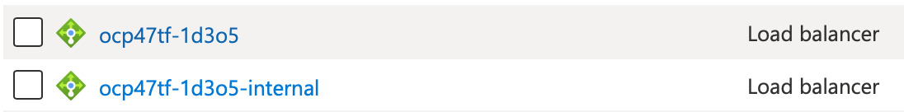
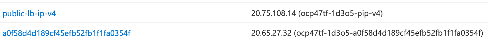

# Production Deployment Guide for OpenShift on Azure

<!--- cSpell:ignore qube cntk autoplay allowfullscreen cloudpak yamls clusterid machineset VNET Loadbalancer loadbalancer loadbalancers ipaddresses -->

## Golden Topology

Before reading this document, familiarize yourself with the <a href="../golden-topology/">Golden Topology</a> section of this Production Deployment Guide.  Unless otherwise stated, all the items in that section apply to the Cluster Infrastructure we will provision on Azure.

Read Red Hat's documentation on [Installing a cluster quickly on Azure](https://docs.openshift.com/container-platform/4.7/installing/installing_azure/installing-azure-default.html) to deploy a cluster with no modifications.

Deploying a cluster with `openshift-install` will provide the following topology.  


---

## MachineSets

The following templates can be used to generate your infrastructure, cloudpak and storage MachineSets

=== "MachineSets"

    !!!note
        Click on each tab above for sample yamls to create your infrastructure

=== "Infrastructure"

    Infrastructure MachineConfigPool

    ```yaml
    apiVersion: machineconfiguration.openshift.io/v1
    kind: MachineConfigPool
    metadata:
      name: infra
    spec:
      machineConfigSelector:
        matchExpressions:
        - key: machineconfiguration.openshift.io/role
          operator: In
          values: 
          - worker
          - infra
      nodeSelector:
        matchLabels:
          node-role.kubernetes.io/infra: ""
    ```

    Infrastructure MachineSet

    Create 3 Infrastructure MachineSets,  the $region, $zone and $clusterid variables in the sample below.  `zone` should be 1 2 and 3, respectively, on each machineset yaml file.  The default node type is Standard_D4s_v3 (4CPU, 16GB mem), if your infrastructure needs are bigger, you can increase it to a bigger node type, or increase the replica count per Availability Zone. To obtain your Cluster ID, you can run the following command.

    ```bash
    $ oc get -o jsonpath='{.status.infrastructureName}{"\n"}' infrastructure cluster
    ```

    If you [Bring Your Own Network](#bring-your-own-network), update lines 48, 57 and 61

    If you [Bring Your Own Resource Group](#bring-your-own-resource-group), update lines 41 and 56.

    ```yaml linenums="1"
    apiVersion: machine.openshift.io/v1beta1
    kind: MachineSet
    metadata:
      labels:
        machine.openshift.io/cluster-api-cluster: $clusterid
        machine.openshift.io/cluster-api-machine-role: infra
        machine.openshift.io/cluster-api-machine-type: infra
      name: $clusterid-infra-$region$zone
      namespace: openshift-machine-api
    spec:
      replicas: 1
      selector:
        matchLabels:
          machine.openshift.io/cluster-api-cluster: $clusterid
          machine.openshift.io/cluster-api-machineset: $clusterid-infra-$region$zone
      template:
        metadata:
          labels:
            machine.openshift.io/cluster-api-cluster: $clusterid
            machine.openshift.io/cluster-api-machine-role: infra
            machine.openshift.io/cluster-api-machine-type: infra
            machine.openshift.io/cluster-api-machineset: $clusterid-infra-$region$zone
        spec:
          taints:
          - effect: NoSchedule
            key: infra
            value: ""
          metadata:
            labels:
              node-role.kubernetes.io/infra: ""
          providerSpec:
            value:
              apiVersion: azureproviderconfig.openshift.io/v1beta1
              kind: AzureMachineProviderSpec
              credentialsSecret:
                name: azure-cloud-credentials
                namespace: openshift-machine-api
              image:
                offer: ""
                publisher: ""
                resourceID: /resourceGroups/$clusterid-rg/providers/Microsoft.Compute/images/$clusterid
                sku: ""
                version: ""
              location: $region
              managedIdentity: $clusterid-identity
              metadata:
                creationTimestamp: null
              networkResourceGroup: $clusterid-rg
              osDisk:
                diskSizeGB: 128
                managedDisk:
                  storageAccountType: Premium_LRS
                osType: Linux
              publicIP: false
              publicLoadBalancer: $clusterid
              resourceGroup: $clusterid-rg
              subnet: $clusterid-worker-subnet
              userDataSecret:
                name: worker-user-data
              vmSize: Standard_D4s_v3
              vnet: $clusterid-vnet
              zone: "$zone"
    ```

    Infrastructure Component Placement

    Follow the <a href="../golden-topology/#image-registry">Golden Topology Guidelines</a> to control placement of infrastructure components.

=== "Storage"

    Storage MachineConfigPool

    ```yaml
    apiVersion: machineconfiguration.openshift.io/v1
    kind: MachineConfigPool
    metadata:
      name: storage
    spec:
      machineConfigSelector:
        matchExpressions:
        - key: machineconfiguration.openshift.io/role
          operator: In
          values: 
          - worker
          - storage
      nodeSelector:
        matchLabels:
          cluster.ocs.openshift.io/openshift-storage: ""
          node-role.kubernetes.io/storage: ""
    ```

    Storage MachineSet

    Create 3 Storage MachineSets, replacing the region, $zone and $clusterid variables in the sample below.  `zone` should be 1 2 and 3, respectively, on each machineset yaml file.  The default node type is Standard_D16s_v3 (16CPU, 64GB mem), To obtain your Cluster ID, you can run the following command.

    ```bash
    $ oc get -o jsonpath='{.status.infrastructureName}{"\n"}' infrastructure cluster
    ```

    If you [Bring Your Own Network](#bring-your-own-network), update lines 49, 58 and 62

    If you [Bring Your Own Resource Group](#bring-your-own-resource-group), update lines 42 and 57.

    ```yaml linenums="1"
    apiVersion: machine.openshift.io/v1beta1
    kind: MachineSet
    metadata:
      labels:
        machine.openshift.io/cluster-api-cluster: $clusterid
        machine.openshift.io/cluster-api-machine-role: storage
        machine.openshift.io/cluster-api-machine-type: storage
      name: $clusterid-storage-$region$zone
      namespace: openshift-machine-api
    spec:
      replicas: 1
      selector:
        matchLabels:
          machine.openshift.io/cluster-api-cluster: $clusterid
          machine.openshift.io/cluster-api-machineset: $clusterid-storage-$region$zone
      template:
        metadata:
          labels:
            machine.openshift.io/cluster-api-cluster: $clusterid
            machine.openshift.io/cluster-api-machine-role: storage
            machine.openshift.io/cluster-api-machine-type: storage
            machine.openshift.io/cluster-api-machineset: $clusterid-storage-$region$zone
        spec:
          taints:
          - effect: NoSchedule
            key: node.ocs.openshift.io/storage
            value: "true"
          metadata:
            labels:
              cluster.ocs.openshift.io/openshift-storage: ""
              node-role.kubernetes.io/storage: ""
          providerSpec:
            value:
              apiVersion: azureproviderconfig.openshift.io/v1beta1
              kind: AzureMachineProviderSpec
              credentialsSecret:
                name: azure-cloud-credentials
                namespace: openshift-machine-api
              image:
                offer: ""
                publisher: ""
                resourceID: /resourceGroups/$clusterid-rg/providers/Microsoft.Compute/images/$clusterid
                sku: ""
                version: ""
              location: $region
              managedIdentity: $clusterid-identity
              metadata:
                creationTimestamp: null
              networkResourceGroup: $clusterid-rg
              osDisk:
                diskSizeGB: 128
                managedDisk:
                  storageAccountType: Premium_LRS
                osType: Linux
              publicIP: false
              publicLoadBalancer: $clusterid
              resourceGroup: $clusterid-rg
              subnet: $clusterid-worker-subnet
              userDataSecret:
                name: worker-user-data
              vmSize: Standard_D16s_v3
              vnet: $clusterid-vnet
              zone: "$zone"
    ```

=== "CloudPak"

    CloudPak MachineConfigPool

    ```yaml
    apiVersion: machineconfiguration.openshift.io/v1
    kind: MachineConfigPool
    metadata:
      name: cp4x
    spec:
      machineConfigSelector:
        matchExpressions:
        - key: machineconfiguration.openshift.io/role
          operator: In
          values: 
          - worker
          - cp4x
      nodeSelector:
        matchLabels:
          node-role.kubernetes.io/cp4x: ""
    ```

    CloudPak Tuned Configuration

    ```yaml
    apiVersion: tuned.openshift.io/v1
    kind: Tuned
    metadata:
      name: cp4x-tuned
      namespace: openshift-cluster-node-tuning-operator
    spec:
      profile:
      - name: cp4x-tuned
        data: |
          [main]
          summary=Tune Kernel parameters on OpenShift Worker Nodes running CloudPak workloads
          [sysctl]
          kernel.shmall = 33554432
          kernel.shmmax = 68719476736
          kernel.shmmni = 16384
          kernel.sem = 250 1024000 100 16384
          kernel.msgmax = 65536
          kernel.msgmnb = 65536
          kernel.msgmni = 32768
          vm.max_map_count = 262144
      recommend:
      - match:
        - label: node-role.kubernetes.io/cp4x    
        priority: 10
        profile: cp4x-tuned
    ```

    CloudPak ContainerRuntimeConfig

    ```yaml
    apiVersion: machineconfiguration.openshift.io/v1
    kind: ContainerRuntimeConfig
    metadata:
      name: cp4x-containerruntimeconfig
    spec:
      machineConfigPoolSelector:
        matchLabels:
          limits-crio: cp4x-containerruntimeconfig
      containerRuntimeConfig:
        pidsLimit: 12288
    ```

    CloudPak MachineSet

    Create 3 Storage MachineSets, replacing the region, $zone and $clusterid variables in the sample below.  `zone` should be 1 2 and 3, respectively, on each machineset yaml file.  The default node type is Standard_D8s_v3 (8CPU, 32GB mem) and can be modified on line 56. To obtain your Cluster ID, you can run the following command.

    ```bash
    $ oc get -o jsonpath='{.status.infrastructureName}{"\n"}' infrastructure cluster
    ```

    If you [Bring Your Own Network](#bring-your-own-network), change lines 44, 53 and 57.

    If you [Bring Your Own Resource Group](#bring-your-own-resource-group), change line 37 and 52.

    ```yaml linenums="1"
    apiVersion: machine.openshift.io/v1beta1
    kind: MachineSet
    metadata:
      labels:
        machine.openshift.io/cluster-api-cluster: $clusterid
        machine.openshift.io/cluster-api-machine-role: cp4x
        machine.openshift.io/cluster-api-machine-type: cp4x
      name: $clusterid-cp4x-$region$zone
      namespace: openshift-machine-api
    spec:
      replicas: 0
      selector:
        matchLabels:
          machine.openshift.io/cluster-api-cluster: $clusterid
          machine.openshift.io/cluster-api-machineset: $clusterid-cp4x-$region$zone
      template:
        metadata:
          labels:
            machine.openshift.io/cluster-api-cluster: $clusterid
            machine.openshift.io/cluster-api-machine-role: worker
            machine.openshift.io/cluster-api-machine-type: worker
            machine.openshift.io/cluster-api-machineset: $clusterid-cp4x-$region$zone
        spec:
          metadata:
            labels:
              node-role.kubernetes.io/cp4x: ""
          providerSpec:
            value:
              apiVersion: azureproviderconfig.openshift.io/v1beta1
              kind: AzureMachineProviderSpec
              credentialsSecret:
                name: azure-cloud-credentials
                namespace: openshift-machine-api
              image:
                offer: ""
                publisher: ""
                resourceID: /resourceGroups/$clusterid-rg/providers/Microsoft.Compute/images/$clusterid
                sku: ""
                version: ""
              location: $region
              managedIdentity: $clusterid-identity
              metadata:
                creationTimestamp: null
              networkResourceGroup: $clusterid-rg
              osDisk:
                diskSizeGB: 128
                managedDisk:
                  storageAccountType: Premium_LRS
                osType: Linux
              publicIP: false
              publicLoadBalancer: $clusterid
              resourceGroup: $clusterid-rg
              subnet: $clusterid-worker-subnet
              userDataSecret:
                name: worker-user-data
              vmSize: Standard_D8s_v3
              vnet: $clusterid-vnet
              zone: "$zone"
    ```

---

## Storage

In a default OpenShift deployment on Azure, you will have a single storage class called `managed-premium` which only provides ReadWriteOnce (RWO) access modes.

```bash
$ oc get storageclass
NAME                        PROVISIONER                RECLAIMPOLICY   VOLUMEBINDINGMODE      ALLOWVOLUMEEXPANSION   AGE
managed-premium (default)   kubernetes.io/azure-disk   Delete          WaitForFirstConsumer   true                   34h
```

This storage class will consume azure-disk resources from a Storage Account in the cluster resource group.

If your CloudPak workloads require a ReadWriteMany (RWX) compatible storage class, the recommended solution is to use <a href="../golden-topology/#deploying-openshift-container-storage">OpenShift Container Storage</a>.

---

## Installation Scenarios

The recommended method for installing OpenShift into Azure is using an [Installer Provisioned Infrastructure Deployment](#installer-provisioned-infrastructure-ipi-deployment).  It is a solid foundation that encompass most of the best practices and recommendations outlined in the <a href="../golden-topology/">Golden Topology</a>.  The installation process is fully supported by IBM and Red Hat, and you won't need to manage and maintain additional code assets to deploy your cluster.

Customers requirements may prevent you from using an unmodified OpenShift installation in Azure.  Below are some of the most common customer requests, as well as ways of handling.  All these methods begin with the same process

```bash
$ openshift-install create install-config
? SSH Public Key /Users/ncolon/.ssh/openshift_rsa.pub
? Platform azure
? azure subscription id ceb9d1a9-d0e8-46f9-a404-f2635fba6829
? azure tenant id fcf67057-50c9-4ad4-98f3-ffca64add9e9
? azure service principal client id a10be0dd-d46f-4592-9a2c-31d1c0bbecbe
? azure service principal client secret [? for help] **********************************
INFO Saving user credentials to "/Users/ncolon/.azure/osServicePrincipal.json"
INFO Credentials loaded from file "/Users/ncolon/.azure/osServicePrincipal.json"
? Region centralus
? Base Domain azure.ibm-gtmaa.dev
? Cluster Name mycluster
? Pull Secret [? for help] ***************************
INFO Install-Config created in: .
```

Once you've modified your `install-config.yaml` to fit your needs, create your manifests files.

```bash
$ openshift-install create manifests
INFO Credentials loaded from file "/Users/ncolon/.azure/osServicePrincipal.json"
INFO Consuming Install Config from target directory
INFO Manifests created in: manifests and openshift
```

Once you've modified your manifests files, you can proceed to create your OpenShift Cluster.

```bash
$ openshift-install create cluster
```

Below is a sample install-config.yaml file for an Azure OpenShift Cluster.

```yaml
apiVersion: v1
baseDomain: azure.ibm-gtmaa.dev
compute:
- architecture: amd64
  hyperthreading: Enabled
  name: worker
  platform: {}
  replicas: 3
controlPlane:
  architecture: amd64
  hyperthreading: Enabled
  name: master
  platform: {}
  replicas: 3
metadata:
  creationTimestamp: null
  name: mycluster
networking:
  clusterNetwork:
  - cidr: 10.128.0.0/14
    hostPrefix: 23
  machineNetwork:
  - cidr: 10.0.0.0/16
  networkType: OpenShiftSDN
  serviceNetwork:
  - 172.30.0.0/16
platform:
  azure:
    baseDomainResourceGroupName: ncolon-openshift4-rg
    cloudName: AzurePublicCloud
    outboundType: Loadbalancer
    region: centralus
publish: External
pullSecret: '{"auths":{...}}'
sshKey: |
  ssh-rsa AAAAB3N...
```

### Node Sizing

#### Control Plane Nodes

The default control plane node size and count in an unmodified IPI installation is 3 `Standard_D8s_v3` nodes with a 1024Gb disk.  You can configure the node size by modifying the `compute` section of your `install-config.yaml`.

```yaml hl_lines="6-12"
...
controlPlane:
  architecture: amd64
  hyperthreading: Enabled
  name: master
  platform:
    azure:
      type: Standard_D16s_v3
      osDisk:
        diskSizeGB: 1024
        diskType: Premium_LRS
  replicas: 3
...
```

!!!warning
    Only 3 replicas are supported for HA

!!!warning
    IOPS Performance on Azure is tied to disk size as well as type.  In order to meet the performance requirements of the ETCD database on the control plane nodes, a minimum of 1024Gb disk size is recommended, as well as using the `Premium_LRS` storage tier.

For a complete list of available `platform.azure.type` options, check out [Azure's documentation](https://azure.microsoft.com/en-us/pricing/details/virtual-machines/series/).  The recommended series is the General Purpose Compute D-Series, with a minimum spec of `Standard_D8s_v3` for production.

##### Compute Nodes

The default worker node size and count in an unmodified IPI installation is 3 `Standard_D2s_v3` nodes with a 128Gb disk.  You can configure the node size by modifying the `compute` section of your `install-config.yaml`

```yaml hl_lines="6-12"
...
compute:
- architecture: amd64
  hyperthreading: Enabled
  name: worker
  platform:
    azure:
      type: Standard_D8s_v3
      osDisk:
        diskSizeGB: 512
        diskType: Premium_LRS
  replicas: 5
...
```

For a complete list of available `platform.azure.type` options, check out [Azure's documentation](https://azure.microsoft.com/en-us/pricing/details/virtual-machines/series/).  The recommended series is the General Purpose Compute D-Series, but your workload requirements may dictate another series.  If your workloads require GPU intensive tasks, take a look at the N-Series GPU Enabled Virtual Machines.

### Private Endpoints

An unmodified OpenShift installation will provision publicly facing LoadBalancers for `api` and `*.apps` (`api-int` is ALWAYS private).  If your customer requires private endpoints, modify your install-config.yaml by appending `publish: Internal` to it.  The `api` and `*.apps` LoadBalancers will be created within your VNET CIDR range on the master and worker subnets

```yaml hl_lines="4"
...
sshKey: |
  ssh-rsa AAAAB3N...
publish: Internal
```

!!!warning
    There are limitations on how Azure VMs can reach the internet.  They either have to

    1.  Have a Public IP address attached to them

    2.  Your VNET provides alternate ways of reaching the internet

    3.  The VMs are connected to a LoadBalancer  with a public IP address(although no traffic is send their way)

When you deploy a cluster with `publish: Internal`, OpenShift operators will create a LoadBalancer with a public IP address (scenario 3 above) listening on port 27627.  The loadbalancer is created as a service called `outbound-provider` in the `openshift-config-managed` Namespace.

### Bring Your Own Resource Group

Customers may wish to use a pre-existing resource group as the target for OpenShift components.  This can be achieved by setting the `platform.azure.resourceGroupName` configuration parameter in `install-config.yaml`

```yaml hl_lines="8"
...
platform:
  azure:
    baseDomainResourceGroupName: os4-common
    cloudName: AzurePublicCloud
    outboundType: Loadbalancer
    region: centralus
    resourceGroupName: example-rg
...
```

!!!warning
    The resource group used **MUST** be empty, and will be deleted when the cluster is destroyed

### Bring Your Own Network

Customers may wish to use their pre-existing VNET infrastructure as the target for OpenShift networking environment.  This can be achieved by setting the `networkResourceGroupName`, `virtualNetwork`,  `controlPlaneSubnet` and `computeSubnet` configuration parameters in the `platform.azure` section of `install-config.yaml`

```yaml hl_lines="8-11"
...
platform:
  azure:
    baseDomainResourceGroupName: ncolon-openshift4-rg
    cloudName: AzurePublicCloud
    outboundType: Loadbalancer
    region: centralus
    networkResourceGroupName: my-cluster-vnet-rg
    virtualNetwork: my-vnet
    controlPlaneSubnet: my-master-subnet
    computeSubnet: my-worker-subnet
...
```

!!!warning
    While deploying into existing VNET and Subnets is a supported scenario, it is the customer's responsibility that there are no policies that prevent OpenShift from deploying, any security groups that block traffic, etc

    Only one `virtualNetwork` is supported per cluster.

!!!note
    You can set your controlPlaneSubnet and computeSubnet to the same if your customer requires a flat network in their VNET.

### User Defined Routing

If absolutely no public endpoints can be present in the deployment of OpenShift on the customer's VNET, the scenario described on [Private Endpoints](#private-endpoints) is not enough.  You also need to set the `platform.azure.outboundType` flag to `UserDefinedRouting`.  This will instruct the OpenShift operators not to create the Public LoadBalancer listening on port 27627.

```yaml hl_lines="6"
...
platform:
  azure:
    baseDomainResourceGroupName: ncolon-openshift4-rg
    cloudName: AzurePublicCloud
    outboundType: UserDefinedRouting
    region: centralus
...
```

!!!warning
    This configuration parameter assumes that connectivity to the internet is *somehow* provided by the VNET infrastructure, via proxies, routing through customer on-prem network connected via ExpressRoute, or any other mechanisms in place.  It is the customer's responsibility to provide the necessary connectivity to the internet so OpenShift can download its required installation artifacts.

### Bring Your Own DNS

Customers may not wish to use Azure DNS Zones (public or private), opting instead to use their existing Enterprise DNS servers.  This can be achieved by modifying the `manifests/cluster-dns-02-config.yml` DNS configuration manifest.  Remove the `spec.privateZone` and `spec.publicZone` sections in the file.  When done editing, the file should look like this:

```yaml
apiVersion: config.openshift.io/v1
kind: DNS
metadata:
  creationTimestamp: null
  name: cluster
spec:
  baseDomain: mycluster.azure.ibm-gtmaa.dev
status: {}
```

!!!warning
    By disabling this feature of the DNS Operator, the cluster will no longer be able to update DNS for you as LoadBalancers are created during installation.  As the installation progresses, you will need to pay **VERY** close attention to the loadbalancers created in your cluster resource group.


The first loadbalancer that gets created is `<cluster_id>-internal`.  You need to update your DNS records so that `api-int.<cluster_name>.<base_domain>` points to this LoadBalancer.  This happens very early in the deployment process, and the OpenShift master nodes will not boot up until this record is created.

The next loadbalancer created is `<cluster_id>`.  It hosts the endpoints for `api` and `*.apps`.  During the first phase of OpenShift deployment (pre-bootstrapping), the LoadBalancer will consist of a single IP address, public or private.  During the second phase of OpenShift deployment (post-bootstrapping) a 2nd IP address will be created by the OpenShift Ingress Operator, and it will have a long random character name.



In the example above, you would point the DNS record `api.<cluster_name>.<base_domain>` to the `public-lb-ip-v4` and `*.apps.<cluster_name>.<base_domain>` to the random character IP address.

In the extreme case that your customer does not allow wildcard DNS entries on their Enterprise DNS servers, the following DNS records **MUST** be created, pointing to the apps Loadbalancer, instead of `*.apps.<cluster_name>.<base_domain>`.  The cluster will not finish deployment until these records are created.

```text
oauth-openshift.apps.<cluster_name>.<base_domain>
console-openshift-console.apps.<cluster_name>.<base_domain>
downloads-openshift-console.apps.<cluster_name>.<base_domain>
canary-openshift-ingress-canary.apps.<cluster_name>.<base_domain>
alertmanager-main-openshift-monitoring.apps.<cluster_name>.<base_domain>
grafana-openshift-monitoring.apps.<cluster_name>.<base_domain>
prometheus-k8s-openshift-monitoring.apps.<cluster_name>.<base_domain>
thanos-querier-openshift-monitoring.apps.<cluster_name>.<base_domain>
```

## User Provided Infrastructure

If your customer has any requirements that can't be met by the above solutions, we've provided an [implementation in terraform](https://github.com/ibm-cloud-architecture/terraform-openshift4-azure).  This implementation is meant to be modified to meet your customer needs, and requires working knowledge of terraform.  Deploying this implementation with no modifications is the equivalent of running `openshift-install create cluster`, and should be avoided.
