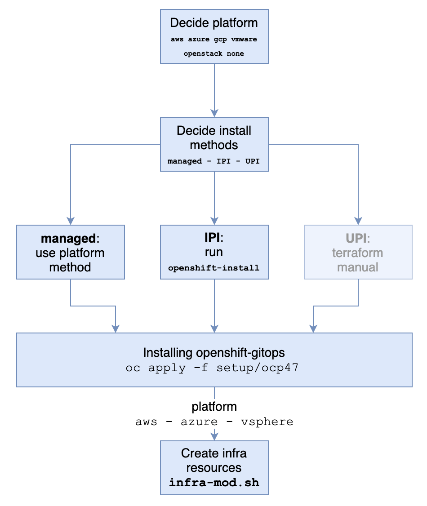

<!--- cSpell:ignore VNET apiserver Plex CNAME RESOURCEGROUP serviceaccount tennant azuread qube cntk autoplay allowfullscreen unmanaged machineset vsphere OOTB vmware openshift -->
# Cluster creation

So you needed a RedHat OpenShift cluster. How you create that depends a lot on the decision point that you make. Some of these architectural decisions are listed in [here](ad/index.md).

The following is a generic simplification of the cluster creation and setup.

You have to decide the following: 

- Where will you stand the cluster? 
    On premises, cloud providers, and other decision points there.

- How would you build the cluster?
    You can do a managed or unmanaged cluster. For most of the practical reason, we recommend that you use either a Managed cluster or an IPI cluster. UPI cluster has a lot more risk in installation and maintenance, so unless you have a very valid reason ... do not venture there.

- Decide on whether you can and wanted to do a machineset for infrastructure and storage nodes. The gitops resources that we have currently only supports `aws`, `azure` and `vsphere` platforms. Further more managed OpenShift has the infrastructure nodes created OOTB while they are not yet support OpenShift Data Foundation (ODF).

The detailed steps for installing Managed OpenShift are listed in:

- [RedHat OpenShift on IBM Cloud (ROKS)](roks.md)
- [RedHat OpenShift on AWS (ROSA)](rosa.md)
- [Azure RedHat OpenShift (ARO)](aro.md)

For a unmanaged OpenShift using Installer Provisioned Infrastructure (IPI) there are some use-cases explained in:

- [Azure](../infrastructure/azure.md)
- [AWS](../infrastructure/aws.md)
- [VMware](../infrastructure/vmware.md)

Implementing openshift-gitops operator is discussed in TBA.

Creating infrastructure nodes and storage nodes for `aws`, `azure` and `vsphere` is explained in [infrastructure GitOps](infra-gitops.md). 

