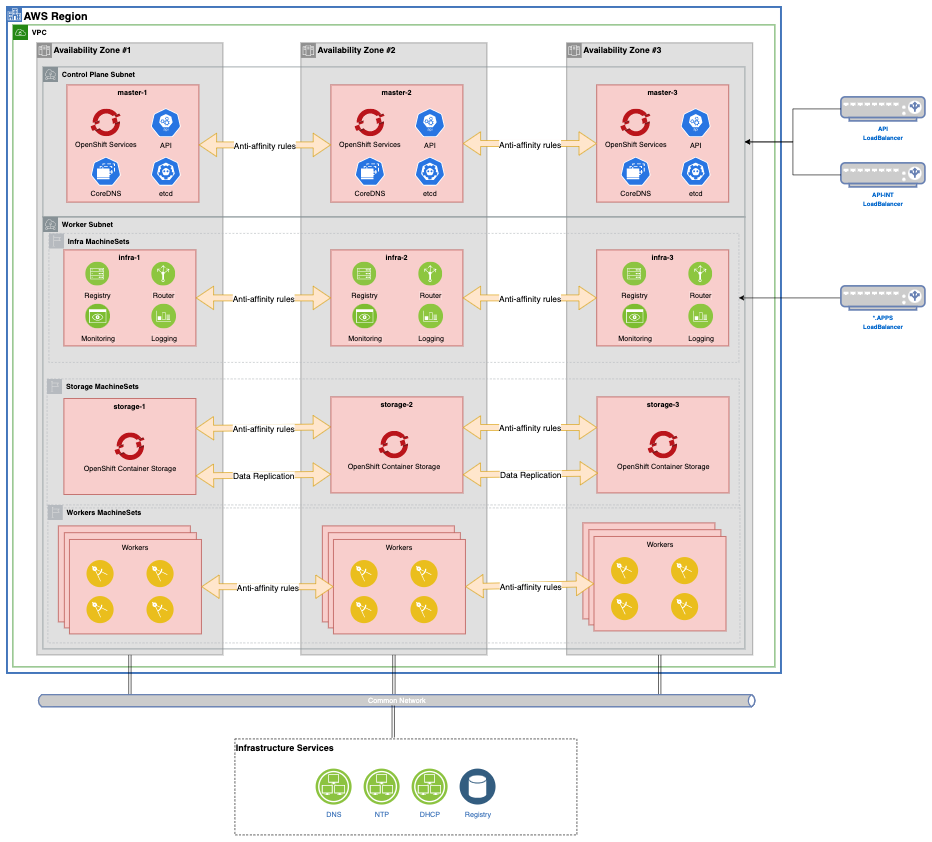

# OpenShift Golden Topology on AWS

<!--- cSpell:ignore -->

## Overview

---

Before reading this document, familiarize yourself with the <a href="../golden-topology/">Golden Topology</a> section of this Production Deployment Guide. Unless otherwise stated, all the items in that section apply to the Cluster Infrastructure we will provision on Azure.

---

## Try It Out!

We've included an <a href="../aws">AWS Hands-on Guide</a> that will allow you to deploy the following Cluster Reference Architecture into your AWS Subscription. 

<a href="https://raw.githubusercontent.com/cloud-native-toolkit/multi-tenancy-gitops/master/doc/diagrams/GoldenTopology.drawio" download>Right-click here and select "Save Link As" to download the DrawIO file</a> used to generate these diagrams or [open the diagram using diagrams.net](https://app.diagrams.net/#Hcloud-native-toolkit%2Fmulti-tenancy-gitops%2Fmaster%2Fdoc%2Fdiagrams%2FGoldenTopology.drawio)

