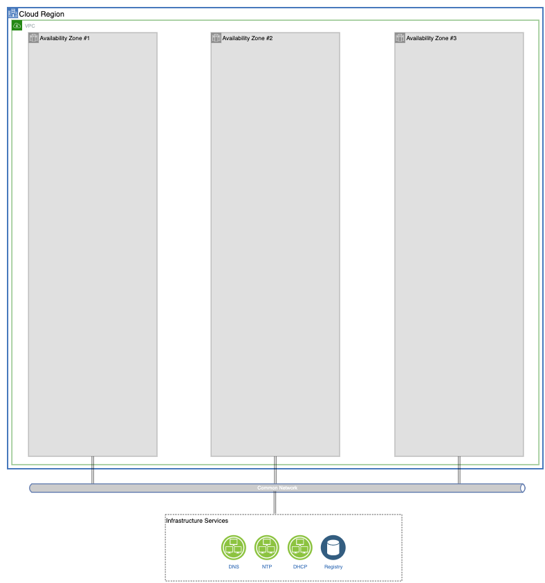

# OpenShift Golden Topology

<!--- cSpell:ignore loadbalancers noobaa ceph cephfs storagecluster Oversizing tolerations configmap datacenters machinesets CNAME qube cntk autoplay allowfullscreen operatorhub cloudpak -->

## Overview

---
A highly available, resilient deployment starts with a solid physical infrastructure foundation that embeds all these principles.  The topology described bellow provides prescriptive guidance on how to achieve these principles at the Network, Compute and Storage layer of your cluster.  All implementation details are handled with YAML so we can leverage Infrastructure as Code/GitOps processes to automate the experience.

## Networking

---
We start by deploying our cluster into a single [region](#regions) with multiple [availability zones](#availability-zones)</a>.  

By deploying into multiple AZs, we provide physical redundancy of our infrastructure into physically separated resources.  

We depend on external [Network Services](#network-services) like DHCP and DNS to provide initial cluster connectivity and configuration.  

Finally, [Load Balancers](#loadbalancers) are used to provide access to the management and application endpoints of our cluster.



### Regions

A **region** is defined as an actual real-life geographical location where your cloud resources are located.  They could be public cloud regions or your on-prem datacenters.
An OpenShift cluster should only span a single region.  Stretch clusters are not recommended, no matter the latency between these regions, to avoid ETCD database corruption.

!!!note
    If you need to spread your application workload across multiple regions, the use of a Geographical LoadBalancer is recommended.

### Availability Zones

An **availability zone** (AZ) is defined as physical locations in your region that are physically separated and connected with private, low latency, high throughput and redundant network connections.

!!!note
    You should deploy your OpenShift cluster to at least **3** AZs, one master per zone and workers spread across them.

!!!note
    Create a per-zone <a href="../ad/ad04-machinesets/">MachineSets</a> for each type of server you want to have.  This increases your Cluster redundancy.  If you're not using MachineSets, make sure you create one master and one worker per zone.

### Network Services

When deploying OpenShift, certain network services need to pre in place prior to deployment

1. **DHCP**: DHCP is required to provide initial network connectivity to your nodes so it can download its ignition configuration file

2. **DNS**: DNS is required to provide information on LoadBalancer endpoints for configuration

3. **NTP**: Time Synchronization across all cluster nodes is critical due to the use of TLS certificates across the platform.  By default they will reach out to Red Hat NTP servers, but can be configured to use internal enterprise NTP servers.

4. **Container Image Registry**: If you're deploying in an environment that has connectivity to the internet, the cluster will use public container image registries provided by Red Hat (quay.io) or IBM (cp.icr.io).  If you're deploying in a <a href="../restricted-networks/">Restricted Network</a> environment, you need to mirror the platform, operatorhub and cloudpak container images to a local image repository.

In a public cloud environment, DHCP and DNS are for the most part handled automatically by your cloud provider, and are configured when deploying your OpenShift Cluster with [IPI](../ad/ad03-cluster-provisioning/). When deploying On-Prem, you need to provide these services in your infrastructure.

!!!warning
    Avoid creating a *bastion* server that also serves as a DHCP/DNS server to provide these services for the cluster.  Production level clusters require production-level backing services.

### LoadBalancers

To spread workload and API traffic to your nodes, there are 3 endpoints to consider

1. **API**: LoadBalances Cluster API traffic to all masters on port 6443
    - DNS CNAME or A record
    - Points **api.*cluster_name*.*base_domain*** to the IP Address of this LoadBalancer

2. **API-INT**: LoadBalances Cluster API traffic to all masters and bootstrap server on port 6443 and 22623
    - DNS CNAME or A record
    - Points **api-int.*cluster_name*.*base_domain*** to the IP Address this LoadBalancer

3. **APPS**: LoadBalances HTTP/HTTPS traffic to all worker nodes on port 80 and 443.
    - DNS WILDCARD CNAME or A record
    - Points **\*.apps.*cluster_name*.*base_domain*** to the IP Address this LoadBalancer

!!!warning
    The API-INT endpoint contains sensitive cluster information. Split API and API-INT into separate load balancers, and place adequate traffic filters on API-INT so its only accessible from the cluster members CIDR range.

### OpenShift SDN

When sizing your cluster, be aware of the `networking` section in your `install-config.yaml` cluster definition. The default values are shown bellow:

```yaml
networking:
clusterNetwork:
    - cidr: 10.128.0.0/14
    hostPrefix: 23
machineNetwork:
    - cidr: 192.168.100.0/24
networkType: OpenShiftSDN
serviceNetwork:
    - 172.30.0.0/16
```

!!!error
    These values **CAN NOT** be changed after deployment.  A cluster rebuild is necessary if these values need to be changed, so plan ahead.

!!!warning
    Make sure there's no overlap between any of the CIDR ranges and external resources (databases, mainframes, etc) that need to be accessed from within the cluster.

- `networking.clusterNetwork.cidr`: The CIDR range for pods in the OpenShift SDN.
- `networking.clusterNetwork.hostPrefix`: Defines the mask for cluster network for pods within a node.  Controls the maximum number of pods that can be placed on a single node
- `networking.machineNetwork.cidr`: The CIDR range for OpenShift nodes in your network.
- `networking.serviceNetwork`: The CIDR range for services in the OpenShift SDN
- `networking.networkType`: The CNI plugin to use for the OpenShift SDN.

The `networking.clusterNetwork` parameters control how many nodes per cluster and pods per node you can have.
With the default values, you can host up to 512 nodes and 510 pods per node.

- `nodesPerCluster: 2^(hostPrefix - cidrMask)`
- `podsPerNode: 2^(32 - hostPrefix) - 2`

```text
hostPrefix: 23       = 512 nodes in cluster
node1: 10.128.0.0/23 = 510 pods
node2: 10.128.2.0/23
node3: 10.128.4.0/23
...
```

| clusterNetwork.cidr | clusterNetwork.hostPrefix | nodesPerCluster | podsPerNode |
| :------------- | :---------- | :---------- | :----------   |
| 10.128.0.0/14 | 23 | 512 | 510|
| 10.128.0.0/14 | 24 | 1024 | 254 |
| 10.128.0.0/12 | 23 | 2048 | 510 |

## Compute

---


### Control Plane

A good initial size for your masters is 3 nodes with 8CPU and 32GB memory.  Since master nodes are deployed as static `Machines` objects, replacing them down the line is a complex task.
The following outlines Red Hat's recommended Control Plane sizing.  Oversizing them at deployment will ensure you have a cluster that can scale past your original estimates if needed.

| Number of worker nodes | CPU cores | Memory (GB) | Storage (GB) |
| :--------------------- | :-------- | :---------- | :------ |
| 25  | 4  | 16 | 120 |
| 100 | 8  | 32 | 120 |
| 250 | 16 | 96 | 120 |

!!!note
    Spread your Control Plane nodes across multiple Availability Zones in your Region to provide resiliency to your cluster.

    Control Plane nodes should be deployed on a separate subnet within the machineNetwork CIDR range.

!!!warning
    Storage for Control Plane nodes should provide at least 500 IOPS to minimize etcd latency.

### Compute Nodes

Any node that is not a Control Plane node is considered a Compute (or Worker) node.  They should be deployed as <a href="../ad/ad04-machinesets/">MachineSets</a> to ensure High Availability and scalability

!!!note
    Compute nodes should be deployed on a separate subnet within the machineNetwork CIDR range.

    Create a MachineSet per Availability Zone per Compute Node type (Infrastructure, Storage, CloudPak).

### Infrastructure Nodes

!!!warning
    If you're running on a MANAGED platform like <a href="../roks/">ROKS</a>, <a href="../rosa/">ROSA</a>or <a href="../aro/">ARO</a>, it is the Cloud Providers responsibility to manage these resources for you.

    **Do not deploy Infrastructure Nodes on Managed Platforms.  Skip to [Storage](#storage)**

You should deploy at least 3 nodes to host the OpenShift infrastructure components with 4CPU and 16GB memory.  They are deployed on the worker subnet.  
Infrastructure Nodes allow customers to isolate infrastructure workloads for 2 primary purposes:

1. To prevent incurring billing costs against subscription counts

2. To separate maintenance and management

The following outlines Red Hat's recommended Infrastructure Node sizing

| Compute Nodes | CPU | Memory (GB) | CPU (Cluster Logging Enabled) | Memory (GB) (Cluster Logging Enabled) |
| :---- | :---- | :---- | :---- | :---- |
| 25 | 4 | 16 | 4 | 64 |
| 100 | 8 | 32 | 8 | 128 |
| 250 | 16 | 128 | 16 | 128 |
| 500 | 32 | 128 | 32 | 192 |

They are deployed as <a href="../ad/ad04-machinesets/">MachineSets</a> with one `MachineSet` per Availability Zone.  The MachineSet definition should include the following taints to ensure no non-infrastructure component is deployed on these nodes.  

| Key   | Value    | Effect     |
| :---- | :------- | :--------- |
| infra | "" | NoSchedule |

!!!note
    Since MachineSets can be modified, you can start with smaller sized nodes and scale as your cluster grows.

!!!warning
    Infrastructure Nodes do not draw against your OpenShift Licensing Subscription.  The use of taints ensures that *only* infrastructure components run on these nodes.

The following components are considered infrastructure components

- Image Registry
- Ingress Controller
- Monitoring
- Metrics
- Cluster Logging
- Service Brokers
- Red Hat Quay
- Red Hat OpenShift Data Foundation (previously Red Hat OpenShift Container Storage)
- Red Hat Advanced Cluster Management
- Red Hat Advanced Cluster Security
- Red Hat OpenShift Gitops
- Red Hat OpenShift Pipelines

!!!warning
    Cluster Logging is not deployed by default.  If you're deploying it, take into account the increased capacity requirements outlined on the sizing table

!!!error
    RedHat OpenShift Container Storage should not be deployed on infrastructure nodes. The use of dedicated [storage nodes](#storage-nodes) is recommended.

Placement of these components is controlled with a combination of `nodeSelectors` and `tolerations` for each of the above deployments.

### Image Registry

```bash
oc patch configs.imageregistry.operator.openshift.io/cluster --type=merge \
-p '{"spec": {"nodeSelector": {"node-role.kubernetes.io/infra": ""},"tolerations": [{"effect":"NoSchedule", "key": "infra", "value": ""}]}}'
```

### Ingress Controller

```bash
oc patch ingresscontroller/default -n openshift-ingress-operator --type=merge \
-p '{"spec": {"nodePlacement": {"nodeSelector": {"matchLabels": {"node-role.kubernetes.io/infra": ""}},"tolerations": [{"effect": "NoSchedule", "key": "infra", "value": ""}]}}}’
```

### Monitoring

Create a `openshift-monitoring-configmap.yaml` file with the following `ConfigMap` and apply it to your cluster.

```yaml
apiVersion: v1
kind: ConfigMap
metadata:
  name: cluster-monitoring-config
  namespace: openshift-monitoring
data:
  config.yaml: |+
    alertmanagerMain:
      nodeSelector:
        node-role.kubernetes.io/infra: ""
      tolerations:
      - key: infra
        value: ""
        effect: NoSchedule
    prometheusK8s:
      nodeSelector:
        node-role.kubernetes.io/infra: ""
      tolerations:
      - key: infra
        value: ""
        effect: NoSchedule
    prometheusOperator:
      nodeSelector:
        node-role.kubernetes.io/infra: ""
      tolerations:
      - key: infra
        value: ""
        effect: NoSchedule
    grafana:
      nodeSelector:
        node-role.kubernetes.io/infra: ""
      tolerations:
      - key: infra
        value: ""
        effect: NoSchedule
    k8sPrometheusAdapter:
      nodeSelector:
        node-role.kubernetes.io/infra: ""
      tolerations:
      - key: infra
        value: ""
        effect: NoSchedule
    kubeStateMetrics:
      nodeSelector:
        node-role.kubernetes.io/infra: ""
      tolerations:
      - key: infra
        value: ""
        effect: NoSchedule
    telemeterClient:
      nodeSelector:
        node-role.kubernetes.io/infra: ""
      tolerations:
      - key: infra
        value: ""
        effect: NoSchedule
    openshiftStateMetrics:
      nodeSelector:
        node-role.kubernetes.io/infra: ""
      tolerations:
      - key: infra
        value: ""
        effect: NoSchedule
    thanosQuerier:
      nodeSelector:
        node-role.kubernetes.io/infra: ""
      tolerations:
      - key: infra
        value: ""
        effect: NoSchedule
```

```bash
oc apply -f openshift-monitoring-config.yaml
```

### Cluster Logging

```bash
oc patch ClusterLogging instance --type=merge \
-p '{"spec": {"curation": {"curator": {"nodeSelector": {"node-role.kubernetes.io/infra": ""}}},"logStore": {"elasticsearch": {"nodeSelector": {"node-role.kubernetes.io/infra": ""}}},"visualization": {"kibana": {"nodeSelector": { "node-role.kubernetes.io/infra": ""}}}}}'
```

## Storage

---
By default, OpenShift will provide a `ReadWriteOnce` storage class leveraging the Cloud Provider storage infrastructure.  For any storage requirements that can't be met with the cloud provider native storage, the recommended solution is to deploy OpenShift Container Storage/OpenShift Data Foundation.  

OCS handles data replication between multiple storage nodes, so your data will always be available regardless of any Availability Zone issues.  If a `ReadWriteMany` storage class is required for your workloads, the use of OpenShift Container Storage is recommended.

You should deploy at least 3 nodes with 16CPU and 64GB memory.


Watch this video for an introduction to the various types of storage available in a Kubernetes cluster.

<div align="center"><iframe width="560" height="315" src="https://www.youtube.com/embed/S_wDTbuT-bM" title="YouTube video player" frameborder="0" allow="accelerometer; autoplay; clipboard-write; encrypted-media; gyroscope; picture-in-picture" allowfullscreen></iframe></div>

### Storage Nodes

They are deployed on the worker subnet as <a href="../ad/ad04-machinesets/">MachineSets</a> with one `MachineSet` per Availability Zone, and one replica per AZ.  The MachineSet definition should include the following taints and labels to ensure no non-storage component is deployed on these nodes.  If additional storage is needed in the future, you can Storage MachineSets as needed.

#### Taints

| Key   | Value    | Effect     |
| :---- | :------- | :--------- |
| node.ocs.openshift.io/storage | true | NoSchedule |

#### Labels

| Label | Value |
| :---- | :---- |
| cluster.ocs.openshift.io/openshift-storage | "" |

!!!note
    Add taints and labels in the MachineSet definition to minimize manual configuration steps

OpenShift Container Storage will provide the following `StorageClasses`

| Storage Class | ReadWriteOnce | ReadWriteMany | ObjectBucket |
| :---- | :---- | :---- | :---- |
| ocs-storagecluster-ceph-rbd |  ✅ | ❌ | ❌ |
| ocs-storagecluster-cephfs |  ✅ |  ✅ | ❌ |
| openshift-storage.noobaa.io | ❌ | ❌ |  ✅ |

### Deploying OpenShift Container Storage

1. Create the `openshift-storage` namespace.

    ```yaml
    apiVersion: v1
    kind: Namespace
    metadata:
    labels:
        openshift.io/cluster-monitoring: "true"
    name: openshift-storage
    spec: {}
    ```

2. Create an `OperatorGroup` that will grant necessary RBAC permissions.

    ```yaml
    apiVersion: operators.coreos.com/v1
    kind: OperatorGroup
    metadata:
    annotations:
        olm.providedAPIs: "BackingStore.v1alpha1.noobaa.io,BucketClass.v1alpha1.noobaa.io,CephBlockPool.v1.ceph.rook.io,CephClient.v1.ceph.rook.io,CephCluster.v1.ceph.rook.io,CephFilesystem.v1.ceph.rook.io,CephNFS.v1.ceph.rook.io,CephObjectRealm.v1.ceph.rook.io,CephObjectStore.v1.ceph.rook.io,CephObjectStoreUser.v1.ceph.rook.io,CephObjectZone.v1.ceph.rook.io,CephObjectZoneGroup.v1.ceph.rook.io,CephRBDMirror.v1.ceph.rook.io,NooBaa.v1alpha1.noobaa.io,OCSInitialization.v1.ocs.openshift.io,ObjectBucket.v1alpha1.objectbucket.io,ObjectBucketClaim.v1alpha1.objectbucket.io,StorageCluster.v1.ocs.openshift.io"
    name: openshift-storage-operatorgroup
    spec:
    targetNamespaces:
    - openshift-storage
    ```

3. Create the OCS subscription in the openshift-storage namespace

    ```yaml
    apiVersion: operators.coreos.com/v1alpha1
    kind: Subscription
    metadata:
    name: ocs-operator
    labels:
        operators.coreos.com/ocs-operator.openshift-storage: ""
    spec:
    channel: stable-4.6
    installPlanApproval: Automatic
    name: ocs-operator
    source: redhat-operators
    sourceNamespace: openshift-marketplace
    ```

4. Deploy a `StorageCluster` instance.  Modify `spec.storageDeviceSets.dataPVCTemplate.spec.resources.requests.storage` to the size that you need, and `spec.storageDeviceSets.dataPVCTemplate.spec.storageClassName` to the default RWO storage class available in your cluster.

    ```yaml
    apiVersion: ocs.openshift.io/v1
    kind: StorageCluster
    metadata:
    name: ocs-storagecluster
    spec:
    externalStorage: {}
    storageDeviceSets:
    - config: {}
        count: 1
        dataPVCTemplate:
        metadata:
            creationTimestamp: null
        spec:
            accessModes:
            - ReadWriteOnce
            resources:
            requests:
                storage: 512Gi
            storageClassName: thin
            volumeMode: Block
        status: {}
        name: ocs-deviceset
        placement: {}
        portable: true
        replica: 3
        resources: {}
    ```

5. Since we added additional taints to the Infrastructure and Storage Nodes, we need to configure some OpenShift Container Storage components to tolerate those taints.

    ```yaml
    kind: ConfigMap
    apiVersion: v1
    metadata:
    name: rook-ceph-operator-config
    namespace: openshift-storage
    data:
    CSI_LOG_LEVEL: "5"
    CSI_PLUGIN_TOLERATIONS: |
        - effect: NoSchedule
        key: infra
        operator: Equal
        value: ""
        - effect: NoSchedule
        key: node.ocs.openshift.io/storage
        operator: Exists
    CSI_PROVISIONER_TOLERATIONS: |2-
        - key: node.ocs.openshift.io/storage
        operator: Equal
        value: "true"
        effect: NoSchedule
    ```
