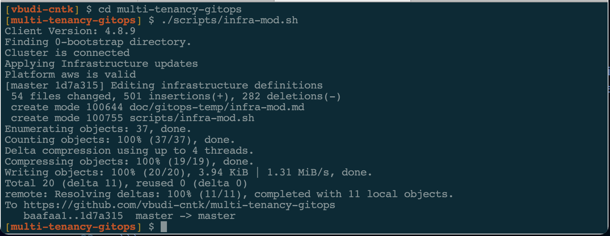

<!--- cSpell:ignore qube cntk autoplay allowfullscreen infraconfig vsphere -->

# Infrastructure creation automation

This document explains the steps for configuring infrastructure and storage resources using GitOps. The procedure is *only* applies when you want to customize the GitOps features manually. This procedure does not apply to the cluster bootstrapping method from the Quick-Start guide. In the Quick-Start guide, you must put `ADD_INFRA="yes"` when you invoke `bootstrap.sh`. 

## Requirements

The following are needed:

- A working OpenShift 4.7 cluster on aws/azure/vsphere 
- Logged in connection to the cluster you want to work on
- The `oc` command client (preferably v4.7)
- Run from under the `multi-tenancy-gitops` git structure 

## Running

The `infra-mod.sh` script performs the following tasks:

- Enable the YAML files under 1-infra argoCD application for `machinesets`, `infraconfig`, `namespace-openshift-storage` and `storage`
- Customize the content of `1-infra/argocd/machinesets.yaml` using values from your cluster
- Customize the content of `1-infra/argocd/infraconfig.yaml` using values from your cluster
- Customize the content of `1-infra/argocd/storage.yaml` using values from your cluster
- Change the content for all branches of the customization 
- Perform a GIT commit and push the changes to the GIT server

Running this modification is simple:

```bash
cd multi-tenancy-gitops
./scripts/infra-mod.sh
```

The following shows the script running



Since the repository is under argoCD control, these changes will be synchronized automatically if or when the bootstrap application is deployed in the cluster. 