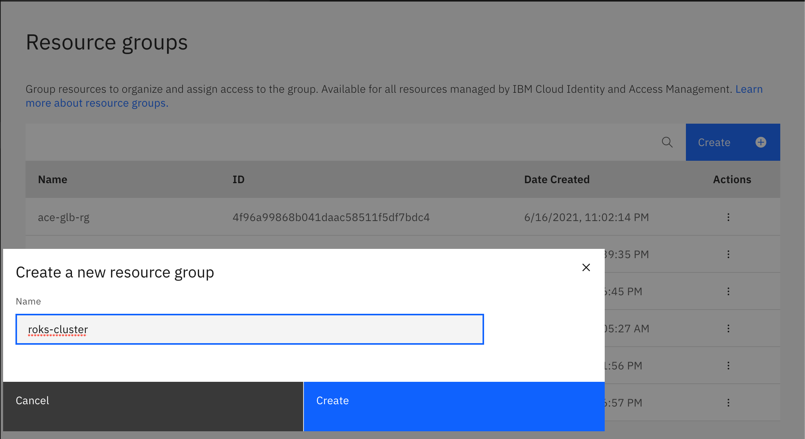
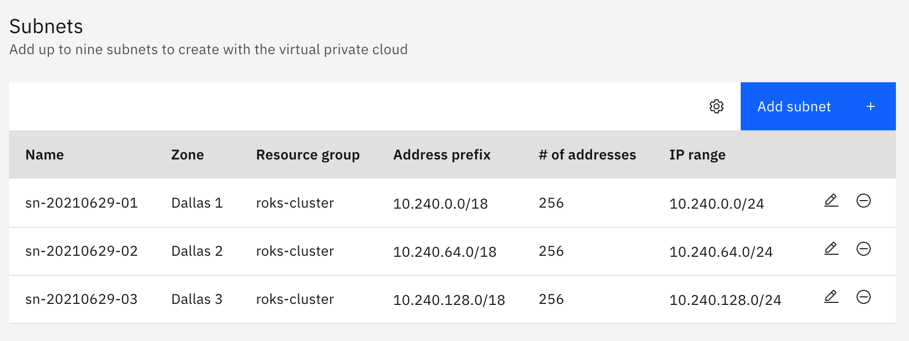
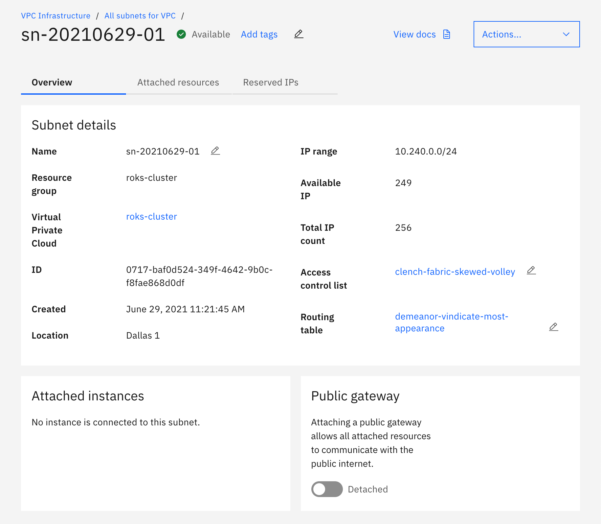
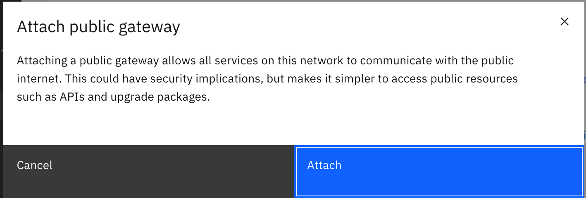
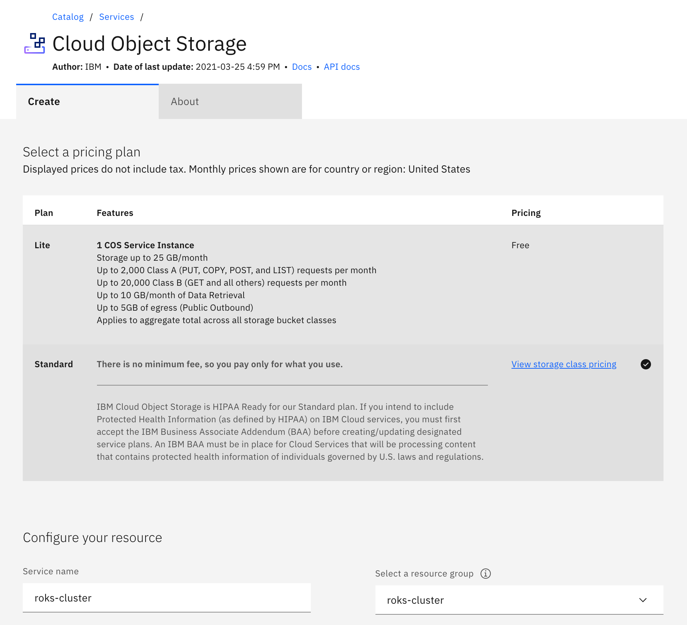
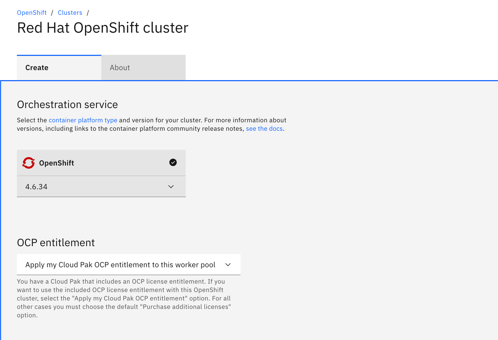
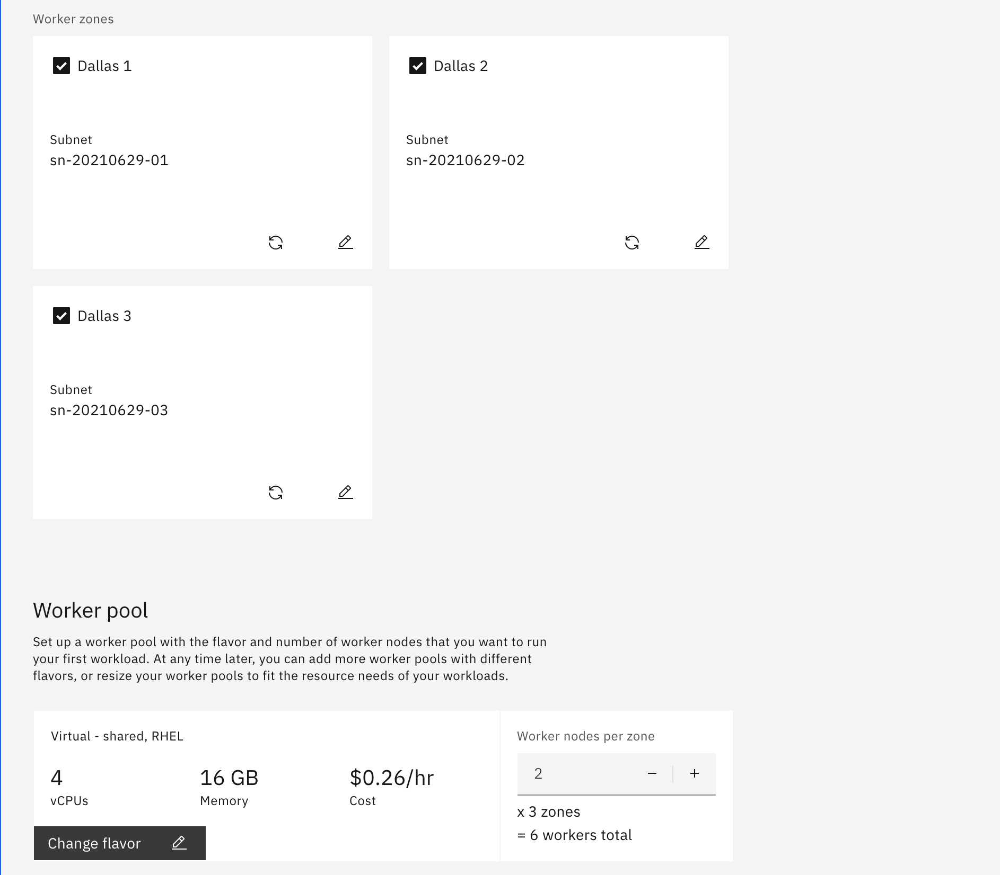
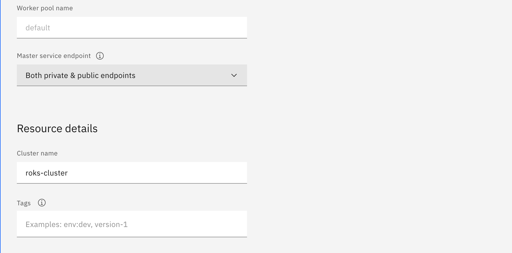
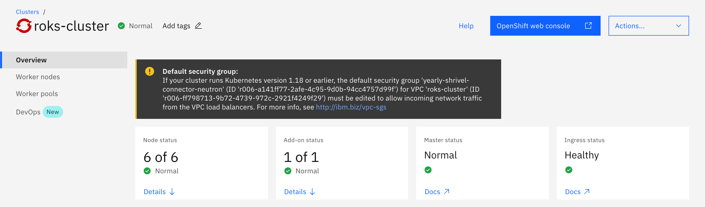

# IBM Red Hat OpenShift Kubernetes Service (ROKS)

<!--- cSpell:ignore qube cntk autoplay allowfullscreen -->

## Overview

This repository document experiences on working with ROKS cluster on OpenShift 4.6 environment 2Q 2021 deployed on a VPC Gen2.
For additional information, refer to [ROKS documentation](https://cloud.ibm.com/docs/openshift?topic=openshift-getting-started).

---

### 1. Create a Resource Group for your cluster and vpc

On the top menu, go to Manage > Accounts then select Resource groups on the left hand side menu.  Click on `Create` button and provide a name for your resource group.

### 2. Create a VPC for your cluster

Navigate to the [VPC Infrastructure overview page](https://cloud.ibm.com/vpc-ext/network/vpcs).  Click on the hamburger menu on the top left corner, and go to VPC Infrastructure > VPCs.  Click on `Create` button.  To create a cluster that meets all the [Golden Topology](../golden-topology/) requirements, provide the following values to the VPC form.

1. **Name**: Provide a name for your cluster

2. **Resource Group**: Select the resource group created in Step #1

3. **Region**: Select the region you would like to use.

4. **Default security group**: (Optional) Select whether the VPC's default security group allows inbound SSH and ping traffic. You can modify the default security group later.

5. **Classic access**: (Optional) Enable this VPC to have private network connectivity to classic resources. Only one VPC per region can communicate with classic resources.

6. **Default address prefixes**: (Optional) Each zone of your VPC is assigned a default address prefix that specifies the address range in which subnets are created. If the default address scheme doesn't suit your requirements, disable this option. After you create the VPC, go to its details page and set your own address prefixes. Then, you can create subnets.

7. **Subnets**: By default, it will create 3 subnets, one per Availability Zone on your region.

  

8. Once the VPC is ready, create a public gateway for each of the subnets in your VPC. Navigate to the [VPC Infrastructure overview page](https://cloud.ibm.com/vpc-ext/network/vpcs) and select your cluster. Under **Subnets in this VPC** select the first subnet, and click on the `Detached` toggle to attach a public gateway for your subnet.  Repeat for all other subnets.

   
   

9. Order the VPC on the right hand summary by clicking on `Create virtual private cloud`

!!!warning
    Failure to attach public gateways to your subnets may result in unavailable worker nodes in your Availability Zones

### 3. Create a Cloud Object Storage instance for your cluster

Navigate to the [Cloud Object Storage create page](https://cloud.ibm.com/objectstorage/create).  Search for `Cloud Object Storage` on the top menu search bar to create a COS instance.  Cloud Object Storage is used to back the OpenShift Internal Image Registry.  To create a COS instance that meets all the [Golden Topology](../golden-topology/) requirements, provide the following values to the Create COS Instance form.

1. **Plan**: Standard

2. **Service Name**: Provide a name for your COS Instance

3. **Resource Group**: Select the resource group created in Step #1

### 4. Create your ROKS cluster

Navigate to the [OpenShift Cluster overview page](https://cloud.ibm.com/kubernetes/clusters?platformType=openshift).  Click on the hamburger menu on the top left corner, and go to Openshift > Clusters.  Click on `Create cluster` button.  To create a cluster that meets all the [Golden Topology](../golden-topology/) requirements, provide the following values to the Cluster form.

1. **Orchestration Service**: Select the OpenShift version.  As of 2Q 2021, options are available for OpenShift 4.5, 4.6 and 4.7

2. **OCP Entitlement**: If you have OCP Entitlements from your CloudPak, select `Apply my Cloud Pak OCP entitlement to this worker pool`, otherwise select `Purchase additional licenses for this worker pool`

3. **Infrastructure**: Select VPC

4. **Virtual private cloud**: Select the VPC created on Step #2

5. **Cloud Object Storage**: Select the COS instance created on Step #3

6. **Location**: Select the resource group created on Step #1

7. **Worker zones**: Use all the subnets created when you deployed your VPC in Step #2

8. **Worker pool**: The default worker node consists of 4CPU by 16GB.  If your application requirement are different, select a new VM profile by clicking the `Change flavor` button.  By default each worker pool will have 3 nodes for a total of 9 worker nodes in your cluster.  The minimum you can provide is 2 workers per zone.

!!!warning
    **Infrastructure nodes** are not required on a Managed Platform like ROKS

9. **Worker pool name**: provide a name for your worker pool.

10. **Master service endpoint**: Select `Both private & public endpoints` if your Cluster API endpoint needs to be publicly exposed.  Otherwise select `Private endpoint only`.

11. **Cluster name**: Provide a name for your cluster

    
    
    
    

12. Order the cluster on the right hand summary by clicking on `Create`

13. After some time, your control plane, worker nodes and ingress controller will be ready.

    

