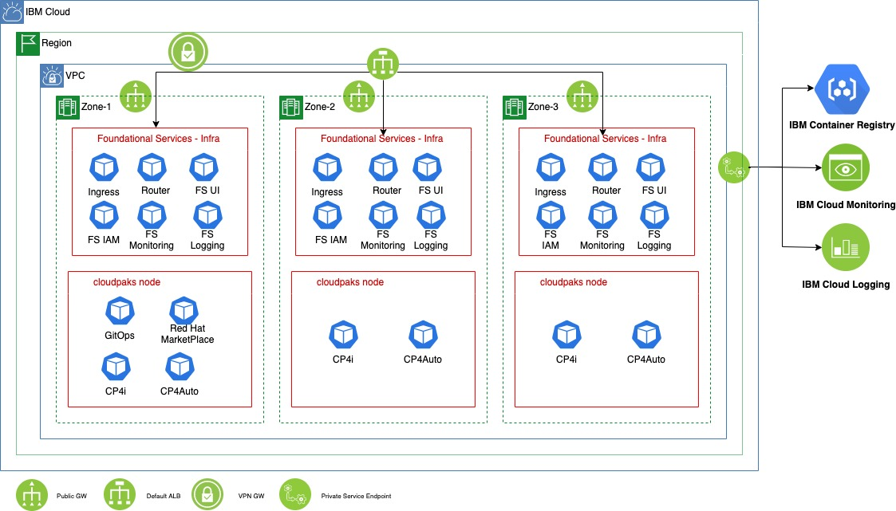
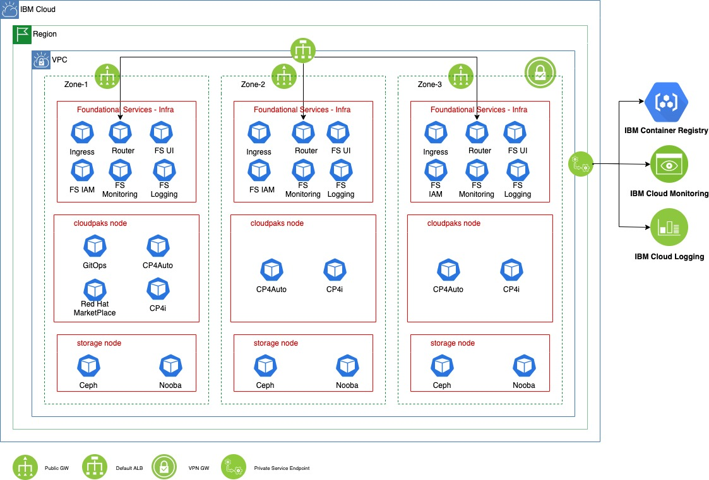
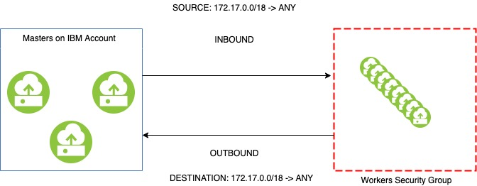
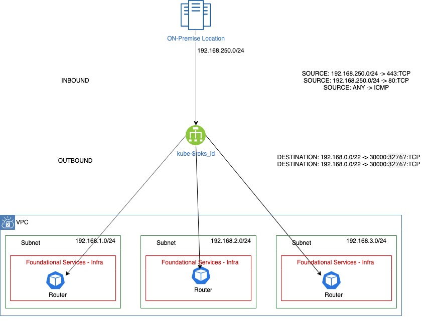

# IBM Red Hat OpenShift Kubernetes Service (ROKS)

<!--- cSpell:ignore qube cntk autoplay allowfullscreen Paks refarch infraconfig -->

## Overview

There are 4 proposed topologies depending on the deployment requirements, choose the one that adapts better to your needs. All topologies deploy Foundational Services as the Cloud Paks requires them to run, and some OpenShift infrastructure elements are deployed over these nodes.  

### ROKS-split-1

- Foundational Services
- Cloud Paks




### ROKS-split-2

- Foundational Services
- Cloud Paks
- Workers (for non Cloud Paks workloads)


### ROKS-split-3


- Foundational Services
- Cloud Paks
- Storage (Openshift Data Foundation using IBM Cloud CRDs)



### ROKS-split-4

- Foundational Services
- Cloud Paks
- Storage (Openshift Data Foundation using IBM Cloud CRDs)
- Workers (for non Cloud Paks workloads)


## Deploy VPC
 * Select an IBM Cloud region ($region)

To get the available regions for VPC run `ibmcloud is regions`  
```bash
ibmcloud target -r $region  
```  
      

 * Create a resource group or use one already created

To get the resource groups available `ibmcloud resource groups`. Create a group if necessary:  
```bash
ibmcloud resource group-create $name
``` 
Select the group:
```bash
    ibmcloud target -g $name
```

 * Create a VPC ($vpc_name)

!!! note
        You can use an already provisioned VPC, just need the VPC ID.

```bash
ibmcloud is vpc-create $vpc_name --resource-group-name $resourcegroup --address-prefix-management manual
```

 * Create the IP address network ranges.

It is needed to create one per node type and zone: infra, storage, cloudpaks, and workers. For example, for infra nodes, it is needed three IP address network ranges, one network range address per zone. The network ranges must be big enough to allocate IPs for all nodes of each type in each zone. $range must differ from one network range to other, it can be a created different ones if it creates the minimum number of IPs needed for the nodes. 
!!! note
        To get available zones on the VPC region targeted run `ibmcloud is zones`, and to get the $vpc_id `ibmcloud is vpcs`:


```bash
ibmcloud is vpc-address-prefix-create subnet-infra-1 $vpc_id $zone_1 192.168.$range_1.0/28

ibmcloud is vpc-address-prefix-create subnet-infra-2 $vpc_id $zone_3 192.168.$range_2.0/28

ibmcloud is vpc-address-prefix-create subnet-infra-3 $vpc_id $zone_3 192.168.$range_3.0/28
```

Repeat the process for the rest of the cloudpak node type:

```bash
ibmcloud is vpc-address-prefix-create subnet-cloud-paks-1 $vpc_id $zone_1 192.168.$range_7.0/27

ibmcloud is vpc-address-prefix-create subnet-cloud-paks-2 $vpc_id $zone_3 192.168.$range_8.0/27

ibmcloud is vpc-address-prefix-create subnet-cloud-paks-3 $vpc_id $zone_3 192.168.$range_9.0/27
```
If you are deploying the architecture topology ROKS-3 or ROKS-4, where the cluster will host OpenShift Storage Container repeat the process for the storage node type:

```bash
ibmcloud is vpc-address-prefix-create subnet-storage-1 $vpc_id $zone_1 192.168.$range_4.0/28

ibmcloud is vpc-address-prefix-create subnet-storage-2 $vpc_id $zone_3 192.168.$range_5.0/28

ibmcloud is vpc-address-prefix-create subnet-storage-3 $vpc_id $zone_3 192.168.$range_6.0/28
```

If you are deploying the architecture topology ROKS-2 or ROKS-4, where the cluster will host applications repeat the process for the worker node type:

```bash
ibmcloud is vpc-address-prefix-create subnet-workers-1 $vpc_id $zone_1 192.168.$range_10.0/27

ibmcloud is vpc-address-prefix-create subnet-workers-2 $vpc_id $zone_3 192.168.$range_11.0/27

ibmcloud is vpc-address-prefix-create subnet-workers-3 $vpc_id $zone_3 192.168.$range_12.0/27
```

Create an IP address network range for the subnet where the VPN Gateway will be deployed:

```bash
ibmcloud is vpc-address-prefix-create subnet-vpn-gw $vpc_id $zone_1 192.168.$range_13.0/29
```

 * Create the subnets.

It is needed to create one per node type and zone: infra, storage, cloudpaks, and workers. For example, for infra nodes, it is needed three subnets, one subnet per zone. It is needed to apply the IP address range to each subnet. For example, for infra nodes:

```bash
ibmcloud is subnet-create subnet-infra-1 $vpc_id --ipv4-cidr-block 192.168.$range_1.0/28 --resource-group-name $resourcegroup

ibmcloud is subnet-create subnet-infra-2 $vpc_id --ipv4-cidr-block 192.168.$range_2.0/28 --resource-group-name $resourcegroup

ibmcloud is subnet-create subnet-infra-3 $vpc_id --ipv4-cidr-block 192.168.$range_3.0/28 --resource-group-name $resourcegroup
```
Repeat the process for the cloudpak node type:
```bash
ibmcloud is subnet-create subnet-cloud-paks-1 $vpc_id --ipv4-cidr-block 192.168.$range_7.0/27 --resource-group-name $resourcegroup

ibmcloud is subnet-create subnet-cloud-paks-2 $vpc_id --ipv4-cidr-block 192.168.$range_8.0/27 --resource-group-name $resourcegroup

ibmcloud is subnet-create subnet-cloud-paks-3 $vpc_id --ipv4-cidr-block 192.168.$range_9.0/27 --resource-group-name $resourcegroup
```

If you are deploying the architecture topology ROKS-3 or ROKS-4, where the cluster will host OpenShift Storage Container repeat the process for the storage node type:
```bash
ibmcloud is subnet-create subnet-storage-1 $vpc_id --ipv4-cidr-block 192.168.$range_4.0/28 --resource-group-name $resourcegroup

ibmcloud is subnet-create subnet-storage-2 $vpc_id --ipv4-cidr-block 192.168.$range_5.0/28 --resource-group-name $resourcegroup

ibmcloud is subnet-create subnet-storage-3 $vpc_id --ipv4-cidr-block 192.168.$range_6.0/28 --resource-group-name $resourcegroup
```

If you are deploying the architecture topology ROKS-2 or ROKS-4, where the cluster will host applications repeat the process for the worker node type:
```bash
ibmcloud is subnet-create subnet-workers-1 $vpc_id --ipv4-cidr-block 192.168.$range_10.0/27 --resource-group-name $resourcegroup

ibmcloud is subnet-create subnet-workers-2 $vpc_id --ipv4-cidr-block 192.168.$range_11.0/27 --resource-group-name $resourcegroup

ibmcloud is subnet-create subnet-worker-3 $vpc_id --ipv4-cidr-block 192.168.$range_12.0/27 --resource-group-name $resourcegroup
```

Create the subnet to place the VPN Gateway:

```bash
ibmcloud is subnet-create subnet-vpn-gw $vpc_id --ipv4-cidr-block 192.168.$range_13.0/29 --resource-group-name $resourcegroup
```

 * Create Public Gateways for outbound connectivity.
It is needed to create one per zone.

```bash
ibmcloud is public-gateway-create gw-subnet-zone-1 $vpc_id $zone_1

ibmcloud is public-gateway-create gw-subnet-zone-2 $vpc_id $zone_2

ibmcloud is public-gateway-create gw-subnet-zone-3 $vpc_id $zone_3
```
Attach the public gateways on all the subnets that need outbound connectivity to the Internet. 
!!! note
        Run `ibmcloud is subnets` to get the subnets ID, and `ibmcloud is public-gateways` to get the public gateway ID:

```bash
ibmcloud is subnet-update $subnet-infra-1_id --public-gateway-id $gw-subnet-zone-1_id

ibmcloud is subnet-update $subnet-infra-2_id --public-gateway-id $gw-subnet-zone-2_id

ibmcloud is subnet-update $subnet-infra-3_id --public-gateway-id $gw-subnet-zone-3_id

ibmcloud is subnet-update $subnet-cloud-paks-1_id --public-gateway-id $gw-subnet-zone-1_id

ibmcloud is subnet-update $subnet-cloud-paks-2_id --public-gateway-id $gw-subnet-zone-2_id

ibmcloud is subnet-update $subnet-cloud-paks-3_id --public-gateway-id $gw-subnet-zone-3_id
```

If you are deploying the architecture topology ROKS-3 or ROKS-4, where the cluster will host OpenShift Storage Container repeat the process for the storage node type:
```bash 
ibmcloud is subnet-update $subnet-storage-1_id --public-gateway-id $gw-subnet-zone-1_id

ibmcloud is subnet-update $subnet-storage-2_id --public-gateway-id $gw-subnet-zone-2_id

ibmcloud is subnet-update $subnet-storage-3_id --public-gateway-id $gw-subnet-zone-3_id
```  

If you are deploying the architecture topology ROKS-2 or ROKS-4, where the cluster will host applications repeat the process for the worker node type:  
```bash 
ibmcloud is subnet-update $subnet-workers-1_id --public-gateway-id $gw-subnet-zone-1_id

ibmcloud is subnet-update $subnet-workers-2_id --public-gateway-id $gw-subnet-zone-2_id

ibmcloud is subnet-update $subnet-workers-3_id --public-gateway-id $gw-subnet-zone-3_id
```


## Create a VPN  tunnel to connect to the VPC

The documentation from IBM Cloud explains each parameter needed to establish the IPsec tunnel that will connect the location of our premises with the VPC on IBM Cloud.
https://cloud.ibm.com/docs/vpc?topic=vpc-using-vpn
!!!note
    IBM Cloud offers a set of recommendation parameters for a certain set of devices here:
    https://cloud.ibm.com/docs/vpc?topic=vpc-vpn-onprem-example


!!!warning
    VMware is not on the list but this article describes how to get it on VMWare environments:
    "https://medium.com/ibm-garage/extending-on-premise-vmware-environment-with-an-ipsec-tunnel-to-consume-securely-ibm-cloud-13cc9326dce1"


The next resources need to be created according to the previous recommendations or the requirements needed to establish the IPsec tunnel.

 * IKE-Policy:
The options available for this parameter can be seen running this command `ibmcloud is ike-policy-create --help`
```bash 
ibmcloud is ike-policy-create $vpc_name $auth_algorithm_ike $dh_group_ike $encryption_ike $ike_version --key-lifetime $key_lifetime_ike --resource-group-name $resourcegroup
```

 * IPsec-Policy:
The options available for this parameter can be seen running this command `ibmcloud is ipsec-policy-create --help`

```bash 
ibmcloud is ipsec-policy-create $vpc_name-ipsec $auth_algorithm_ipsec $encryption_ipsec $pfs_ipsec --key-lifetime $key_lifetime_ipsec --resource-group-name $resourcegroup
```

 * Create the VPN-Gateway:
$vpn_subnet is the subnet where the VPN gateway will be deployed. It can be a dedicated subnet or one of the infra subnets

```bash 
ibmcloud is vpn-gateway-create $vpc_name $subnet-vpn-gw_ID --mode $policy --resource-group-name $resourcegroup
```

 * Create an IPsec connection:
To check the parameters needed `ibmcloud is vpn-gateway-connection-create --help`. To get the id of the IKE policies run `ibmcloud is ike-policies` and to get the IPsec policies `ibmcloud is ipsec-policies`, to get the vpn gateway ID run `ibmcloud is vpn-gateways`:

```bash
ibmcloud is vpn-gateway-connection-create $vpc_name $vpn_id $peer_address $pre_shared_key --ike-policy $ike_id --ipsec-policy $ipsec_id
```

If the policy selected was `route` based when the VPN Gateway was created, a route table is needed to be created:        
    
!!!note
        As an example here is described how to connect to a VMware environment as is described in the article shown above

```bash 
ibmcloud is vpc-routing-table-create $vpc_id --vpc-zone-ingress false --name $vpc_name
```

Attach all the subnets to the route table, to get the ID of the route table run `ibmcloud is vpc-routing-tables`:
```bash 
ibmcloud is subnet-update  $subnet-infra-1_ID --routing-table-id $route_table_ID
ibmcloud is subnet-update  $subnet-infra-2_ID --routing-table-id $route_table_ID
ibmcloud is subnet-update  $subnet-infra-3_ID --routing-table-id $route_table_ID
ibmcloud is subnet-update  $subnet-storage-1_ID --routing-table-id $route_table_ID
ibmcloud is subnet-update  $subnet-storage-2_ID --routing-table-id $route_table_ID
ibmcloud is subnet-update  $subnet-storage-3_ID --routing-table-id $route_table_ID
ibmcloud is subnet-update  $subnet-cloud-paks-1_ID --routing-table-id $route_table_ID
ibmcloud is subnet-update  $subnet-cloud-paks-2_ID --routing-table-id $route_table_ID
ibmcloud is subnet-update  $subnet-cloud-paks-3_ID --routing-table-id $route_table_ID
ibmcloud is subnet-update  $subnet-workers-1_ID --routing-table-id $route_table_ID
ibmcloud is subnet-update  $subnet-workers-2_ID --routing-table-id $route_table_ID
ibmcloud is subnet-update  $subnet-workers-3_ID --routing-table-id $route_table_ID
ibmcloud is subnet-update  $subnet-vpn-gw_ID --routing-table-id $route_table_ID
```
 * To add the routes:
Each subnet needs a route to the remote network address range. $network_remote is the network address range of the remote network from which ROKS will be accessed. To get the connection ID run `ibmcloud is vpn-gateway-connections $vpn-gw_ID`
For example for infra subnets:
```bash 
ibmcloud is vpc-routing-table-route-create $vpc_id $route_table_id --name subnet-infra-1  --zone  $zone_1 --destination $network_remote --action deliver --next-hop $connection_id
ibmcloud is vpc-routing-table-route-create $vpc_id $route_table_id --name subnet-infra-2  --zone  $zone_2 --destination $network_remote --action deliver --next-hop $connection_id
ibmcloud is vpc-routing-table-route-create $vpc_id $route_table_id --name subnet-infra-3  --zone  $zone_3 --destination $network_remote --action deliver --next-hop $connection_id
```

## Deploy ROKS


 * Create a Cloud Object Storage instance to host the images of the registry among others:

```bash
ibmcloud resource service-instance-create $cos_name cloud-object-storage standard global -g $resourcegroup
```

 * Create the ROKS cluster:
There is a CLI limitation that does not allow the creation of several zones deployment for nodes from the start, it needs to be added after, either change the `default` worker pool from `default`, the `default` worker pool is deleted right after the creation of the cluster. The public endpoint is disabled for security, public outbound connectivity is enabled through the public gateways though.     
    
!!!note
To get the flavors available on the zone/region `ibmcloud oc flavors --zone $zone_1`. Use minimum flavor as the default pool will be deleted right after the cluster is created.

To get the Openshift versions available `ibmcloud oc versions`. The recommended version at the moment that this guide was written is `4.7.19_openshift`. 

To get the CRN (ID of the storage instance) of the Object Storage instance, run `ibmcloud resource service-instance $cos_name`.


```bash
ibmcloud oc cluster create vpc-gen2 --name $cluster_name --vpc-id $vpc_id --workers 2 --version $version --flavor $flavor --zone $zone_1 --subnet-id $subnet-infra-1_id --cos-instance $cos_id --disable-public-service-endpoint --entitlement cloud_pak
```

 * To create the Foundational services worker pool:
    
!!!note
        The flavor recommended to deploy a minimum version of Foundational Services in the Infra nodes is `bx2.8x32`
        To get the ROKS cluster ID run `ibmcloud oc clusters`


```bash
ibmcloud oc worker-pool create vpc-gen2 --name foundational-services --cluster $roks_id --flavor $flavor_infra --size-per-zone 1 --vpc-id $vpc_id --entitlement cloud_pak --label node-role.kubernetes.io/foundational-services=true
```

```bash
    ibmcloud oc zone add vpc-gen2 --subnet-id $subnet-infra-1_id  --cluster $roks_id --zone $zone_1 --worker-pool foundational-services
    ibmcloud oc zone add vpc-gen2 --subnet-id $subnet-infra-2_id  --cluster $roks_id --zone $zone_2 --worker-pool foundational-services
    ibmcloud oc zone add vpc-gen2 --subnet-id $subnet-infra-3_id  --cluster $roks_id --zone $zone_3 --worker-pool foundational-services
```

!!!note
    If you are deploying topologies ROKS-1 or ROKS-3. Once there is another worker pool, we can delete the default worker-pool
    ```bash
    ibmcloud oc worker-pool rm --worker-pool default --cluster $roks_id
    ```


 * To create the Cloud Pak worker pool:
If you are bringing your own license use the flag `cloud_pak` for the entitlement, in the case you want to consume the entitlement directly from IBM Cloud remove the flag.
!!!note
  The flavor for these nodes will depend on the cloudpak that will be installed on them.

```bash
ibmcloud oc worker-pool create vpc-gen2 --name cloud-paks  --cluster $roks_id --flavor $flavor_cloud-paks  --size-per-zone 1 --vpc-id $vpc_id --entitlement cloud_pak --label node-role.kubernetes.io/cloud-paks=true
```

 Extending the worker pool across the three zones:

```bash
ibmcloud oc zone add vpc-gen2 --subnet-id $subnet-cloud-paks-1_id  --cluster $roks_id --zone $zone_1 --worker-pool cloud-paks
ibmcloud oc zone add vpc-gen2 --subnet-id $subnet-cloud-paks-2_id  --cluster $roks_id --zone $zone_2 --worker-pool cloud-paks
ibmcloud oc zone add vpc-gen2 --subnet-id $subnet-cloud-paks-3_id  --cluster $roks_id --zone $zone_3 --worker-pool cloud-paks
```
 * To create the Storage worker pool:

If you are deploying topologies ROKS-3 or ROKS-4, you need to create the Storage worker pool:
    
!!!note 
        The recommended storage class to run Openshift Data Foundation (previously Openshift Container Storage) is bx2.16x64


If you are bringing your own license use the flag `cloud_pak` for the entitlement, in the case you want to consume the entitlement directly from IBM Cloud remove the flag.

```bash
ibmcloud oc worker-pool create vpc-gen2 --name storage --cluster $roks_id --flavor $flavor_storage --size-per-zone 1 --vpc-id $vpc_id --entitlement cloud_pak --label node-role.kubernetes.io/storage=true

```
It is needed to apply the Openshift Data Foundation addon from IBM Cloud to the cluster, that will deploy the specific CRD for Openshift Data Foundation from IBM Cloud:
```bash
ibmcloud oc cluster addon enable openshift-container-storage --cluster $roks_id --version 4.7.0
```

Extending the worker pool across the three zones:

```bash
ibmcloud oc zone add vpc-gen2 --subnet-id $subnet-storage-1_id  --cluster $roks_id --zone $zone_1 --worker-pool storage
ibmcloud oc zone add vpc-gen2 --subnet-id $subnet-storage-2_id  --cluster $roks_id --zone $zone_2 --worker-pool storage
ibmcloud oc zone add vpc-gen2 --subnet-id $subnet-storage-3_id  --cluster $roks_id --zone $zone_3 --worker-pool storage
```
  * To create the Storage worker pool:
If you are deploying topologies ROKS-2 or ROKS-4, you need to create the Workers worker pool:    

The `default` worker pool can be used to host applications that don`t fit with the infra workloads, storage workloads, or Cloud Pak workloads. To label the worker pool run:


 * Adjust roles and labels

The default roles assigned by IBM Cloud need to be changed, to remove them:
Retrieve the admin credentials for the cluster:
```bash
ibmcloud oc cluster config --cluster $roks_name --admin
```
!!!note
    Run `oc get nodes` to check you are logged in the cluster.

Remove the master and worker role labels from nodes, to apply the correct labels to each worker-pool:
```bash
oc get nodes | awk '{print $1}'|awk '{if(NR>1)print}' | xargs -I {} bash -c 'oc label node {} node-role.kubernetes.io/master-'
oc get nodes | awk '{print $1}'|awk '{if(NR>1)print}' | xargs -I {} bash -c 'oc label node {} node-role.kubernetes.io/worker-'

```

Apply the label to the foundational services nodes (if not added when the worker pool was created):

 ```bash
ibmcloud oc worker-pool label set --cluster $roks_name --worker-pool foundational-services --label node-role.kubernetes.io/foundational-services=true  -f
ibmcloud oc worker-pool label set --cluster $roks_name --worker-pool foundational-services --label node-role.kubernetes.io/master=""  -f
```

Apply the label to the cloud-paks nodes (if not added when the worker pool was created):

```bash
ibmcloud oc worker-pool label set --cluster $roks_name --worker-pool cloud-paks --label node-role.kubernetes.io/cloud-paks=true  -f
```

Apply the label to the worker nodes:

```bash
ibmcloud oc worker-pool label set --cluster $roks_name --worker-pool default --label node-role.kubernetes.io/worker=true  -f
```

Apply the label to the Storage nodes:
```bash
ibmcloud oc worker-pool label set --cluster $roks_name --worker-pool default --label cluster.ocs.openshift.io/openshift-storage=true  -f
ibmcloud oc worker-pool label set --cluster $roks_name --worker-pool default --label node-role.kubernetes.io/storage=true  -f
```


## Deploy GitOps


Log into the ROKS cluster:

```bash
ibmcloud oc cluster config --cluster $roks_name --admin
```

 * Installing GitOps operator:

Fork and clone the standard repo GitOps for IBM Cloud:
```bash
git clone https://github.com/chechuironman/roks-splits.git
```

 * Install the GitOps operator 
```bash
oc apply -f setup/ocp47/openshift-gitops-operator.yaml
```

Add the ClusterRoles needed by ArgoCD  (GitOps) to Bootstrap the cluster 
```bash
oc apply -f setup/ocp47/custom-argocd-app-controller-clusterrole.yaml 
oc apply -f setup/ocp47/custom-argocd-app-controller-clusterrolebinding.yaml

```

 * Apply the 3-layer GitOps structure

Wait until the GitOps operator is successfully deployed before deploy the Bootstrap ArgoCD application.
Modify the bootstrap.yaml on the root folder file to point to the newly forked repo:
 
```yaml
apiVersion: argoproj.io/v1alpha1
kind: Application
metadata:
  name: bootstrap-roks-split-X
  namespace: openshift-gitops
spec:
  destination:
    namespace: openshift-gitops
    server: https://kubernetes.default.svc
  project: default
  source:
    path: 0-bootstrap/argocd/$YOUR_ROKS_FLAVOR_TOPOLOGY
    repoURL: $YOUR_REPO_URL
    targetRevision: master
  syncPolicy:
    automated:
      prune: true
      selfHeal: true
```

Apply the taints to the nodes to avoid workloads not related to that node role to be placed in:

!!!note
        Before applying taints you should confirm all pods are running.

For the cloud-paks nodes.

```bash
ibmcloud oc worker-pool taint set --cluster $roks_name --worker-pool cloud-paks --taint node-role.kubernetes.io/cloud-paks=true:NoExecute -f
```

For the Foundational Services nodes.

```bash
ibmcloud oc worker-pool taint set --cluster $roks_name --worker-pool foundational-services --taint node-role.kubernetes.io/foundational-services=true:NoExecute -f
```

If you are deploying topologies ROKS-3 or ROKS-4, you need to apply the Storage nodes taints:

```bash
ibmcloud oc worker-pool taint set --cluster $roks_name --worker-pool storage --taint node-role.kubernetes.io/storage=true:NoExecute -f
```

Depending on the cluster topology to deploy choose between the next bootstrap ArgoCD apps:
- 0-bootstrap/argocd/roks-split-1/bootstrap.yaml 
- 0-bootstrap/argocd/roks-split-2/bootstrap.yaml
- 0-bootstrap/argocd/roks-split-3/bootstrap.yaml
- 0-bootstrap/argocd/roks-split-4/bootstrap.yaml


To grab the ArgoCD credentials and route to access to the dashboard run:

password:

```bash
passwd_argocd=$(oc get secret openshift-gitops-cluster -n openshift-gitops -o json  | jq -r .data | jq -r .['admin.password'] | tail -1 | base64 -d)
```

route:

```bash
argo_route=$(oc get route openshift-gitops-server -n openshift-gitops -o json | jq -r '.spec.host')
```

If using Github Enterprise it is needed to authenticate against the repo. Follow the next steps:

```bash
    argocd login ${argo_route} --username admin --password ${passwd_argocd} --insecure
```

Add the following repos to the argoCD instance, $github_password is a token created in Github Enterprise with permissions to read the repo:

 ```bash
argocd  repo add https://github.com/chechuironman/roks-splits --type git --name roks-splits 
argocd  repo add https://github.com/chechuironman/roks-infra --type git --name roks-infra
argocd  repo add https://github.com/chechuironman/roks-services --type git --name roks-services 

```

To deploy the bootstrap app that will roll out the cluster components installation run:

```bash
    oc apply -f 0-bootstrap/argocd/roks-split-$X/bootstrap.yaml -n openshift-gitops
```


## Deploy Observability


Log into the ROKS cluster:

```bash
ibmcloud oc cluster config --cluster $roks_name --admin
```

### Monitoring:

 * Create the monitoring instance to use:

!!!note
        It is possible to use an already provisioned instance 
!!!note
        You can find the service tiers for monitoring [here](https://cloud.ibm.com/docs/monitoring?topic=monitoring-pricing_plans).
        You can find the locations [here](ibmcloud regions)

```bash
ibmcloud resource service-instance-create $monitoring_instance_name sysdig-monitor $service_tier $location  -p '{"default_receiver": false,"external_api_auth": "API_AUTH"}'
```
Once the instance is created, we need to create the key to access the instance from Openshift with "Writer" access:
```bash
ibmcloud resource service-key-create $monitoring_instance_access_key_name Writer --instance-name $monitoring_instance_name
```
The output of the key creation should give us two parameters we need to monitor the Openshift cluster with this Sysdig instance: Sysdig Access Key and Sysdig Collector Endpoint. 

!!!note
        If you missed these parameters you can run the script get_monitoring_parameters.sh from teh monkey-army folder
        ```bash
        ./monkey-army/get_observability_parameters.sh $monitoring_instance_access_key_name


 * Deploy the Sysdig monitoring agents on the Openshift cluster
!!!note
        The Sysdig pods need priviledge to access the metrics of the node. Run the following command to add the privileged 'security context constraints'
        ```bash
        oc adm policy add-scc-to-user privileged -n ibm-observe -z sysdig-agent 
        ```

```bash
curl -sL https://raw.githubusercontent.com/draios/sysdig-cloud-scripts/master/agent_deploy/IBMCloud-Kubernetes-Service/install-agent-k8s.sh | bash -s -- -a $Sysdig_Access_Key -c $Sysdig_Collector_Endpoint -t TAG_DATA -ac 'sysdig_capture_enabled: false'
```

Wait until all the pods are deployed on the 'ibm-observe' namespace:

```bash
oc get pods -n ibm-observe --watch
```

Access to the Monitoring Dashboard through the IBM Cloud UI or the url you can obtain with this command:

```bash
ibmcloud resource service-instance $monitoring_instance_name --output JSON | jq -r .[0].dashboard_url
```
[More information about monitoring in IBM Cloud Openshift clusters](https://cloud.ibm.com/docs/monitoring?topic=monitoring-kubernetes_cluster)

### Logging

 * Create the Logging instance to use:

!!!note 
        It is possible to use an already provisioned instance 
!!!note
        The service plan availables are: 'lite', '7-day', '14-day', '30-day'.
        You can find the regions available to deploy Logging [here](https://cloud.ibm.com/docs/log-analysis?topic=log-analysis-regions)
        ```bash
        ibmcloud resource service-instance-create $logging_instance_name logdna $logging_plan $location
        ```
Once the instance is created, we need to create the key to access the instance from Openshift with "Manager" access:
```bash
ibmcloud resource service-key-create $logging_instance_access_key_name Manager --instance-name $logging_instance_name
```
The output of the key creation should give us one parameter we need to monitor the Openshift cluster with this LogDNA instance: ingestion_key.

!!!note
        If you missed this parameter you can run the script get_logging_parameter.sh from the monkey-army folder
        ```bash
        ./monkey-army/get_observability_parameters.sh $logging_instance_access_key_name
        ```

Create the LogDNA secret with the logging ingestion key to send the logs to the LogDNA instance:
```bash
oc create secret generic logdna-agent-key --from-literal=logdna-agent-key=$log_dna_ingestion_key -n ibm-observe
```
 * Deploy the LogDNA agents on the Openshift cluster. 
!!!note
        The LogDNA pods need hostmount-anyuid permissions. Run the following command to add the hostmount-anyuid 'security context constraints'
        ```bash
          oc adm policy add-scc-to-user hostmount-anyuid -n ibm-observe -z default
        ```


Download the daemon set definition:
```bash
wget https://assets.us-south.logging.cloud.ibm.com/clients/logdna-agent-ds.yaml
```
Edit the yaml definition and change the following values to point to the right region where the logging instance is deployed, by default is pointing to us-south: 
  - 'LDAPIHOST'
  - 'LDLOGHOST'

Aply the new values:

```bash
oc apply -f logdna-agent-ds.yaml -n ibm-observe
```

Wait until all the pods are deployed on the 'ibm-observe' namespace:

```bash
oc get pods -n ibm-observe --watch
```

Access to the Logging Dashboard through the IBM Cloud UI or the url you can obtain with this command:

```bash
ibmcloud resource service-instance $logging_instance_name --output JSON | jq -r .[0].dashboard_url
```

[More information about monitoring in IBM Cloud Openshift clusters](https://cloud.ibm.com/docs/log-analysis?topic=log-analysis-kube#kube)


## Establish Security Perimeter


To establish a network security perimeter in the VPC, we will use Security groups. The security perimeter is split into two security groups: workers and load balancer.

!!!note
        The deployment of Openshift Data Foundation triggers the deployment of two public load balancers that are not needed, this is because Red Hat does not support the Openshift Data Foundation install in an air-gapped environment, but as we deployed public gateways for outbound connectivity, we can remove it with the following commands:

        1. List the load balancers:
            ```bash
            ibmcloud is load-balancers 
            ```
        2. Delete the public load balancers:
            ```bash
                ibmcloud is load-balancer-pools  $public_lb_id | awk 'NR > 2 {print $1}' | xargs ibmcloud is load-balancer-delete $public_lb_id -f
            ```

 * Workers Security Groups



This security group is automatically created when the cluster is provisioned with the name "kube-"$roks_id. This security group is used to set the rules for the workers, as they are not visible in the IBM Cloud account. There are three inbound rules and one outbound rule. We just need to keep the rules that connect with the masters:

1. (INBOUND) All protocols from 172.17.0.0/18 to All ports -> This is used to connect from masters to workers.
2. (INBOUND) TCP from All to 30000-32767 ports - This is used to connect to services exposed via nodeports.
3. (INBOUND) UDP from All to 30000-32767 ports - This is used to connect to services exposed via nodeports.
4. (OUTBOUND) All protocols to 172.17.0.0/18 to All ports -> This is used to connect from workers to masters.

We should remove rules 2 and 3 as the Load Balancer will connect to the nodeports via the routes created on Openshift. The commands to remove the rules are:
```bash
ibmcloud is security-groups
```
Copy the security group with the name $kube-roks_id, and use that id to get the rules on that security group:

```bash
ibmcloud is security-group-rules $sg_id
```
Delete the inbound rules pointing to the nodeports, the rules 2 and 3 from the previous list on this doc:
```bash
ibmcloud is security-group-rule-delete $sg_id $rule_to_delete_id -f
```

 * Load Balancer Security Group

We assume the apps will be exposed through routes via the load balancer automatically provisioned by the default router or provisioned with another app service. 

   * Load Balancer for the default Openshift router


!!!note
        192.168.250.0/24 is the CIDR of our on-premise network in the diagram. 

        192.168.0.0/22 is the range of our networks hosting the infra nodes with the router pods where we want to send the traffic.
There are three inbound rules and one outbound rule:

1. (INBOUND) TCP protocol from $on_premise_network to 443 port -> This is used to expose the https routes (Openshift dashboard or other apps exposed through this LB)
2.  (INBOUND) TCP protocol from $on_premise_network to 80 port -> This is used to expose the http routes 
3. (INBOUND) ICMP from All - This is used from the IBM Cloud platform DNS to check the LB is healthy and send traffic
4. (OUTBOUND) TCP protocol to $infra_nodes to Nodeports (30000:32767) -> This is used to connect to the services exposed on the nodeports.
5. (OUTBOUND) UDP protocol to $infra_nodes to Nodeports (30000:32767) -> This is used to connect to the services exposed on the nodeports.


!!!note
        It can be more granular and just create the outbound rule to the specific nodeports where the apps are published, app service by app service.


We need to create a new security group for the load balancer:

```bash
ibmcloud is security-group-create $LB-default-route-name $vpc_id
```
With the id from the output from the previous command ($security_group_id) we add the rules as they are shown in the picture:

```bash
ibmcloud is security-group-rule-add $security_group_id inbound tcp --port-min 443 --port-max 443 --remote $on_premise_network
ibmcloud is security-group-rule-add $security_group_id inbound tcp --port-min 80 --port-max 80 --remote $on_premise_network
ibmcloud is security-group-rule-add $security_group_id inbound icmp 
ibmcloud is security-group-rule-add $security_group_id outbound tcp --port-min 30000 --port-max 32767 --remote 192.168.0.0/22
ibmcloud is security-group-rule-add $security_group_id outbound udp --port-min 30000 --port-max 32767 --remote 192.168.0.0/22
```


