# Amazon ROSA

<!--- cSpell:ignore rosasearch rosaenable rosacli rosamachinepool rosaclidownload rosatoken rosalogin machinesets rosacluster rosadescribe rosastatus machinepool machineset rosaadmin rosaidp storagecluster qube cntk autoplay allowfullscreen -->

## Overview

This repository document experiences on working with ROSA cluster on OpenShift 4.6 environment 1Q 2021.
For additional information, refer to [ROSA documentation](https://docs.openshift.com/rosa/welcome/index.html).

To work with ROSA, you need the following:

* Enable ROSA in AWS
  1. Login to the [AWS console](https://aws.amazon.com), and search for ROSA service.

      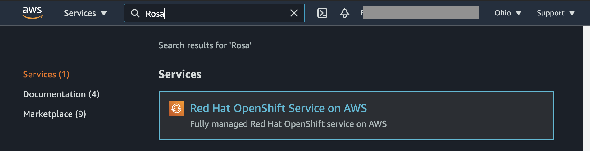

  2. Click **Enable Openshift** button in the ROSA services page.

      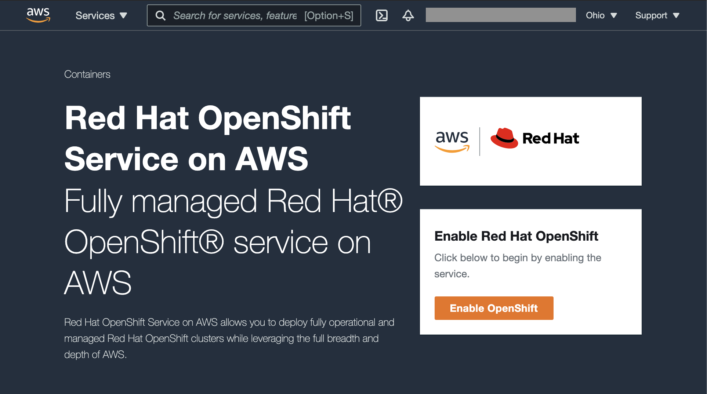

* Download the CLI
  1. Rosa CLI can be downloaded from the ROSA page, once it is enabled.

      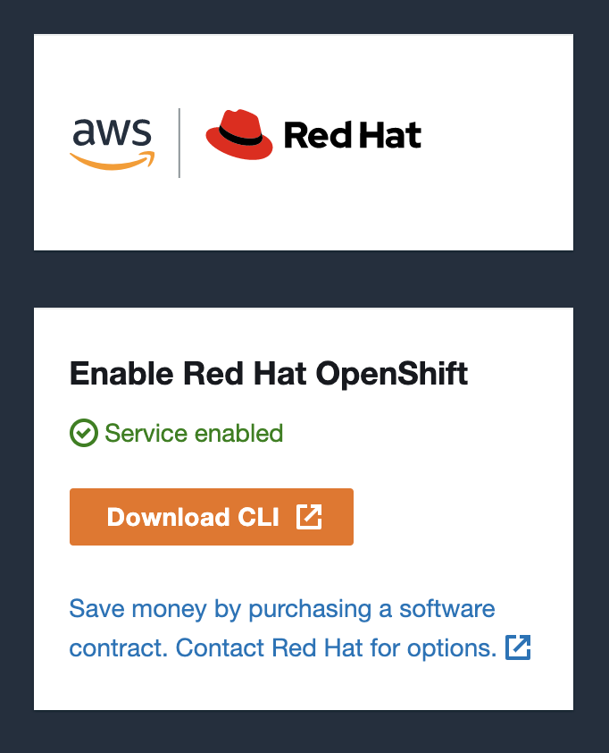

  2. Click on **Download CLI** button or go to [ROSA CLI page](https://www.openshift.com/products/amazon-openshift/download).

      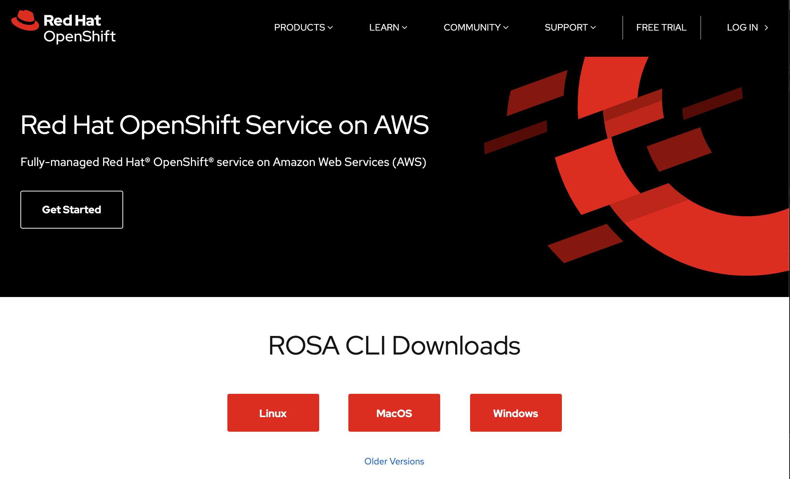

* Create a ROSA secret, it is retrieved from https://cloud.redhat.com/openshift/token/rosa

    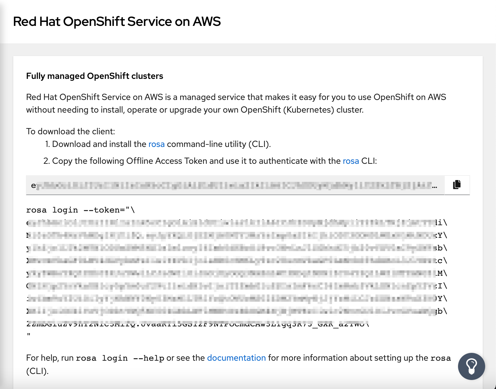


---

## Instructions


### Setup cluster

ROSA cluster work is performed through the `rosa` cli. The CLI is typically supplemented by the `oc` command line.

- Login to ROSA: `rosa login --token=<token>`
    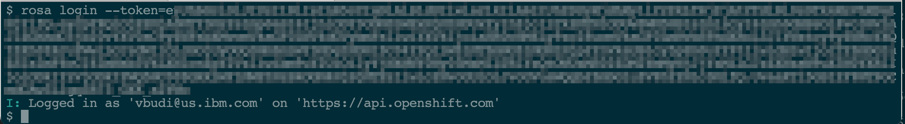

Once you login to ROSA, you can create a cluster, the following list summarizes the common options for creating a ROSA cluster:

- cluster-name: name of the cluster - this name is used for subsequent commands for manipulating the cluster.
- version: openshift version
- multi-az: create machinesets in all zones within a region or only on the first zone
- region: target region for deployment
- channel-group: openshift upgrade channel - typically use `stable`
- compute-machine-type, compute-nodes: [machine types](https://aws.amazon.com/ec2/instance-types/) and number of compute nodes for this type.
- enable-autoscaling, min-replicas, max-replicas: the autoscaling properties of the cluster, max and min replicas only accepted when autoscaling is enabled
- machine-cidr, service-cidr, pod-cidr, host-prefix: network specifications for the cluster, see [network](golden-topology.md#networking)
- private: whether the endpoints are exposed to the public network or not
- subnet-ids: pairs of subnet ids per az (one private, one public - attached to internet gateway)

The following command creates a ROSA cluster:

```
export AWS_ACCESS_KEY_ID="AKIAAAAAAAAAAAAAAAAAAA"
export AWS_SECRET_ACCESS_KEY="xxxxxxxxxxxxxxxxxxxxxxxxxxxxxxxxxx"
export AWS_DEFAULT_REGION="us-east-2"
rosa create cluster --cluster-name rosa-test-001 --version 4.6.27 --multi-az --region us-east-2 --compute-machine-type m5.xlarge --compute-nodes 3
```

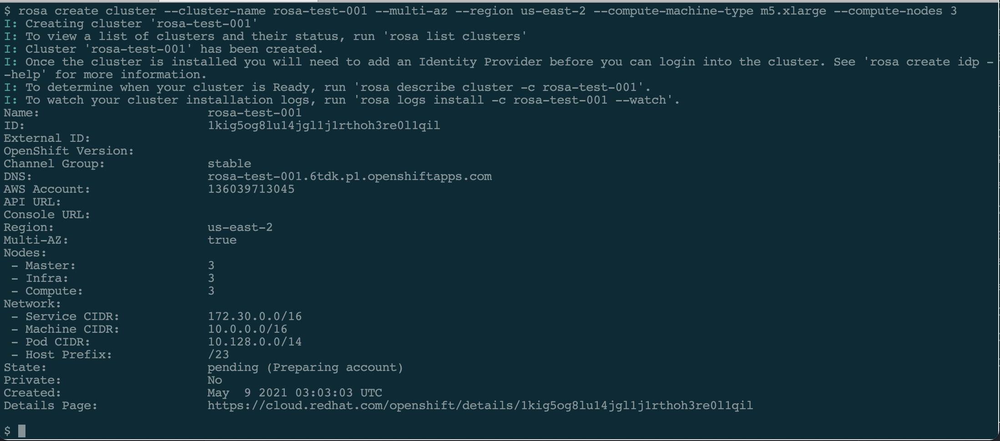

The cluster status will be `pending` then `installing` and later `ready`. Once you have the cluster `ready` (it may take up to an hour) you can check it using the following command:

```
rosa describe cluster --cluster=test-rosa-001
```

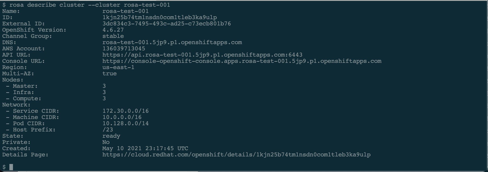

You can also go to the URL in the cluster description to get the progress log.

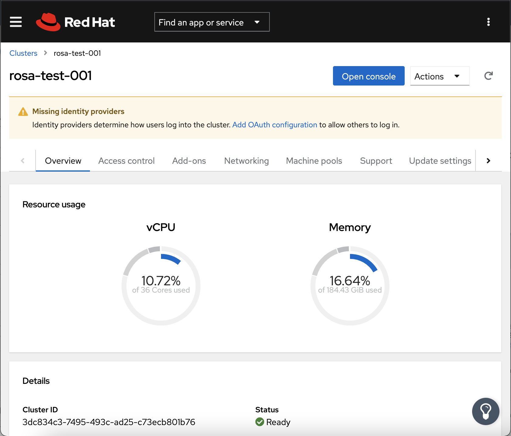

With the ROSA cluster is ready, you can add the following features:

- admin: adding cluster-admin user
- idp: authentication method can be added, such as from github or ldap or other
- machinepool: adding a machineset or machinepool with different worker specifications
- addons: (codeready container, cluster logging addon etc)

### Authentication

ROSA provides 2 methods for authentication:
- A cluster-admin user
    ```
    rosa create admin --cluster <clustername>
    ```

    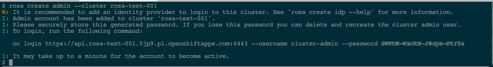

- Identity provider integration, the following example is for github integration:
    ```
    rosa create idp --cluster <clustername> --type github --name <name> --organization <github-org>
    ```

    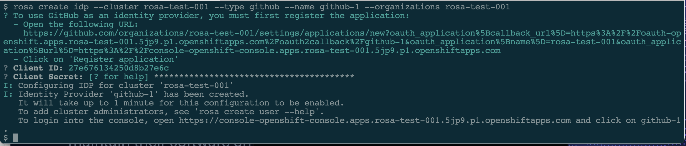

    The integration with github as the example show, requires a github token, which can be retrieved using the URL listed when the command is executed.

    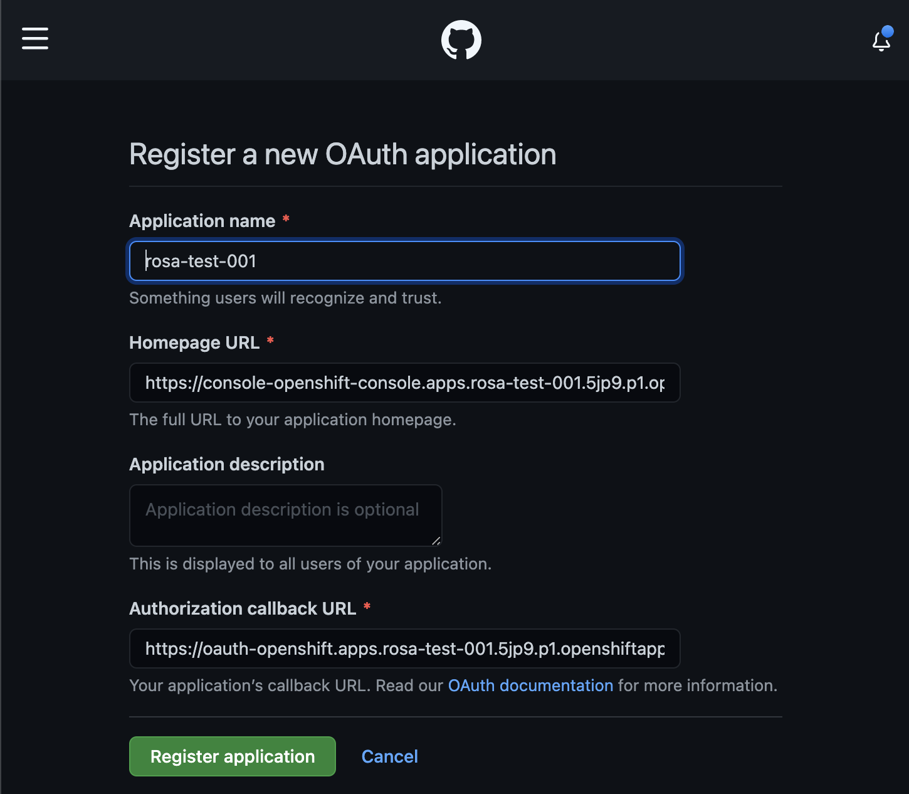

    when you click **Register application**, you are presented with the GitHub client Id and you can generate GitHub secret (which must be copied to the idp command).

    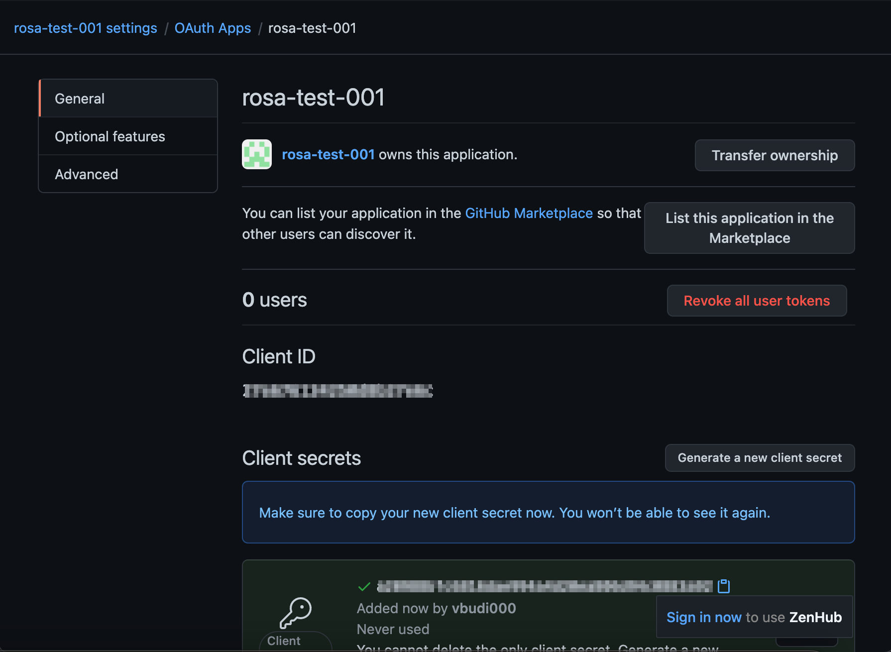

Once you have created an admin user and idp, your OpenShift login Web page shows those methods:

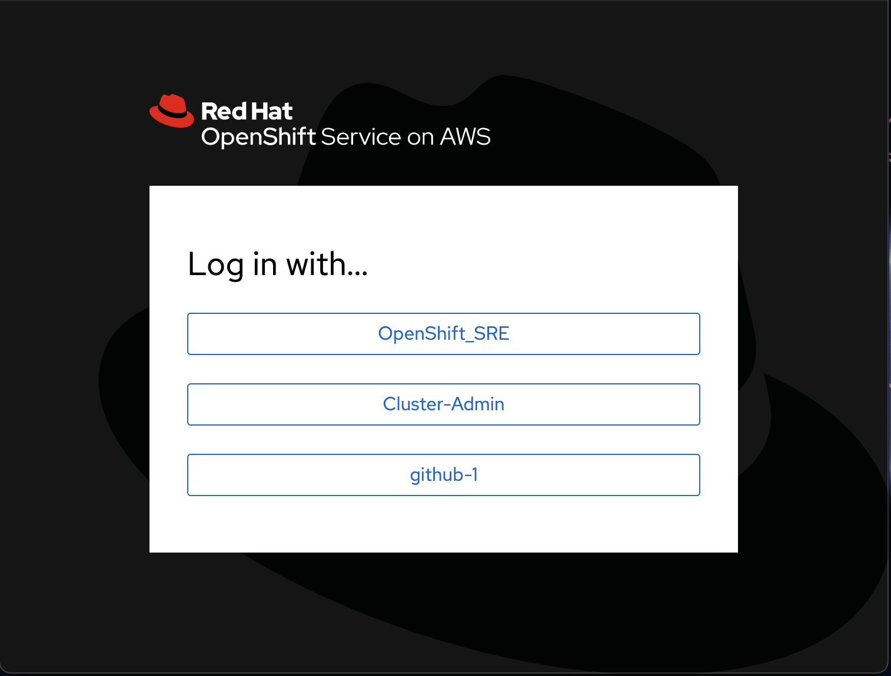

### OpenShift Container Storage

OCS in ROSA can be installed from the Web UI, there are some validations in a managed OpenShift that restrict OCS installation.

1. Create the machine pool for the storage nodes:

    ```
    rosa create machinepool --cluster rosa-test-001 --name storage-nodes --instance-type m5.4xlarge --replicas 3 \
    --taints 'node.ocs.openshift.io/storage=true:NoSchedule' \
    --labels 'node-role.kubernetes.io/storage=,cluster.ocs.openshift.io/openshift-storage='
    ```
    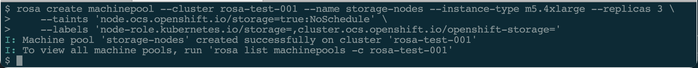

2. Wait until the nodes becomes ready (notice that it creates one machinesets per zones and one machine per machineset).

    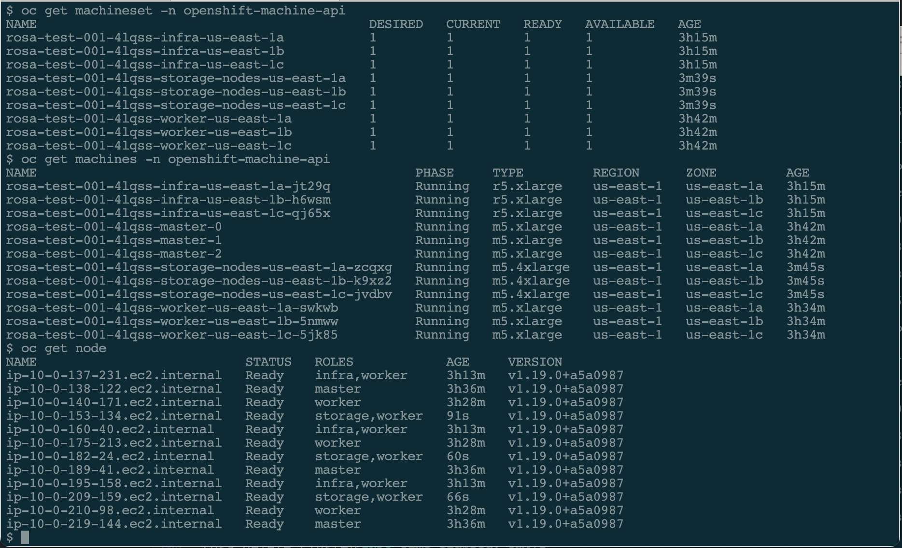

3. Go to the Web UI and login as `cluster-admin`, select **Operators > Operator Hub** and search for `OCS`. Click on the OpenShift Container Storage tile and you are presented with the Operator detail screen and click **Install**.

    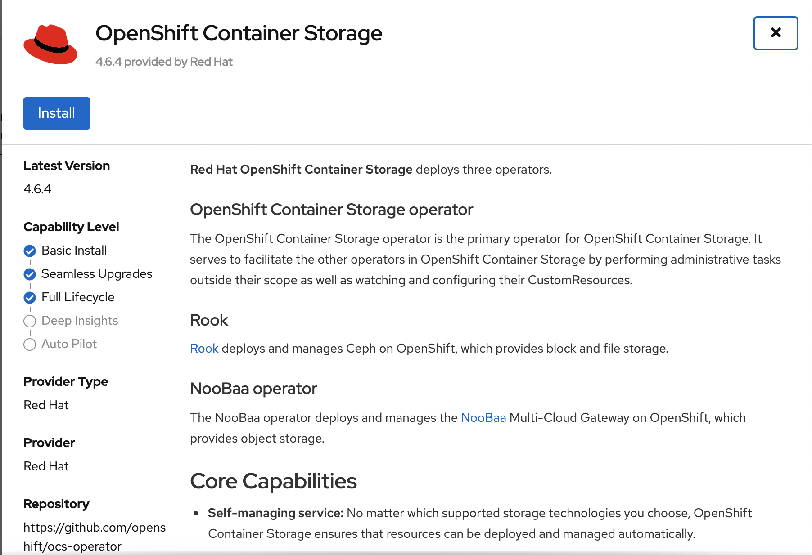

4. In the OCS installation page, click **Install** again.

    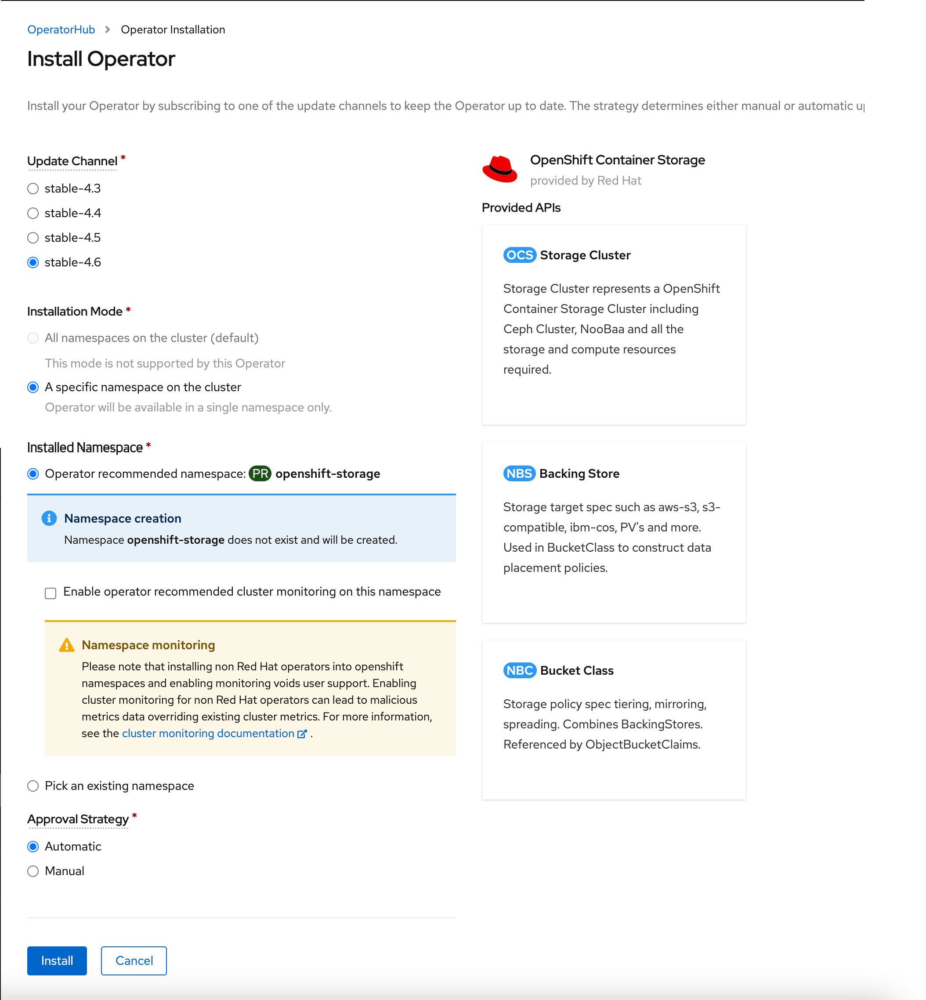

5. After a couple of minutes, the Status is installed and proceed to the installed operator page.

    

6. Click on the **OpenShift Container Storage** and select the **Storage Cluster** tab and click **Create Storage Cluster**. Specify the necessary argument (the nodes would have been preselected) and click **Create**.

    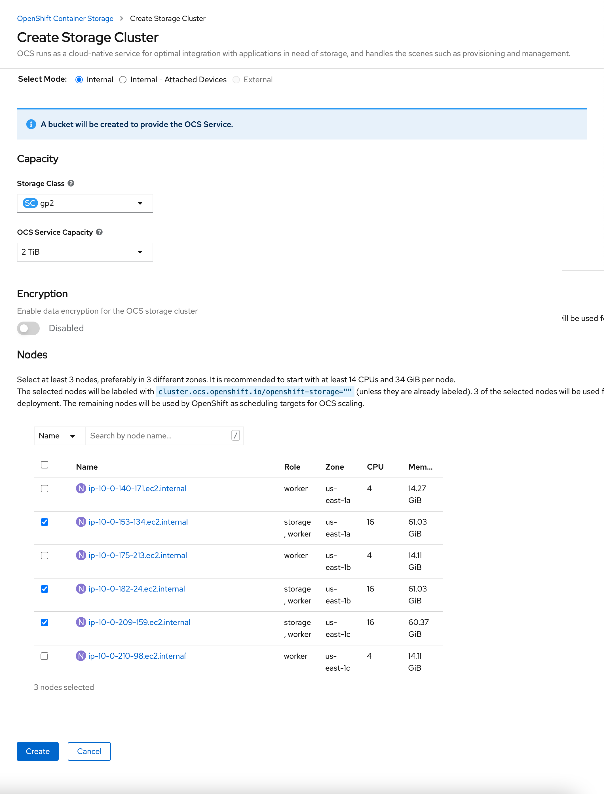

Once the storage cluster is available, your cluster is ready for use.

