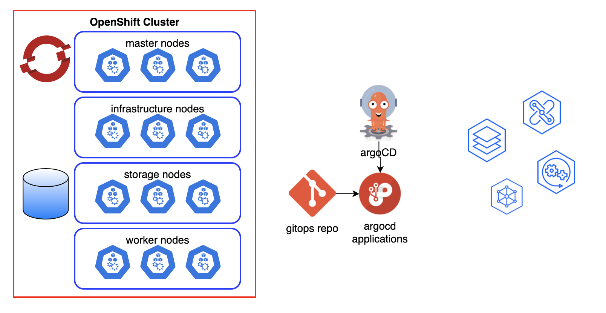

# What are the Production Deployment Guides?

<!--- cSpell:ignore unmanaged Quickstart Paks practitioners qube cntk autoplay allowfullscreen apic walkthrough cpdbase Quickstarts -->

The **Cloud Pak Production Deployment Guides** document and demonstrate how to design, deploy and operate cloud-native solutions leveraging IBM Cloud Pak capabilities in Red Hat OpenShift environments.
The guides focus on **Production** level qualities of services such as High Availability, Security and Performance including how to design, install and manage your Cluster in the popular managed and unmanaged Cloud environments as well as tackling disconnected or air-gapped environments.

## Production Deployment Guide objectives

There are a number of objectives behind providing the Production Deployment Guides. The three main goals of the Guides are provided below:

### Provide opinionated, validated Production topologies

There are many different topology related options to consider when deploying Cloud Paks in Production and often our customers are looking for IBM to guide them to the right decisions for their environment. These guides provide an opinionated approach that has been validated in each of the major clouds by a team of IBMers including field practitioners, developers and thought leaders. 

More information can be read in [golden-topology](../infrastructure/golden-topology.md).

### Provide a GitOps driven automation framework 

What is GitOps? 

GitOps requires us to describe the entire system declaratively in Git where the desired system state is versioned, managed and applied by software agents.

[Automation](../automation/why-automate.md) is key for scale in the Cloud world and OpenShift and Cloud Paks are no different. The implementation code and artifacts provided along with these guides are based on a GitOps approach where infrastructure and everything deployed in to an OpenShift Cluster (including Cloud Paks) is described as code and is managed in the same way that application code would be. 

More information on the gitops structure can be read in [gitops](../gitops/structure.md) and the different personas that can benefit from this guide is listed in [personas](../gitops/personas.md).

### Enable IBMers to setup Production topologies

These guides and the assets provided along with them are designed for use by IBM field practitioners from Customer Success, Tech Sales, Tech Garage and Expert Labs. Before a customer is ready for Production, the [**Cloud Pak Quickstarts**](../quickstart/overview.md) can be used to **show** a Customer how to run a given Cloud Pak capability on any cloud and to provide a foundation to discuss automation, GitOps and cloud-native concepts. Once the customer is ready to discuss their Production topology, the [**Infrastructure**](../infrastructure/infra-gitops.md) assets will be important in showing how to design a Cluster with the required qualities of service. Finally, once the topology is agreed, the automation provided by the guides can be used to quickly configure a Production cluster and deploy workloads. 

!!! note
    Before using this guide, check the following [pre-requisites](prerequisites.md) and [important updates](whats-new.md).

Go to the [Hands-on Guides](using.md) section if you would like to try out some hands-on activities.

## Video Introduction

This short video describes the motivation behind Production Deployment Guides, what its GitOps configurations can do, and the basic structure of the solution.

<iframe width="560" height="315" src="https://www.youtube.com/embed/1PPPwJOvL-c" title="YouTube video player" frameborder="0" allow="accelerometer; autoplay; clipboard-write; encrypted-media; gyroscope; picture-in-picture" allowfullscreen></iframe>

## Guided walkthrough

If you'd like to have a guided walkthrough of what the Production Deployment Guides provide, check out this video demonstration of the Guides in action:

## Components of the Production Deployment Guides

As the name suggests, the Production Deployment Guides provide a collection of guidance that can be used to deploy IBM Cloud Paks in Production Topologies on different cloud providers. 
The following provides a listing of the assets that make up the Production Deployment Guides:

- [**Infrastructure**](../infrastructure/golden-topology.md) - best practice, validated, opinionated topologies for running OpenShift and Cloud Paks on each of the major clouds 
- [**GitOps**](../gitops/structure.md) - a deep dive in to our opinionated GitOps approach and repository structure and a step by step guide to configure your cluster 
- [**Quickstart Demos**](../quickstart/overview.md) - a series of demonstrations that can be used to take a blank cluster and configure it to demonstrate GitOps and the cloud-native capabilities of the IBM Cloud Paks including:
    - [**MQ**](../quickstart/quickstart-mq.md)
    - [**App Connect Enterprise**](../quickstart/quickstart-ace.md)
    - [**API Connect**](../quickstart/quickstart-apic.md)
    - [**Process Mining**](../quickstart/quickstart-process-mining.md)
- [**Cloud Pak Guides**](../guides/guides-overview.md) - in-depth guides addressing Production level qualities of service for each of the Cloud Pak capabilities including:
    - [**MQ**](../guides/cp4i/mq/overview/overview.md)
    - [**App Connect Enterprise**](../guides/cp4i/ace/overview/overview.md)
    - [**API Connect**](../guides/cp4i/apic/overview/overview.md)
    - [**Process Mining**](../guides/cp4ba/process-mining/overview/overview.md)
    - [**Cloud Pak for Data**](../guides/cp4d/cpdbase/overview/cpd-overview.md)
    - [**Cloud Pak for Security**](../guides/cp4s/cp4s-tree/overview/overview.md)

To start deploying IBM Cloud Pak using this guide, read [deployment paths](using.md).

