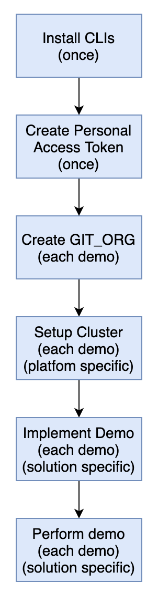

# What are Quick-start Demos?

<!--- cSpell:ignore qube cntk autoplay allowfullscreen Quickstart apic -->

--8<-- "quickstart-overview.md"

---

## Quick-start Demo Overview

The overall process for running  Quick-start Demos is as follows:

- Install the necessary [CLI](#cli-tools). This task is only performed once, regardless how many times you run a Quick-start Demos.

- Create a [GitHub Personal Access Token](#create-a-git-personal-access-token-pat) that you can use to authenticate to GitHub. This task is only performed once. You can use the same Personal Access Token for different demos.

- [Setup a Git organization](#create-a-custom-git-organization), you can either create a new organization for each time you perform a demo or you clean up all the repositories in that organization before using it for a new demo.

- Prepare an OpenShift cluster, you perform this for each Demo, the instruction assumes that you start from a new cluster. The instruction here depends on the platform you choose.

- Implement the Demos scenario - this is typically done using the `bootstrap.sh` script.

- Explore the generated environment.

## Additional Considerations

The Quick-start Demos is typically implemented on a single OpenShift cluster that has a sufficient compute and storage capabilities. Each demo scenario come with the list of compute and storage requirements.

To setup your OpenShift cluster, see [Cluster setup](../infrastructure/cluster.md).
