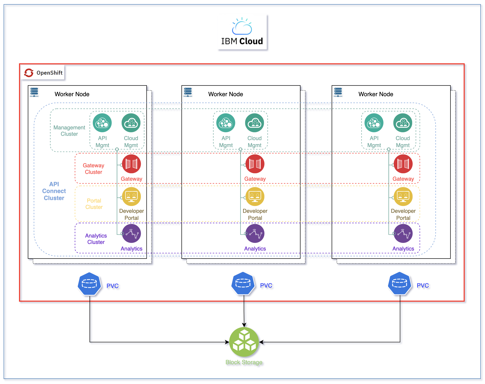

# IBM API Connect Quickstart

<!--- cSpell:ignore APIC qube cntk autoplay allowfullscreen Codespaces -->

--8<-- "quickstart-overview.md"

By the end of this tutorial, you should have a highly available deployment of IBM API Connect on a Red Hat OpenShift Kubernetes Service on IBM Cloud as shown below.

{: style="max-height:800px"}

---

--8<-- "gitops-cluster-prereq.md"

--- 

--8<-- "techzone-roks-bootstrapped-cluster.md"

    !!! note
        For this IBM API Connect quickstart we recommend you to request the Red Hat OpenShift on IBM Cloud cluster with GitOps Configuration with the following size:
          
          * Worker Node Count = **3**
          * Worker Node Flavor = **16 CPU x 64 GB**

--8<-- "techzone-roks-bootstrapped-cluster-use.md"

---

--8<-- "quickstart-install-required-cli.md"

---

--8<-- "quickstart-select-resources.md"

### Instructions 

1. You can execute the following steps either locally by cloning the `multi-tenancy-gitops` GitHub repository the IBM Technology Zone environment request automation has forked into the GitHub organization you created in the Pre-requisites section above to your local workstation (and then make changes from you local workstation and commit and deliver those) or by using the new VSCode extension of GitHub Codespaces capability straight from your web browser (just open the `multi-tenancy-gitops` repository in your Git Organization in your browser and press the `.` key):
   
    1. Review the `Infrastructure` layer [kustomization.yaml](https://github.com/cloud-native-toolkit/multi-tenancy-gitops/blob/master/0-bootstrap/single-cluster/1-infra/kustomization.yaml) and un-comment the resources to deploy to match the [IBM API Connect recipe](https://github.com/cloud-native-toolkit/multi-tenancy-gitops/blob/master/doc/apic-recipe.md#infrastructure---kustomizationyaml).
    1. Review the `Services` layer [kustomization.yaml](https://github.com/cloud-native-toolkit/multi-tenancy-gitops/blob/master/0-bootstrap/single-cluster/2-services/kustomization.yaml) and un-comment the resources to deploy to match the [IBM API Connect recipe](https://github.com/cloud-native-toolkit/multi-tenancy-gitops/blob/master/doc/apic-recipe.md#services---kustomizationyaml).
    1. Review the `storage` and `high availability` options for the [IBM API Connect cluster definition](https://github.com/cloud-native-toolkit/multi-tenancy-gitops/blob/master/0-bootstrap/single-cluster/2-services/argocd/instances/ibm-apic-instance.yaml) explained in the [IBM API Connect recipe](https://github.com/cloud-native-toolkit/multi-tenancy-gitops/blob/master/doc/apic-recipe.md#storage---ibm-apic-instanceyaml).
    1. Commit and push changes to your git repository (the following code refers to the commands when you cloned the `multi-tenancy-gitops` repository locally on your workstation)
    ```bash
    git add .
    git commit -m "initial bootstrap setup"
    git push origin
    ```

2. After 40 mins approximately:
    1. Make sure that the phase in which the IBM API Connect cluster is at is `Ready`
    ```bash
    oc get APIConnectCluster apic-cluster -n tools -o=jsonpath='{.status.phase}'
    ```
    Expected output is
    ``` { .text .no-copy }
    Ready
    ```
    
    1. Make sure that the state in which the IBM API Connect cluster installation is at is `4/4`
    ```bash
    oc get APIConnectCluster apic-cluster -n tools -o=jsonpath='{.status.state}'
    ```
    Expected output is
    ``` { .text .no-copy }
    4/4
    ```
    

3. You can now access your IBM API Connect Cloud Manager
  ```bash
  oc get APIConnectCluster apic-cluster -n tools -o=jsonpath='{.status.endpoints[?(@.name=="admin")].uri}'
  ```

4. The credentials for logging into the IBM API Connect Cloud Manager are `admin/<password>` where password is stored in a secret.
   ```bash
   oc get secret apic-cluster-mgmt-admin-pass -n tools -o=jsonpath='{.data.password}' | base64 -D
   ```

!!! info
    The deployment process **WILL NOT** configure all of the IBM API Connect subsystems that this quickstart got deployed to work together straight away. Instead, you will need to manually complete the following [IBM API Connect Cloud Manager configuration checklist](https://www.ibm.com/docs/en/api-connect/10.0.x?topic=environment-cloud-manager-configuration-checklist) or you can go to the [Configure API](../guides/cp4i/apic/configuration/ibm-cloud.md) section of the in depth IBM API Connect tutorial to create an OpenShift Pipeline that gets your recently deployed IBM API Connect instance configured automatically so that you can start working with it right away.

!!! warning "Important"
    Before going through the [Configure API](../guides/cp4i/apic/configuration/ibm-cloud.md) section aforementioned, **you must fork the [GitOps Application Repository](https://github.com/cloud-native-toolkit-demos/multi-tenancy-gitops-apps)** into the GitHub organization that you created at the beginning of this IBM API Connect quickstart tutorial in the Pre-requisites section.

!!! warning "Important"
    The [Configure API](../guides/cp4i/apic/configuration/ibm-cloud.md) section of the in depth IBM API Connect tutorial that creates an OpenShift Pipeline that gets your recently deployed IBM API Connect instance configured automatically expects/assumes you have previously cloned the `multi-tenancy-gitops` GitHub repository the IBM Technology Zone environment request automation has forked into the GitHub organization you created in the Pre-requisites section above to your local workstation into `$HOME/git`. As a result, you will need to clone that `multi-tenancy-gitops` GitHub repository manually into such location or follow that [Configure API](../guides/cp4i/apic/configuration/ibm-cloud.md) section with precaution to replace such location where needed.
