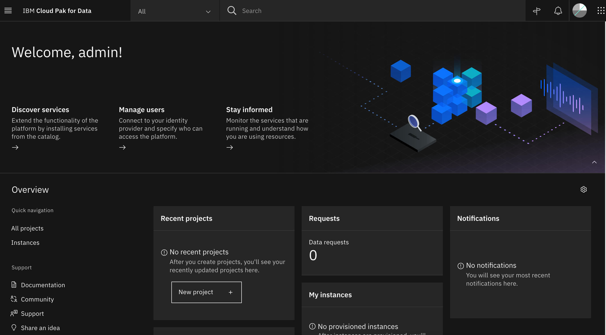
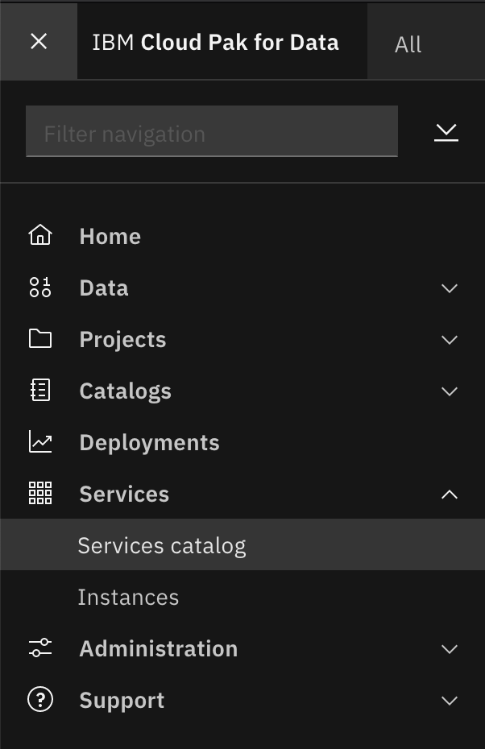
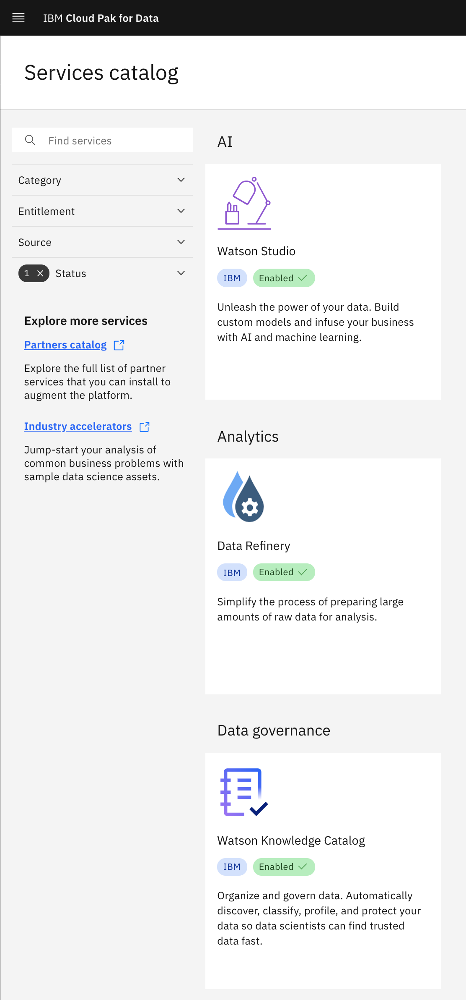

# Cloud Pak for Data - Watson Studio Quickstart

<!--- cSpell:ignore qube cntk autoplay allowfullscreen -->


--8<-- "quickstart-overview.md"

---

--8<-- "gitops-cluster-prereq.md"

---

--8<-- "techzone-roks-bootstrapped-cluster.md"

    !!! note
        For this Cloud Pak for Data - Watson Studio Quickstart we recommend you to request the Red Hat OpenShift on IBM Cloud cluster with GitOps Configuration with the following size:
          
          * Worker Node Count = **5**
          * Worker Node Flavor = **16 CPU x 64 GB**
          * NFS Size = **500 GB**

--8<-- "techzone-roks-bootstrapped-cluster-use.md"

---

--8<-- "quickstart-install-required-cli.md"

---

## Select resources to deploy

- Clone the [`multi-tenancy-gitops`](https://github.com/cloud-native-toolkit/multi-tenancy-gitops) repository in your Git Organization if you have not already done so and select the K8s resources to deploy in the [infrastructure](https://github.com/cloud-native-toolkit/multi-tenancy-gitops/blob/master/0-bootstrap/single-cluster/1-infra/kustomization.yaml) and [services](https://github.com/cloud-native-toolkit/multi-tenancy-gitops/blob/master/0-bootstrap/single-cluster/2-services/kustomization.yaml) layers.

### Instructions

1. Select a profile and delete the others from the [`0-bootstrap`](https://github.com/cloud-native-toolkit/multi-tenancy-gitops/tree/master/0-bootstrap) directory.  If this is your first usage of the gitops workflow, Use the `single-cluster` profile.
    ```bash
    GITOPS_PROFILE="0-bootstrap/single-cluster"
    ```

1. Review the `Infrastructure` layer [kustomization.yaml](https://github.com/cloud-native-toolkit/multi-tenancy-gitops/blob/master/0-bootstrap/single-cluster/1-infra/kustomization.yaml) and un-comment the resources to deploy to match the [Cloud Pak for Data - Watson Studio recipe](https://github.com/cloud-native-toolkit/multi-tenancy-gitops/blob/master/doc/cp4d-ws-recipe.md).

1. Review the `Services` layer [kustomization.yaml](https://github.com/cloud-native-toolkit/multi-tenancy-gitops/blob/master/0-bootstrap/single-cluster/2-services/kustomization.yaml) and un-comment the resources to deploy to match the [Cloud Pak for Data - Watson Studio recipe](https://github.com/cloud-native-toolkit/multi-tenancy-gitops/blob/master/doc/cp4d-ws-recipe.md).

1. Commit and push changes to your git repository
    ```bash
    git add .
    git commit -m "initial bootstrap setup"
    git push origin
    ```

### Verifying the Installation

1. Get the status of the control plane (lite-cr)

    ```
    oc get ZenService lite-cr -n tools -o jsonpath="{.status.zenStatus}{'\n'}"
    ```

    Cloud Pak for Data control plane is ready when the command returns `Completed`. If the command returns another status, wait for some more time and rerun the command.

1. Get the status of Watson Studio (ws-cr)

    ```
    oc get WS ws-cr -n tools -o jsonpath="{.status.wsStatus} {'\n'}"
    ```

    Watson Studio is ready when the command returns `Completed`.

### Cloud Pak for Data UI

1. Get the URL of the Cloud Pak for Data web client and open it in a browser.

    ```
    echo https://`oc get ZenService lite-cr -n tools -o jsonpath="{.status.url}{'\n'}"`
    ```

1. The credentials for logging into the Cloud Pak for Data web client are `admin/<password>` where password is stored in a secret.

    ```
    oc extract secret/admin-user-details -n tools --keys=initial_admin_password --to=-
    ```

1. Log into the IBM Cloud Pak for Data UI using the password from previous step.

    

1. Click on the navigation menu icon on the top left corner. Click on Services menu option to expand it, then select Services catalog.

    {: style="max-height:500px"}

1. Under Status, select "Enabled" to display only the services that are installed and enabled in Cloud Pak for Data.

    {: style="max-height:540px"}

1. Notice the green colored text that says Enabled next to Watson Studio. There might be other enabled services as well.

    {: style="max-height:540px"}
    
