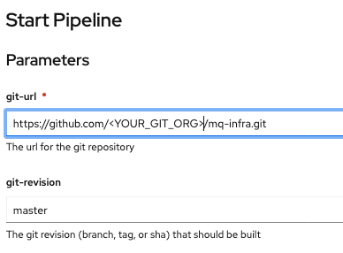
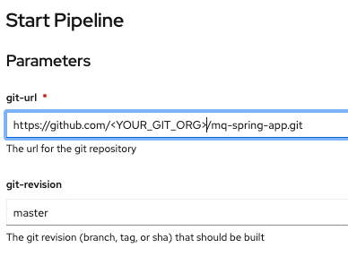

# IBM MQ Quickstart

<!--- cSpell:ignore qube cntk autoplay allowfullscreen -->

--8<-- "quickstart-overview.md"

The following instructions is from the README.md in this repository: [https://github.com/cloud-native-toolkit-demos/multi-tenancy-gitops-mq](https://github.com/cloud-native-toolkit-demos/multi-tenancy-gitops-mq).

---

--8<-- "gitops-cluster-prereq.md"

---

--8<-- "techzone-roks-empty-cluster.md"

---

--8<-- "quickstart-install-required-cli.md"

---

## Deploy the IBM MQ operator and its pre-requisites
- Log in with the Github CLI 
    ```bash
    gh auth login
    ```

- Setup a local git directory to clone all the git repositories
    ```bash
    mkdir -p mq-quickstart
    ```

- Download [sealed-secrets-ibm-demo-key.yaml](https://bit.ly/demo-sealed-master) and save in the default location `~/Downloads/sealed-secrets-ibm-demo-key.yaml`. You can override the location when running the script with `SEALED_SECRET_KEY_FILE`. Remember do not check this file to git.

- Log into your OCP cluster, substituting the `--token` and `--server`
  parameters with your values:

    ```bash
    oc login --token=<token> --server=<server>
    ```

    If you are unsure of these values, click your user ID in the OpenShift web console and select `Copy login command`.

- Run the bootstrap script, specify the git org `GIT_ORG` and the output directory to clone all repos `OUTPUT_DIR`. You can use `DEBUG=true` for verbose output.  Note, the deployment of all selected resources will take 30 - 45 minutes.  
    ```bash
    curl -sfL https://raw.githubusercontent.com/cloud-native-toolkit-demos/multi-tenancy-gitops-mq/ocp47-2021-2/scripts/bootstrap.sh | DEBUG=true GIT_ORG=<YOUR_GIT_ORG> OUTPUT_DIR=mq-quickstart bash
    ```

- Open the ArgoCD UI from the OpenShift Console, then use `admin` as the username and password should have printed in the previous command

- You can open the output directory with VSCode and the set of required git repositories has been forked into your GitHub Organization. 
    ```bash
    code mq-quickstart
    ```

- At this point, you can already demonstrate the value of using a GitOps approach (OpenShift Pipelines) to declaratively deploy the IBM MQ operator and its dependencies.  

---

## Execute pipelines to deploy a Queue Manager and Spring application to write messages to the queue.
- Before running the pipelines, verify the Platform Navigator and Common Services instances have been deployed successfully.
    ```bash
    oc get commonservice common-service -n ibm-common-services -o=jsonpath='{.status.phase}'
    # Expected output = Succeeded

    oc get platformnavigator -n tools -o=jsonpath='{ .items[*].status.conditions[].status }'
    # Expected output = True
    ```
- Configure the cluster with your GitHub Personal Access Token (PAT), update the `gitops-repo` Configmap which will be used by the pipeline to populate the forked gitops repository and add the `artifactory-access` Secret to the `ci` namespace.  Specify values for the `GIT_USER`, `GIT_TOKEN` and `GIT_ORG` environment variables.
    ```bash
    cd mq-quickstart/gitops-3-apps/scripts

    curl -sfL https://raw.githubusercontent.com/cloud-native-toolkit-demos/multi-tenancy-gitops-apps/ocp47-2021-2/scripts/mq-kubeseal.sh | DEBUG=true GIT_USER=<GIT_USER> GIT_TOKEN=<GIT_TOKEN> GIT_ORG=<GIT_ORG> bash
    ```

    As this script executes it will issue a `git diff` to allow you to review
    its customizations.
    - Type `q` when you're finished examining the changes; the script will continue to completion.

- Run a pipeline to build and deploy a Queue Manager
    - Log in to the OpenShift Web Console.
    - Select Pipelines > Pipelines view in the `ci` namespace. 
    - Click the `mq-infra-dev` pipeline and select Actions > Start.
    - Provide the HTTPS URL for the `mq-infra` repository in your Git Organization.

    

- Run a pipeline to build and deploy a Spring application
    - Log in to the OpenShift Web Console.
    - Select Pipelines > Pipelines view in the `ci` namespace. 
    - Click the `mq-spring-app-dev` pipeline and select Actions > Start.
    - Provide the HTTPS URL for the `mq-spring-app` repository in your Git Organization.

    


