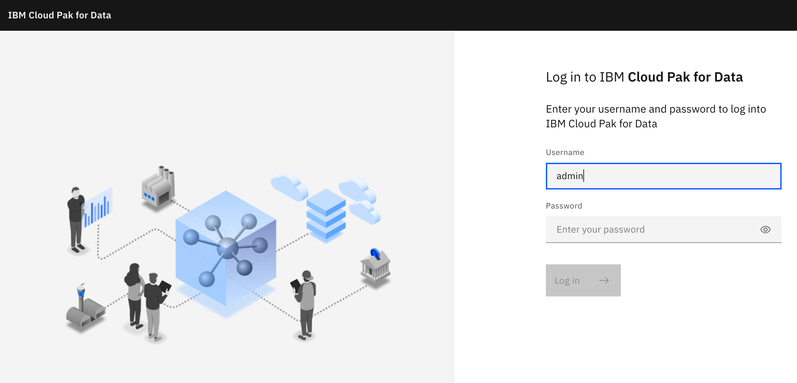
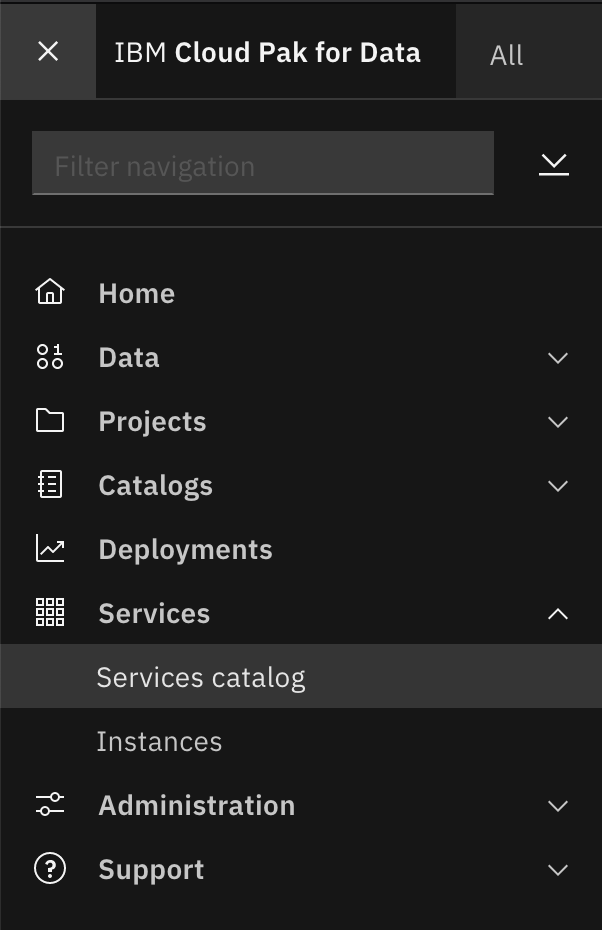
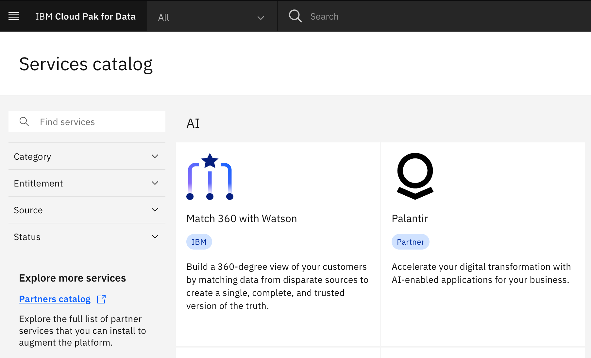

<!--- # Cloud Pak for Data UI --->

<!--- cSpell:ignore Ceph singl apiconnectcluster ibmc APIC Availability unmanaged practioners Pak Paks Quickstart qube cntk autoplay allowfullscreen -->

Let's make sure that our IBM Cloud Pak for Data instance is up and running. Do that by logging into the IBM Cloud Pak for Data user interface.

1. Obtain IBM Cloud Pak for Data console URL by executing

    ```
    echo https://`oc -n cloudpak get ZenService lite-cr -o jsonpath="{.status.url}{'\n'}"`
    ```

1. Open the URL in a browser and you will be presented with the IBM Cloud Pak for Data user interface login option. Enter `admin` as username.

    

1. Obtain admin password by executing

    ```
    oc -n cloudpak extract secret/admin-user-details --keys=initial_admin_password --to=-
    ```

1. Log into the IBM Cloud Pak for Data UI using the password from previous step.

    

1. Click on the navigation menu icon on the top left corner. Click on Services menu option to expand it, then select Services catalog.

    {: style="max-height:500px"}

1. The various services installed with IBM Cloud Pak for Data will be displayed.

    {: style="max-height:540px"}

That is it to get a working instance of IBM Cloud Pak for Data.
