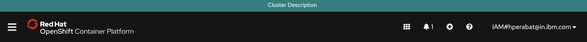
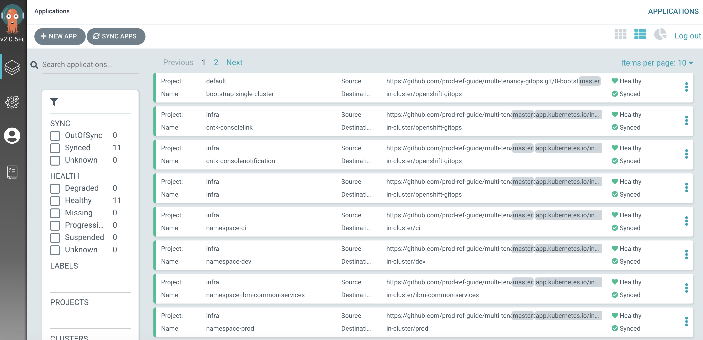
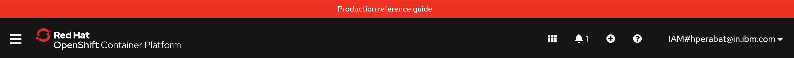
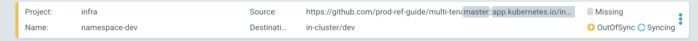
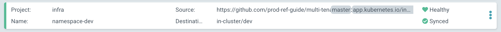

## ArgoCD change management and governance

<!--- cSpell:ignore resynched consolenotification subfolders rolebindings rolebinding CICD qube cntk autoplay allowfullscreen -->

In this final section about managing infrastructure resources, let's explore how
ArgoCD provides some advanced resource management features:

*Dynamic*

*Monitored*

  1. *Locate your GitOps repository*

    If necessary, change to the root of your GitOps repository, which is typically
    `$HOME/git`.

    Issue the following command to change to your GitOps repository:

    ```bash
    cd $HOME/git
    cd multi-tenancy-gitops
    ```

  2. *Customize the web console banner*

    Examine the banner in the OpenShift web console:

    {: style="max-height:400px"}

    We're going to use GitOps to modify this banner dynamically.

  3. *The banner YAML*

    This banner properties are defined by the YAML in
    `/0-bootstrap/single-cluster/1-infra/argocd/consolenotification.yaml`. This
    YAML is currently being used by the `cntk-consolenotification` ArgoCD application that was
    deployed earlier.

    We can examine the YAML with the following command:

    ```bash
    cat 0-bootstrap/single-cluster/1-infra/argocd/consolenotification.yaml
    ```

    which shows the banner properties are part of the `ConsoleNotification` custom
    resource:

    ```{ .yaml .no-copy }
    apiVersion: argoproj.io/v1alpha1
    kind: Application
    metadata:
      name: cntk-consolenotification
      labels:
        gitops.tier.layer: infra
      annotations:
        argocd.argoproj.io/sync-wave: "100"
      finalizers:
        - resources-finalizer.argocd.argoproj.io
    spec:
      syncPolicy:
        automated:
          prune: true
          selfHeal: true
      destination:
        namespace: openshift-gitops
        server: https://kubernetes.default.svc
      project: infra
      source:
        path: consolenotification
        helm:
          values: |
            ocp-console-notification:
              ## The name of the ConsoleNotification resource in the cluster
              name: "banner-env"

              ## The background color that should be used for the banner
              backgroundColor: teal
              ## The color of the text that will appear in the banner
              color: "'#fff'"
              ## The location of the banner. Options: BannerTop, BannerBottom, BannerTopBottom
              location: BannerTop
              ## The text that should be displayed in the banner. This value is required for the banner to be created
              text: "Cluster Description"
    ```

    See how the banner at the top of the screen:
      * contains the text `Cluster Description`
      * is located at top of the screen
      * has the color `Teal`

  4. *Modify the YAML for this banner*

    Let's now change this YAML

    In your editor, modify this YAML and change the below fields as follows:

    ```yaml
    ocp-console-notification:
      ## The name of the ConsoleNotification resource in the cluster
      name: "banner-env"

      ## The background color that should be used for the banner
      backgroundColor: red
      ## The color of the text that will appear in the banner
      color: "'#fff'"
      ## The location of the banner. Options: BannerTop, BannerBottom, BannerTopBottom
      location: BannerTop
      ## The text that should be displayed in the banner. This value is required for the banner to be created
      text: "Production reference guide"
    ```

    It's clear that our intention is to modify the banner's `backgroundColor:red` and `text: Production reference guide` to the newly specified values. If you look at the `diff`:

    ```{ .bash }
    git diff
    ```

    you should see the following

    ``` {.diff .no-copy}
    diff --git a/0-bootstrap/single-cluster/1-infra/argocd/consolenotification.yaml b/0-bootstrap/single-cluster/1-infra/argocd/consolenotification.yaml
    index 30adf1a..596e821 100644
    --- a/0-bootstrap/single-cluster/1-infra/argocd/consolenotification.yaml
    +++ b/0-bootstrap/single-cluster/1-infra/argocd/consolenotification.yaml
    @@ -26,10 +26,10 @@ spec:
              name: "banner-env"

              ## The background color that should be used for the banner
    -         backgroundColor: teal
    +         backgroundColor: red
              ## The color of the text that will appear in the banner
              color: "'#fff'"
              ## The location of the banner. Options: BannerTop, BannerBottom, BannerTopBottom
              location: BannerTop
              ## The text that should be displayed in the banner. This value is required for the banner to be created
    -         text: "Cluster Description"
    +         text: "Production reference guide"
    ```

  5. *Make the web console YAML change active*

    Let's make these changes visible to the `cntk-consolenotification` ArgoCD
    application via GitHub.

    Add all changes in the current folder to a git index, commit them, and push
    them to GitHub:

    ```bash
    git add .
    git commit -s -m "Modify console banner"
    git push origin $GIT_BRANCH
    ```

    You'll see the changes being pushed to GitHub:

    ```{ .text .no-copy }
    Enumerating objects: 13, done.
    Counting objects: 100% (13/13), done.
    Delta compression using up to 8 threads
    Compressing objects: 100% (7/7), done.
    Writing objects: 100% (7/7), 670 bytes | 670.00 KiB/s, done.
    Total 7 (delta 5), reused 0 (delta 0)
    remote: Resolving deltas: 100% (5/5), completed with 5 local objects.
    To https://github.com/prod-ref-guide/multi-tenancy-gitops.git
       a1e8292..b49dff5  master -> master
    ```

    Let's see what effect they have on the web console.

  6. *A dynamic change to the web console*

    You can either wait for ArgoCD to automatically sync the `cntk-consolenotification`
    application or manually `Sync` it yourself:

    {: style="max-height:600px"}

    Returning to the OpenShift web console, you'll notice changes.

    {: style="max-height:100px"}

    Notice the **dynamic** nature of these changes; we updated the console YAML,
    pushed our changes to our GitOps repository and everything else happened
    automatically.

    As a result, our OpenShift console has a new banner color and text.

  7. *Governing changes to the* `dev` *namespace*

    Let's now look at how ArgoCD monitors Kubernetes resources for configuration
    drift, and what happens if it detects an unexpected change to a monitored
    resource.

    Don't worry about the following command; it might seem drastic and even
    reckless, but as you'll see, everything will be OK.

    Let's delete the `dev` namespace from the cluster:

    ```bash
    oc get namespace dev
    oc delete namespace dev
    ```

    See how the active namespace:

    ```{ .text .no-copy }
    NAME   STATUS   AGE
    dev    Active   2d18h
    ```

    is deleted:

    ```{ .text .no-copy }
    namespace "dev" deleted
    ```

    We can see that the `dev` namespace has been manually deleted from the
    cluster.

  8. *GitOps repository as a source of truth*

    If you switch back to the ArgoCD UI, you may see that ArgoCD has detected a
    configuration drift:

       * a resource is `Missing` (the `dev` namespace)
       * `namespace-dev` therefore is `OutOfSync`
       * `namespace-dev` is therefore `Syncing` with the GitOps repository

    {: style="max-height:90px"}

    After a while we'll see that `namespace-dev` is `Healthy` and `Synced`:

    {: style="max-height:90px"}

    ArgoCD has detected a configuration drift, and resynched with GitOps
    repository, re-applying the `dev` namespace to the cluster.

    !!! note
        You may miss seeing the first screenshot if ArgoCD detects and corrects the missing `dev` namespace before you get a chance to switch to the ArgoCD UI. Don't worry, you can try this operator again!

  9. *The restored* `dev` *namespace*

    Issue the following command to determine the status of the `dev` namespace:

    ```bash
    oc get namespace dev
    ```

    which confirms that the `dev` namespace has been re-instated:

    ```{ .text .no-copy }
    NAME   STATUS   AGE
    dev    Active   115s
    ```

    Note that it is a different instance of the `dev` namespace; as indicated by
    its `AGE` value.

    Notice the **governed** nature of these changes; GitOps is our source of truth
    about the resources deployed to the cluster. ArgoCD restores any resources
    that suffer from configuration drift to their GitOps-defined configuration.
