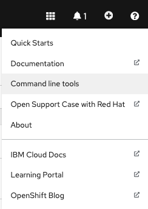

## Post cluster provisioning tasks

### Red Hat OpenShift cluster 
- An OpenShift v4.7+ cluster is required.  

### CLI tools
- Install the OpenShift CLI oc (version 4.7+) .  The binary can be downloaded from the Help menu from the OpenShift Console. 
    <details>
    <summary>Download oc cli</summary>

    {: style="max-height:400px"}
    </details>
    
- Log in from a terminal window.
    ```bash
    oc login --token=<token> --server=<server>
    ```

### IBM Entitlement Key
- The `IBM Entitlement Key` is required to pull IBM Cloud Pak specific container images from the IBM Entitled Registry.  To get an entitlement key, 

    1. Log in to [MyIBM Container Software Library](https://myibm.ibm.com/products-services/containerlibrary) with an IBMid and password associated with the entitled software.  
    2. Select the **View library** option to verify your entitlement(s). 
    3. Select the **Get entitlement key** to retrieve the key.

- A **Secret** containing the entitlement key is created in the `tools` namespace. 

    ```bash
    oc new-project tools || true
    oc create secret docker-registry ibm-entitlement-key -n tools \
    --docker-username=cp \
    --docker-password="<entitlement_key>" \
    --docker-server=cp.icr.io
    ```