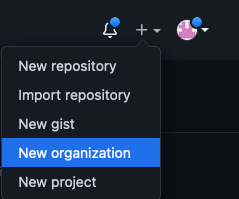
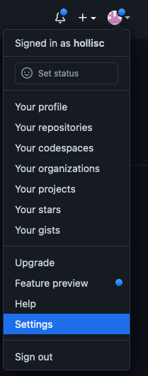
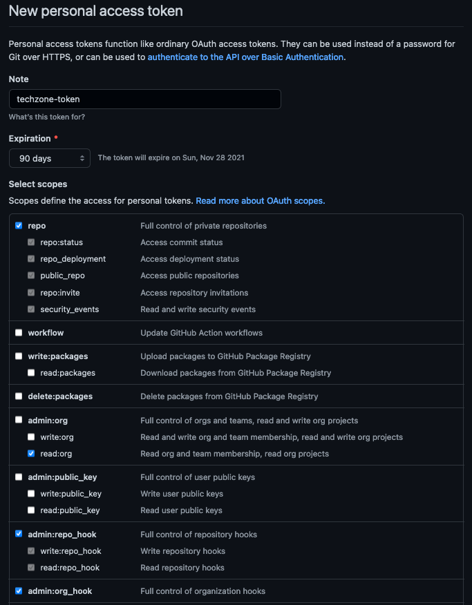
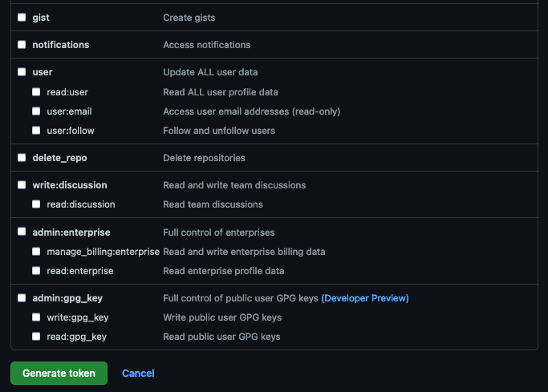

## Pre-requisites

### Create a custom Git Organization

Create a new [Git Organization](https://docs.github.com/en/organizations/collaborating-with-groups-in-organizations/creating-a-new-organization-from-scratch) to host the different GitOps repositories. 

Instructions: 

1. Log in to [http://github.com](https://github.com/) and select the option to create a **New organization**.

    

2. Click on `Create a free organization` plan. 

3. Complete the wizard by filling in the `Organization account name` and `Contact email` fields.  Select the `My personal account` bullet and complete the verification step and click Next. 

4. Skip the step to add members to the Organization. 

5. Complete the `Welcome to GitHub` questionnaire and click Submit.

6. Congratulations, you have successfully created a new Github Organization.

### Create a Git Personal Access Token (PAT)

Create a new [Git Personal Access Token](https://docs.github.com/en/github/authenticating-to-github/keeping-your-account-and-data-secure/creating-a-personal-access-token) with the appropriate scopes.  This will be required to run the application pipelines or to set up webhooks. 

Instructions: 

1. Log in to [http://github.com](https://github.com/) and click on **Settings**.

    

2. Select **Developer settings** and click on **Personal access tokens**.

3. Provide a name for the token, set the `Expiration` to 90 days ,set the following scopes and click **Generate token**.

    

    
 GitHub Personal Access Token scopes

    {: style="max-height:850px"}    
    {: style="max-height:480px"}  

    

  

4. Copy and save the **Personal Access Token**.  You will not be able to retrieve this value again later. 
