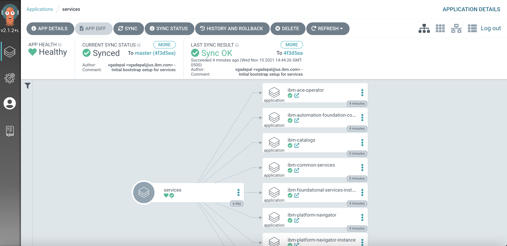

## Deploy services to the cluster

<!--- cSpell:ignore resynched resyncs configmaps consolenotification subfolders rolebindings rolebinding CICD qube cntk autoplay allowfullscreen storageclass -->

We've just had our first successful GitOps experience, using an ArgoCD
application to create the `ci`, `tools` and `dev` namespaces in our cluster.
There are few more components to create: IBM ACE, IBM Platform navigator,
IBM foundations, IBM automation foundations, IBM Catalog and Sealed secrets.

These components are part of the **services** layer in our architecture, and
that requires us to access **/0-bootstrap/single-cluster/2-services** within our GitOps repository.

  1. *How to deploy services*

      As we saw earlier, the `bootstrap-single-cluster` application uses the contents of the
      `/0-bootstrap/single-cluster/2-services` folder to determine which Kubernetes resources should be deployed
      in the cluster.

      Issue the following command to see what's currently deployed in the cluster:

      ```bash
      tree 0-bootstrap/single-cluster/2-services/ -L 3
      ```

      The resources currently deployed to the cluster map directly to this folder
      structure:

      ```bash
      0-bootstrap/single-cluster/
      ├── 1-infra
      │   ├── 1-infra.yaml
      │   ├── argocd
      │   │   ├── consolelink.yaml
      │   │   ├── consolenotification.yaml
      │   │   ├── infraconfig.yaml
      │   │   ├── machinesets.yaml
      │   │   ├── namespace-ci.yaml
      │   │   ├── namespace-dev.yaml
      │   │   ├── namespace-ibm-common-services.yaml
      │   │   ├── namespace-istio-system.yaml
      │   │   ├── namespace-openldap.yaml
      │   │   ├── namespace-openshift-storage.yaml
      │   │   ├── namespace-prod.yaml
      │   │   ├── namespace-sealed-secrets.yaml
      │   │   ├── namespace-staging.yaml
      │   │   ├── namespace-tools.yaml
      │   │   └── storage.yaml
      │   └── kustomization.yaml
      ├── 2-services
      │   ├── 2-services.yaml
      │   ├── argocd
      │   │   ├── instances
      │   │   └── operators
      │   └── kustomization.yaml
      ├── 3-apps
      │   ├── 3-apps.yaml
      │   ├── argocd
      │   │   ├── ace
      │   │   ├── apic
      │   │   ├── bookinfo
      │   │   ├── mq
      │   │   └── soapserver
      │   └── kustomization.yaml
      ├── bootstrap.yaml
      └── kustomization.yaml

      13 directories, 23 files
      ```

      This structure shows how only **infrastructure** ArgoCD applications -- and
      therefore their managed resources such as `ci`, `tools` and `dev` namespaces
      -- are deployed in the cluster.

  2. *Review ArgoCD services folder*

      Let’s examine the `0-bootstrap/single-cluster/2-services/kustomization.yaml`
      to see how ArgoCD manages the resources deployed to the cluster.

      Issue the following command:

      ```bash
      cat 0-bootstrap/single-cluster/2-services/kustomization.yaml
      ```

      We can see the contents of the `kustomization.yaml`:

      ```bash
      resources:
      # IBM Software
      #- argocd/operators/ibm-ace-operator.yaml
      #- argocd/operators/ibm-apic-operator.yaml
      #- argocd/operators/ibm-aspera-operator.yaml
      #- argocd/operators/ibm-assetrepository-operator.yaml
      #- argocd/operators/ibm-cp4i-operators.yaml
      #- argocd/operators/ibm-datapower-operator.yaml
      #- argocd/operators/ibm-eventstreams-operator.yaml
      #- argocd/operators/ibm-mq-operator.yaml
      #- argocd/operators/ibm-opsdashboard-operator.yaml
      #- argocd/operators/ibm-process-mining-operator.yaml
      #- argocd/instances/ibm-process-mining-instance.yaml
      #- argocd/operators/ibm-platform-navigator.yaml
      #- argocd/instances/ibm-platform-navigator-instance.yaml

      # IBM Foundations / Common Services
      #- argocd/operators/ibm-foundations.yaml
      #- argocd/instances/ibm-foundational-services-instance.yaml
      #- argocd/operators/ibm-automation-foundation-core-operator.yaml
      #- argocd/operators/ibm-automation-foundation-operator.yaml

      # IBM Catalogs
      #- argocd/operators/ibm-catalogs.yaml

      # Required for IBM MQ
      #- argocd/instances/openldap.yaml
      # Required for IBM ACE, IBM MQ
      #- argocd/operators/cert-manager.yaml
      #- argocd/instances/cert-manager-instance.yaml

      # Sealed Secrets
      #- argocd/instances/sealed-secrets.yaml

      # CICD
      #- argocd/operators/grafana-operator.yaml
      #- argocd/instances/grafana-instance.yaml
      #- argocd/instances/artifactory.yaml
      #- argocd/instances/chartmuseum.yaml
      #- argocd/instances/developer-dashboard.yaml
      #- argocd/instances/swaggereditor.yaml
      #- argocd/instances/sonarqube.yaml
      #- argocd/instances/pact-broker.yaml
      # In OCP 4.7+ we need to install openshift-pipelines and possibly privileged scc to the pipeline serviceaccount
      #- argocd/operators/openshift-pipelines.yaml


      # Service Mesh
      #- argocd/operators/elasticsearch.yaml
      #- argocd/operators/jaeger.yaml
      #- argocd/operators/kiali.yaml
      #- argocd/operators/openshift-service-mesh.yaml
      #- argocd/instances/openshift-service-mesh-instance.yaml

      patches:
      - target:
          group: argoproj.io
          kind: Application
          labelSelector: "gitops.tier.layer=services"
        patch: |-
          - op: add
            path: /spec/source/repoURL
            value: https://github.com/prod-ref-guide/multi-tenancy-gitops-services.git
          - op: add
            path: /spec/source/targetRevision
            value: master
      ```

  3. *Add the services layer to the cluster*

    !!! note
        The `IBM Platform Navigator` instance requires a RWX storageclass and it is set to `managed-nfs-storage` by default in the
        ArgoCD Application `0-bootstrap/single-cluster/2-services/argocd/instances/ibm-platform-navigator-instance.yaml`.  This storageclass is available for Red Hat OpenShift on IBM Cloud cluster provisioned from IBM Technology Zone with NFS storage selected.  

      Open `0-bootstrap/single-cluster/2-services/kustomization.yaml` and
      uncomment the below resources:  

      ```bash
      - argocd/operators/ibm-ace-operator.yaml
      - argocd/operators/ibm-platform-navigator.yaml
      - argocd/instances/ibm-platform-navigator-instance.yaml

      # IBM Foundations / Common Services
      - argocd/operators/ibm-foundations.yaml
      - argocd/instances/ibm-foundational-services-instance.yaml
      - argocd/operators/ibm-automation-foundation-core-operator.yaml
      #- argocd/operators/ibm-automation-foundation-operator.yaml

      # IBM Catalogs
      - argocd/operators/ibm-catalogs.yaml

      # Sealed Secrets
      - argocd/instances/sealed-secrets.yaml

      ```

      If you take a diff, and just look for the added services:

      ```bash
      git diff  | grep "^\+" | grep -v "^\+++"
      ```

      You will have the following

      ``` {.bash .no-copy}
      +- argocd/operators/ibm-ace-operator.yaml
      +- argocd/operators/ibm-platform-navigator.yaml
      +- argocd/instances/ibm-platform-navigator-instance.yaml
      +- argocd/operators/ibm-foundations.yaml
      +- argocd/instances/ibm-foundational-services-instance.yaml
      +- argocd/operators/ibm-automation-foundation-core-operator.yaml
      +- argocd/operators/ibm-catalogs.yaml
      +- argocd/instances/sealed-secrets.yaml
      ```

      which shows the resources to be deployed for services.

      Commit and push changes to your git repository:

      ```bash
      git add .
      git commit -s -m "Initial boostrap setup for services"
      git push origin $GIT_BRANCH
      ```

      The changes have now been pushed to your GitOps repository:

      ```bash
      Enumerating objects: 11, done.
      Counting objects: 100% (11/11), done.
      Delta compression using up to 8 threads
      Compressing objects: 100% (6/6), done.
      Writing objects: 100% (6/6), 564 bytes | 564.00 KiB/s, done.
      Total 6 (delta 5), reused 0 (delta 0)
      remote: Resolving deltas: 100% (5/5), completed with 5 local objects.
      To https://github.com/prod-ref-guide/multi-tenancy-gitops.git
         b49dff5..533602c  master -> master
      ```

      The intention of this operation is to indicate that we'd like the resources
      declared in `0-bootstrap/single-cluster/2-services/kustomization.yaml` to be
      deployed in the cluster. Like the `infra` ArgoCD application, the resources
      created by the `services` ArgoCD application will manage the Kubernetes
      relevant services resources applied to the cluster.

  4. *Optional: Activate the services in the GitOps repo*

      Run this step if you skip installing tekton in the previous section. If
      you did not skip that step go to `Step 7`.

      Access the `0-bootstrap/single-cluster/kustomization.yaml`:

      ```bash
      cat 0-bootstrap/single-cluster/kustomization.yaml
      ```

      Let us deploy `services` resources to the cluster. Open `0-bootstrap/single-cluster/kustomization.yaml` and uncomment `2-services/2-services.yaml` as follows:

      ```bash
      resources:
      - 1-infra/1-infra.yaml
      - 2-services/2-services.yaml
      # - 3-apps/3-apps.yaml
      patches:
      - target:
          group: argoproj.io
          kind: Application
          labelSelector: "gitops.tier.layer=gitops"
        patch: |-
          - op: add
            path: /spec/source/repoURL
            value: https://github.com/prod-ref-guide/multi-tenancy-gitops.git
          - op: add
            path: /spec/source/targetRevision
            value: master
      - target:
          group: argoproj.io
          kind: AppProject
          labelSelector: "gitops.tier.layer=infra"
        patch: |-
          - op: add
            path: /spec/sourceRepos/-
            value: https://github.com/prod-ref-guide/multi-tenancy-gitops.git
          - op: add
            path: /spec/sourceRepos/-
            value: https://github.com/prod-ref-guide/multi-tenancy-gitops-infra.git
      - target:
          group: argoproj.io
          kind: AppProject
          labelSelector: "gitops.tier.layer=services"
        patch: |-
          - op: add
            path: /spec/sourceRepos/-
            value: https://github.com/prod-ref-guide/multi-tenancy-gitops.git
          - op: add
            path: /spec/sourceRepos/-
            value: https://github.com/prod-ref-guide/multi-tenancy-gitops-services.git
      - target:
          group: argoproj.io
          kind: AppProject
          labelSelector: "gitops.tier.layer=applications"
        patch: |-
          - op: add
            path: /spec/sourceRepos/-
            value: https://github.com/prod-ref-guide/multi-tenancy-gitops.git
          - op: add
            path: /spec/sourceRepos/-
            value: https://github.com/prod-ref-guide/multi-tenancy-gitops-apps.git
      ```

      Once we push this change to GitHub, it will be seen by the
      `bootstrap-single-cluster` application in ArgoCD, and the resources it
      refers to will be applied to the cluster.

  5. *Push GitOps changes to GitHub*

      Let’s make these GitOps changes visible to the ArgoCD
      `bootstrap-single-cluster` application via GitHub.

      Add all changes in the current folder to a git index, commit
      them, and push them to GitHub:

      ```bash
      git add .
      git commit -s -m "Deploying services"
      git push origin $GIT_BRANCH
      ```

      The changes have now been pushed to your GitOps repository:

      ```bash
      Enumerating objects: 9, done.
      Counting objects: 100% (9/9), done.
      Delta compression using up to 8 threads
      Compressing objects: 100% (5/5), done.
      Writing objects: 100% (5/5), 431 bytes | 431.00 KiB/s, done.
      Total 5 (delta 4), reused 0 (delta 0)
      remote: Resolving deltas: 100% (4/4), completed with 4 local objects.
      To https://github.com/prod-ref-guide/multi-tenancy-gitops.git
         533602c..85a4c46  master -> master
      ```

      This change to the GitOps repository can now be used by ArgoCD.

  6. *The* `bootstrap-single-cluster` *application detects the change and resyncs*

      Once these changes to our GitOps repository are seen by ArgoCD, it will resync
      the cluster to the desired new state.

      Switch to the ArgoCD UI **Applications** view to see the start of this resync process:

      {: style="max-height:400px"}

      Notice how the `bootstrap-single-cluster` application has detected the
      changes and is automatically synching the cluster.

      (*You can manually* `sync` the `bootstrap-single-cluster` *ArgoCD application in the UI if
      you don't want to wait for ArgoCD to detect the change.*)

  7. *The new ArgoCD applications*

      After a short while, you'll see lots of new ArgoCD applications have been
      created to manage the **services** we have deployed by modifying
      `kustomization.yaml` under `0-bootstrap/single-cluster/2-services` folder:

      {: style="max-height:400px"}

      See how most ArgoCD applications are `Synced` almost immediately, but some
      spend time in `Progressing`. 

      After a few minutes you'll see that all ArgoCD applications become `Healthy`
      and `Synced`:

      

      Notice how many more `Synched` ArgoCD applications are now in the cluster;
      these are as a result of the newly added **services** layer in our
      architecture.

  8. *The* `services` *application*

      Let's examine the ArgoCD application that manage the **services** in our
      reference architecture.

      In the ArgoCD UI **Applications** view, click on the icon for the `services`
      application:

      {: style="max-height:400px"}

      We can see that the `services` ArgoCD application creates several ArgoCD applications, each of which is responsible for applying specific YAMLs to the cluster according to the folder the ArgoCD application is watching.

      It’s the `services` ArgoCD application that watches the `0-bootstrap/single-cluster/2-services/argocd` folder for ArgoCD applications that apply service resources to our cluster. It was the `services` application that created the `artifactory` ArgoCD application which manages the Artifactory instance that is used for application configuration management that we will be exploring later in this section of the tutorial.

      We’ll continually reinforce these relationships as we work through the tutorial. You might like to spend some time exploring the ArgoCD UI and ArgoCD YAMLs before you proceed, though it’s not necessary, as you’ll get lots of practice as we proceed.

  9. *The* `services` *ArgoCD project*

      As we've seen in the ArgoCD UI, the `services` ArgoCD application is
      responsible for creating the ArgoCD applications that manage the services
      within the cluster. Let's examine their definitions to see how they do this.

      Issue the following command:

      ```bash
      cat 0-bootstrap/single-cluster/2-services/2-services.yaml
      ```

      The following YAML may initially look a little intimidating; we'll discuss the
      major elements below:

      ```bash
      ---
      apiVersion: argoproj.io/v1alpha1
      kind: AppProject
      metadata:
        name: services
        labels:
          gitops.tier.layer: services
      spec:
        sourceRepos: [] # Populated by kustomize patches in 2-services/kustomization.yaml
        destinations:
        - namespace: tools
          server: https://kubernetes.default.svc
        - namespace: ibm-common-services
          server: https://kubernetes.default.svc
        - namespace: redhat-operators
          server: https://kubernetes.default.svc
        - namespace: openshift-operators
          server: https://kubernetes.default.svc
        - namespace: openshift-marketplace
          server: https://kubernetes.default.svc
        - namespace: ci
          server: https://kubernetes.default.svc
        - namespace: dev
          server: https://kubernetes.default.svc
        - namespace: staging
          server: https://kubernetes.default.svc
        - namespace: prod
          server: https://kubernetes.default.svc
        - namespace: sealed-secrets
          server: https://kubernetes.default.svc
        - namespace: istio-system
          server: https://kubernetes.default.svc
        - namespace: openldap
          server: https://kubernetes.default.svc
        - namespace: instana-agent
          server: https://kubernetes.default.svc
        - namespace: openshift-gitops
          server: https://kubernetes.default.svc
        clusterResourceWhitelist:
        # TODO: SCC needs to be moved to 1-infra, here for now for artifactory
        - group: "security.openshift.io"
          kind: SecurityContextConstraints
        - group: "console.openshift.io"
          kind: ConsoleLink
        - group: "apps"
          kind: statefulsets
        - group: "apps"
          kind: deployments
        - group: ""
          kind: services
        - group: ""
          kind: configmaps
        - group: ""
          kind: secrets
        - group: ""
          kind: serviceaccounts
        - group: "batch"
          kind: jobs
        - group: ""
          kind: roles
        - group: "route.openshift.io"
          kind: routes
        - group: ""
          kind: RoleBinding
        - group: "rbac.authorization.k8s.io"
          kind: ClusterRoleBinding
        - group: "rbac.authorization.k8s.io"
          kind: ClusterRole
        - group: apiextensions.k8s.io
          kind: CustomResourceDefinition
        roles:
        # A role which provides read-only access to all applications in the project
        - name: read-only
          description: Read-only privileges to my-project
          policies:
          - p, proj:my-project:read-only, applications, get, my-project/*, allow
          groups:
          - argocd-admins
      ---
      apiVersion: argoproj.io/v1alpha1
      kind: Application
      metadata:
        name: services
        annotations:
          argocd.argoproj.io/sync-wave: "200"
        labels:
          gitops.tier.layer: gitops
      spec:
        destination:
          namespace: openshift-gitops
          server: https://kubernetes.default.svc
        project: services
        source: # repoURL  and targetRevision populated by kustomize patches in 2-services/kustomization.yaml
          path: 0-bootstrap/single-cluster/2-services
        syncPolicy:
          automated:
            prune: true
            selfHeal: true
      ```

      Notice how this YAML defines three ArgoCD resources: a `services` project
      which manages all the necessary services that are needed by the applications.

      Notice how the `destinations` for the `services` project are limited to the
      `ci`, `tools` and `dev` namespaces -- as well as a few others that we'll use
      in the tutorial.  These `destinations` restrict the namespaces where ArgoCD
      applications in the `services` project can manage resources.

      The same is true for `clusterResourceWhiteList`. It limits the Kubernetes
      resources that can be managed to `configmaps`, `deployments` and
      `rolebindings` amongst others.

      In summary, we see that the `service` project is used to group all the ArgoCD
      applications that will manage the services in our cluster. These ArgoCD
      applications can only perform specific actions on specific resource types in
      specific namespaces. See how ArgoCD is acting as a well-governed
      administrator.

  10. *The similar structure of *`services` *and* `infra` *ArgoCD applications*

      Even though we didn't closely examine the `infra` ArgoCD  application YAML in
      the previous topic, it has has a very similar structure to the ArgoCD
      `services` applications we've just examined.

      Type the following command to list the ArgoCD `infra` app YAML.

      ```bash
      cat 0-bootstrap/single-cluster/1-infra/1-infra.yaml
      ```

      Again, although this YAML might look a little intimidating, the overall
      structure is the same as for `services`:

      ```bash
      ---
      apiVersion: argoproj.io/v1alpha1
      kind: AppProject
      metadata:
        name: infra
        labels:
          gitops.tier.layer: infra
      spec:
        sourceRepos: [] # Populated by kustomize patches in 1-infra/kustomization.yaml
        destinations:
        - namespace: ci
          server: https://kubernetes.default.svc
        - namespace: dev
          server: https://kubernetes.default.svc
        - namespace: staging
          server: https://kubernetes.default.svc
        - namespace: prod
          server: https://kubernetes.default.svc
        - namespace: sealed-secrets
          server: https://kubernetes.default.svc
        - namespace: tools
          server: https://kubernetes.default.svc
        - namespace: ibm-common-services
          server: https://kubernetes.default.svc
        - namespace: istio-system
          server: https://kubernetes.default.svc
        - namespace: openldap
          server: https://kubernetes.default.svc
        - namespace: instana-agent
          server: https://kubernetes.default.svc
        - namespace: openshift-gitops
          server: https://kubernetes.default.svc
        clusterResourceWhitelist:
        - group: ""
          kind: Namespace
        - group: ""
          kind: RoleBinding
        - group: "security.openshift.io"
          kind: SecurityContextConstraints
        - group: "console.openshift.io"
          kind: ConsoleNotification
        - group: "console.openshift.io"
          kind: ConsoleLink
        roles:
        # A role which provides read-only access to all applications in the project
        - name: read-only
          description: Read-only privileges to my-project
          policies:
          - p, proj:my-project:read-only, applications, get, my-project/*, allow
          groups:
          - argocd-admins
      ---
      apiVersion: argoproj.io/v1alpha1
      kind: Application
      metadata:
        name: infra
        annotations:
          argocd.argoproj.io/sync-wave: "100"
        labels:
          gitops.tier.layer: gitops
      spec:
        destination:
          namespace: openshift-gitops
          server: https://kubernetes.default.svc
        project: infra
        source: # repoURL  and targetRevision populated by kustomize patches in 1-infra/kustomization.yaml
          path: 0-bootstrap/single-cluster/1-infra
        syncPolicy:
          automated:
            prune: true
            selfHeal: true
      ```

      As with the `2-services.yaml`, we can see

      * An ArgoCD project called `infra`. ArgoCD applications defined in this
      project will be limited by the `destinations:` and
      `clusterResourceWhitelist:` specified in the YAML.
      * An ArgoCD app called `infra`.  This is the ArgoCD application that we
      used in the previous section of the tutorial. It watches the
      `path: 0-bootstrap/single-cluster/1-infra` folder for ArgoCD applications
      that it applied to the cluster. It was these applications that managed the
      `ci`, `tools` and `dev` namespaces for example.

      The installation of the operators will take approximately 30 - 45 minutes.

  11. Verify the deployment of IBM App Connect operator

      ```bash
      sleep 30; oc wait --for condition=available --timeout 60s deployment.apps/ibm-appconnect -n openshift-operators
      ```

      After a while, you should see the following message informing us that operator installation is complete:

      ``` {.bash .no-copy}
      deployment.apps/ibm-appconnect condition met
      ```

      If you see something like:

      ``` {.bash .no-copy}
      Error from server (NotFound): deployments.apps "ibm-appconnect" not found
      ```

      then re-issue the command; the error occurred because the subscription took a little longer to create than expected.

  12. Validate the deployment of IBM Cloud Pak for Integration Platform Navigator operator

      ```bash
      sleep 30; oc wait --for condition=available --timeout 60s deployment.apps/ibm-integration-platform-navigator-operator -n openshift-operators
      ```

      After a while, you should see the following message informing us that operator installation is complete:

      ``` {.bash .no-copy}
      deployment.apps/ibm-integration-platform-navigator-operator condition met
      ```

      If you see something like:

      ``` {.bash .no-copy}
      Error from server (NotFound): deployments.apps "ibm-integration-platform-navigator-operator" not found
      ```

      then re-issue the command; the error occurred because the subscription took a little longer to create than expected.

  13. Verify the IBM Platform Navigator has been deployed successfully.

      ```bash
      oc get platformnavigator -n tools -o=jsonpath='{ .items[*].status.conditions[].status }'
      ```
      Expected output = True

      The Platform Navigator console has been installed as part of the IBM Cloud Pak for Integration. We use the Platform Navigator to view our App Connect Enterprise dashboard.

  14. Access the IBM Platform Navigator console
      - Retrieve the URL for the IBM Platform Navigator console:

      ```bash
      oc get route integration-navigator-pn -n tools
      ```

      - Copy the URL from the `HOST/PORT` column and paste into a browser, prefixed with `https://`.

      - Retrieve the `admin` password:

      ```bash
      oc get secret ibm-iam-bindinfo-platform-auth-idp-credentials -n dev -o json -n ibm-common-services | jq -r '.data."admin_password"' | base64 -D
      ```

      - Log in to the `IBM Platform Navigator` console with the `admin` credentials.
