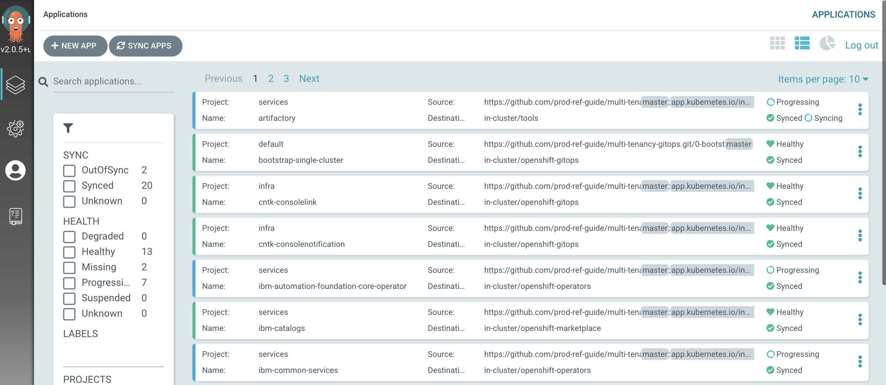
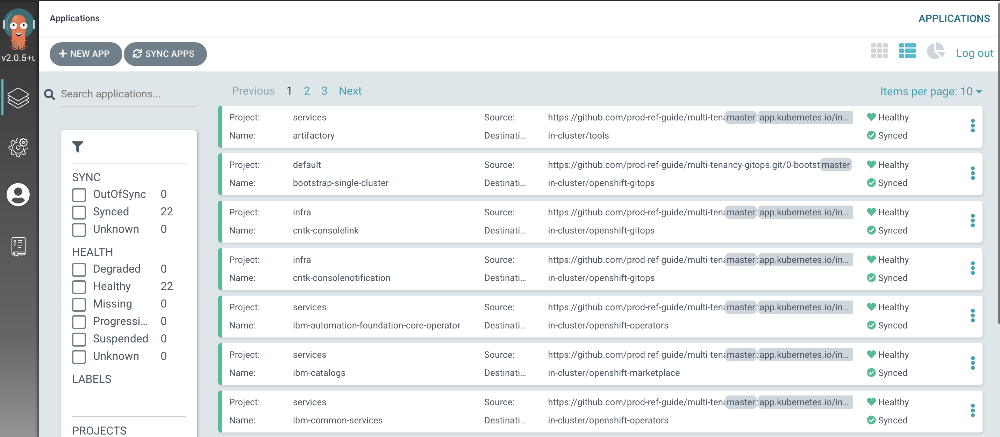
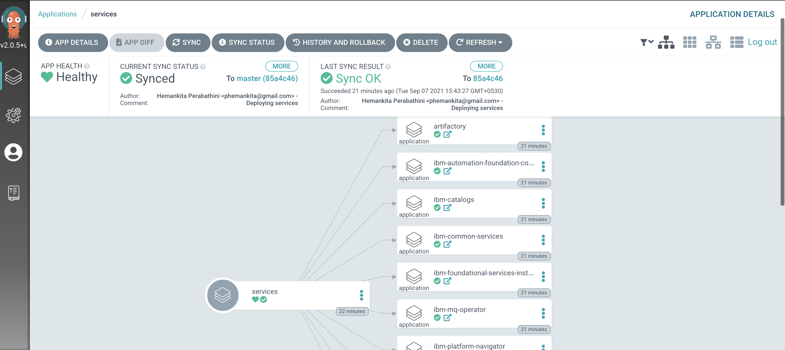
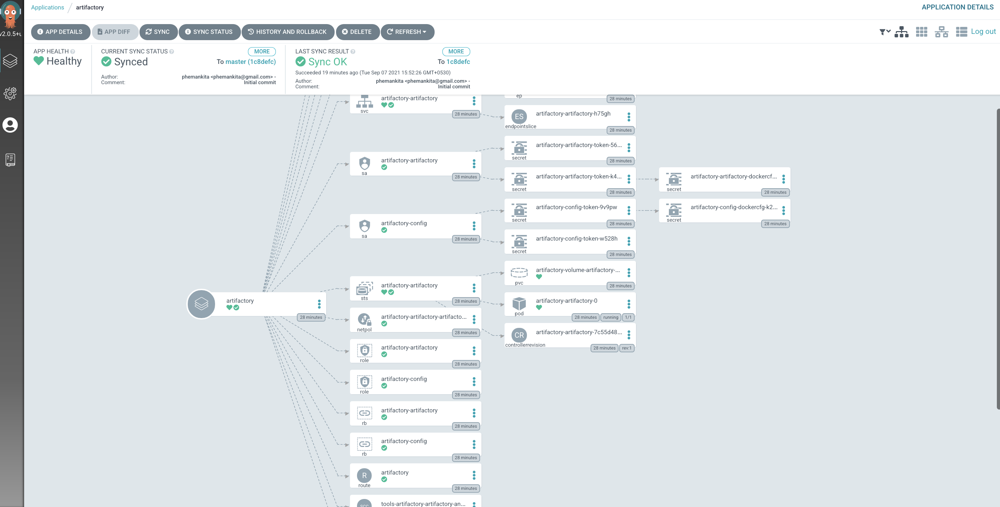
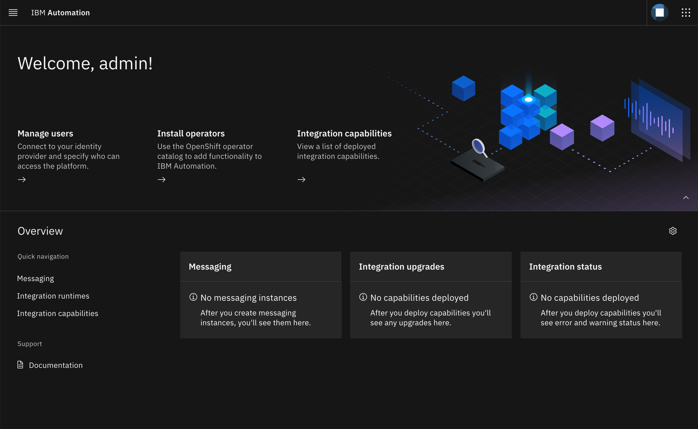

## Deploy services to the cluster

<!--- cSpell:ignore resynched resyncs configmaps consolenotification subfolders rolebindings rolebinding CICD qube cntk autoplay allowfullscreen storageclass -->

We've just had our first successful GitOps experience, using an ArgoCD application to create the `ci`, `tools` and `dev` namespaces in our cluster at the `infrastructure` layer level as well as using ArgoCD to deploy the `Red Hat OpenShift Pipelines` operator at the `services` layer level. There are few more components you need to create for this IBM MQ tutorial: IBM MQ, IBM Platform navigator, IBM foundations, IBM automation foundations, IBM Catalog, Sealed secrets, Sonarqube and Artifactory.

These components are part of the **services** layer in our architecture, and
that requires us to access **/0-bootstrap/single-cluster/2-services** within our GitOps repository.

  1. *Check services layer components*

      As we saw earlier, the `bootstrap-single-cluster` application uses the contents of the
      `/0-bootstrap/single-cluster/2-services` folder to determine which Kubernetes resources are available to be deployed in the cluster.

      Issue the following command to see what could be deployed in the cluster:

      ```bash
      tree 0-bootstrap/single-cluster/2-services/ -L 3
      ```

      You should see a set of operators and instances of these available in the GitOps framework at the services layer:

      ``` { .bash .no-copy }
      0-bootstrap/single-cluster/2-services/
      ├── 2-services.yaml
      ├── argocd
      │   ├── instances
      │   │   ├── artifactory.yaml
      │   │   ├── baas-instance.yaml
      │   │   ├── cert-manager-instance.yaml
      │   │   ├── chartmuseum.yaml
      │   │   ├── developer-dashboard.yaml
      │   │   ├── grafana-instance.yaml
      │   │   ├── ibm-apic-gateway-analytics-instance.yaml
      │   │   ├── ibm-apic-instance.yaml
      │   │   ├── ibm-apic-management-portal-instance.yaml
      │   │   ├── ibm-cp4d-watson-studio-instance.yaml
      │   │   ├── ibm-cp4sthreatmanagements-instance.yaml
      │   │   ├── ibm-cpd-instance.yaml
      │   │   ├── ibm-foundational-services-instance.yaml
      │   │   ├── ibm-platform-navigator-instance.yaml
      │   │   ├── ibm-process-mining-instance.yaml
      │   │   ├── instana-agent.yaml
      │   │   ├── instana-robot-shop.yaml
      │   │   ├── oadp-instance.yaml
      │   │   ├── openldap.yaml
      │   │   ├── openshift-service-mesh-instance.yaml
      │   │   ├── pact-broker.yaml
      │   │   ├── sealed-secrets.yaml
      │   │   ├── sonarqube.yaml
      │   │   ├── spp-instance.yaml
      │   │   └── swaggereditor.yaml
      │   └── operators
      │       ├── cert-manager.yaml
      │       ├── elasticsearch.yaml
      │       ├── grafana-operator.yaml
      │       ├── ibm-ace-operator.yaml
      │       ├── ibm-apic-operator.yaml
      │       ├── ibm-aspera-operator.yaml
      │       ├── ibm-assetrepository-operator.yaml
      │       ├── ibm-automation-foundation-core-operator.yaml
      │       ├── ibm-automation-foundation-operator.yaml
      │       ├── ibm-catalogs.yaml
      │       ├── ibm-cp4a-operator.yaml
      │       ├── ibm-cp4d-watson-studio-operator.yaml
      │       ├── ibm-cp4i-operators.yaml
      │       ├── ibm-cp4s-operator.yaml
      │       ├── ibm-cpd-platform-operator.yaml
      │       ├── ibm-cpd-scheduling-operator.yaml
      │       ├── ibm-datapower-operator.yaml
      │       ├── ibm-db2u-operator.yaml
      │       ├── ibm-eventstreams-operator.yaml
      │       ├── ibm-foundations.yaml
      │       ├── ibm-mq-operator.yaml
      │       ├── ibm-opsdashboard-operator.yaml
      │       ├── ibm-platform-navigator.yaml
      │       ├── ibm-process-mining-operator.yaml
      │       ├── jaeger.yaml
      │       ├── kiali.yaml
      │       ├── oadp-operator.yaml
      │       ├── openshift-gitops.yaml
      │       ├── openshift-pipelines.yaml
      │       ├── openshift-service-mesh.yaml
      │       ├── spp-catalog.yaml
      │       └── spp-operator.yaml
      └── kustomization.yaml
      ```

  2. *Review ArgoCD services folder*

      Let’s examine the `0-bootstrap/single-cluster/2-services/kustomization.yaml`
      to see how ArgoCD manages the resources deployed to the cluster.

      Issue the following command:

      ```bash
      cat 0-bootstrap/single-cluster/2-services/kustomization.yaml
      ```

      We can see the contents of the `kustomization.yaml`:

      ``` { .yaml .no-copy }
      resources:
      # IBM Software

      ## Cloud Pak for Integration
      #- argocd/operators/ibm-ace-operator.yaml
      #- argocd/operators/ibm-apic-operator.yaml
      #- argocd/instances/ibm-apic-instance.yaml
      #- argocd/instances/ibm-apic-management-portal-instance.yaml
      #- argocd/instances/ibm-apic-gateway-analytics-instance.yaml
      #- argocd/operators/ibm-aspera-operator.yaml
      #- argocd/operators/ibm-assetrepository-operator.yaml
      #- argocd/operators/ibm-cp4i-operators.yaml
      #- argocd/operators/ibm-datapower-operator.yaml
      #- argocd/operators/ibm-eventstreams-operator.yaml
      #- argocd/operators/ibm-mq-operator.yaml
      #- argocd/operators/ibm-opsdashboard-operator.yaml
      #- argocd/operators/ibm-platform-navigator.yaml
      #- argocd/instances/ibm-platform-navigator-instance.yaml

      ## Cloud Pak for Business Automation
      #- argocd/operators/ibm-cp4a-operator.yaml
      #- argocd/operators/ibm-db2u-operator.yaml
      #- argocd/operators/ibm-process-mining-operator.yaml
      #- argocd/instances/ibm-process-mining-instance.yaml

      ## Cloud Pak for Data
      #- argocd/operators/ibm-cp4d-watson-studio-operator.yaml
      #- argocd/instances/ibm-cp4d-watson-studio-instance.yaml
      #- argocd/operators/ibm-cpd-platform-operator.yaml
      #- argocd/operators/ibm-cpd-scheduling-operator.yaml
      #- argocd/instances/ibm-cpd-instance.yaml

      ## Cloud Pak for Security
      #- argocd/operators/ibm-cp4s-operator.yaml
      #- argocd/instances/ibm-cp4sthreatmanagements-instance.yaml

      ## IBM Foundational Services / Common Services
      #- argocd/operators/ibm-foundations.yaml
      #- argocd/instances/ibm-foundational-services-instance.yaml
      #- argocd/operators/ibm-automation-foundation-core-operator.yaml
      #- argocd/operators/ibm-automation-foundation-operator.yaml

      ## IBM Catalogs
      #- argocd/operators/ibm-catalogs.yaml


      # Required for IBM MQ
      #- argocd/instances/openldap.yaml
      # Required for IBM ACE, IBM MQ
      #- argocd/operators/cert-manager.yaml
      #- argocd/instances/cert-manager-instance.yaml

      # Sealed Secrets
      #- argocd/instances/sealed-secrets.yaml

      # CICD
      #- argocd/operators/grafana-operator.yaml
      #- argocd/instances/grafana-instance.yaml
      #- argocd/instances/artifactory.yaml
      #- argocd/instances/chartmuseum.yaml
      #- argocd/instances/developer-dashboard.yaml
      #- argocd/instances/swaggereditor.yaml
      #- argocd/instances/sonarqube.yaml
      #- argocd/instances/pact-broker.yaml
      # In OCP 4.7+ we need to install openshift-pipelines and possibly privileged scc to the pipeline serviceaccount
      - argocd/operators/openshift-pipelines.yaml

      # Service Mesh
      #- argocd/operators/elasticsearch.yaml
      #- argocd/operators/jaeger.yaml
      #- argocd/operators/kiali.yaml
      #- argocd/operators/openshift-service-mesh.yaml
      #- argocd/instances/openshift-service-mesh-instance.yaml

      # Monitoring
      #- argocd/instances/instana-agent.yaml
      #- argocd/instances/instana-robot-shop.yaml

      # Spectrum Protect Plus
      #- argocd/operators/spp-catalog.yaml
      #- argocd/operators/spp-operator.yaml
      #- argocd/instances/spp-instance.yaml
      #- argocd/operators/oadp-operator.yaml
      #- argocd/instances/oadp-instance.yaml
      #- argocd/instances/baas-instance.yaml

      patches:
      - target:
          group: argoproj.io
          kind: Application
          labelSelector: "gitops.tier.layer=services,gitops.tier.source=git"
        patch: |-
          - op: add
            path: /spec/source/repoURL
            value: https://github.com/prod-ref-guide/multi-tenancy-gitops-services.git
          - op: add
            path: /spec/source/targetRevision
            value: master
      - target:
          group: argoproj.io
          kind: Application
          labelSelector: "gitops.tier.layer=applications,gitops.tier.source=git"
        patch: |-
          - op: add
            path: /spec/source/repoURL
            value: https://github.com/prod-ref-guide/multi-tenancy-gitops-apps.git
          - op: add
            path: /spec/source/targetRevision
            value: master
      - target:
          group: argoproj.io
          kind: Application
          labelSelector: "gitops.tier.layer=services,gitops.tier.source=helm"
        patch: |-
          - op: add
            path: /spec/source/repoURL
            value: https://charts.cloudnativetoolkit.dev
      - target:
          name: ibm-automation-foundation-operator
        patch: |-
          - op: add
            path: /spec/source/helm/parameters/-
            value:
              name: spec.channel
              value: v1.1
      ```

  3. *Add the services to the cluster*

    !!! note
        The `IBM Platform Navigator` instance requires a RWX storageclass and it is set to `managed-nfs-storage` by default in the
        ArgoCD Application `0-bootstrap/single-cluster/2-services/argocd/instances/ibm-platform-navigator-instance.yaml`.  This storageclass is available for Red Hat OpenShift on IBM Cloud cluster provisioned from IBM Technology Zone with NFS storage selected.  

      Open `0-bootstrap/single-cluster/2-services/kustomization.yaml` and
      uncomment the below resources:  

      ``` { .yaml .no-copy }
      ## Cloud Pak for Integration
      - argocd/operators/ibm-mq-operator.yaml
      - argocd/operators/ibm-platform-navigator.yaml
      - argocd/instances/ibm-platform-navigator-instance.yaml

      ## IBM Foundational Services / Common Services
      - argocd/operators/ibm-foundations.yaml
      - argocd/instances/ibm-foundational-services-instance.yaml
      - argocd/operators/ibm-automation-foundation-core-operator.yaml

      ## IBM Catalogs
      - argocd/operators/ibm-catalogs.yaml

      # Sealed Secrets
      - argocd/instances/sealed-secrets.yaml

      # CICD
      - argocd/instances/artifactory.yaml
      - argocd/instances/sonarqube.yaml
      ```

      You will have the following resources deployed for services:

      ``` { .yaml .no-copy }
      resources:
      # IBM Software

      ## Cloud Pak for Integration
      #- argocd/operators/ibm-ace-operator.yaml
      #- argocd/operators/ibm-apic-operator.yaml
      #- argocd/instances/ibm-apic-instance.yaml
      #- argocd/instances/ibm-apic-management-portal-instance.yaml
      #- argocd/instances/ibm-apic-gateway-analytics-instance.yaml
      #- argocd/operators/ibm-aspera-operator.yaml
      #- argocd/operators/ibm-assetrepository-operator.yaml
      #- argocd/operators/ibm-cp4i-operators.yaml
      #- argocd/operators/ibm-datapower-operator.yaml
      #- argocd/operators/ibm-eventstreams-operator.yaml
      - argocd/operators/ibm-mq-operator.yaml
      #- argocd/operators/ibm-opsdashboard-operator.yaml
      - argocd/operators/ibm-platform-navigator.yaml
      - argocd/instances/ibm-platform-navigator-instance.yaml

      ## Cloud Pak for Business Automation
      #- argocd/operators/ibm-cp4a-operator.yaml
      #- argocd/operators/ibm-db2u-operator.yaml
      #- argocd/operators/ibm-process-mining-operator.yaml
      #- argocd/instances/ibm-process-mining-instance.yaml

      ## Cloud Pak for Data
      #- argocd/operators/ibm-cp4d-watson-studio-operator.yaml
      #- argocd/instances/ibm-cp4d-watson-studio-instance.yaml
      #- argocd/operators/ibm-cpd-platform-operator.yaml
      #- argocd/operators/ibm-cpd-scheduling-operator.yaml
      #- argocd/instances/ibm-cpd-instance.yaml

      ## Cloud Pak for Security
      #- argocd/operators/ibm-cp4s-operator.yaml
      #- argocd/instances/ibm-cp4sthreatmanagements-instance.yaml

      ## IBM Foundational Services / Common Services
      - argocd/operators/ibm-foundations.yaml
      - argocd/instances/ibm-foundational-services-instance.yaml
      - argocd/operators/ibm-automation-foundation-core-operator.yaml
      #- argocd/operators/ibm-automation-foundation-operator.yaml

      ## IBM Catalogs
      - argocd/operators/ibm-catalogs.yaml


      # Required for IBM MQ
      #- argocd/instances/openldap.yaml
      # Required for IBM ACE, IBM MQ
      #- argocd/operators/cert-manager.yaml
      #- argocd/instances/cert-manager-instance.yaml

      # Sealed Secrets
      - argocd/instances/sealed-secrets.yaml

      # CICD
      #- argocd/operators/grafana-operator.yaml
      #- argocd/instances/grafana-instance.yaml
      - argocd/instances/artifactory.yaml
      #- argocd/instances/chartmuseum.yaml
      #- argocd/instances/developer-dashboard.yaml
      #- argocd/instances/swaggereditor.yaml
      - argocd/instances/sonarqube.yaml
      #- argocd/instances/pact-broker.yaml
      # In OCP 4.7+ we need to install openshift-pipelines and possibly privileged scc to the pipeline serviceaccount
      - argocd/operators/openshift-pipelines.yaml

      # Service Mesh
      #- argocd/operators/elasticsearch.yaml
      #- argocd/operators/jaeger.yaml
      #- argocd/operators/kiali.yaml
      #- argocd/operators/openshift-service-mesh.yaml
      #- argocd/instances/openshift-service-mesh-instance.yaml

      # Monitoring
      #- argocd/instances/instana-agent.yaml
      #- argocd/instances/instana-robot-shop.yaml

      # Spectrum Protect Plus
      #- argocd/operators/spp-catalog.yaml
      #- argocd/operators/spp-operator.yaml
      #- argocd/instances/spp-instance.yaml
      #- argocd/operators/oadp-operator.yaml
      #- argocd/instances/oadp-instance.yaml
      #- argocd/instances/baas-instance.yaml

      patches:
      - target:
          group: argoproj.io
          kind: Application
          labelSelector: "gitops.tier.layer=services,gitops.tier.source=git"
        patch: |-
          - op: add
            path: /spec/source/repoURL
            value: https://github.com/prod-ref-guide/multi-tenancy-gitops-services.git
          - op: add
            path: /spec/source/targetRevision
            value: master
      - target:
          group: argoproj.io
          kind: Application
          labelSelector: "gitops.tier.layer=applications,gitops.tier.source=git"
        patch: |-
          - op: add
            path: /spec/source/repoURL
            value: https://github.com/prod-ref-guide/multi-tenancy-gitops-apps.git
          - op: add
            path: /spec/source/targetRevision
            value: master
      - target:
          group: argoproj.io
          kind: Application
          labelSelector: "gitops.tier.layer=services,gitops.tier.source=helm"
        patch: |-
          - op: add
            path: /spec/source/repoURL
            value: https://charts.cloudnativetoolkit.dev
      - target:
          name: ibm-automation-foundation-operator
        patch: |-
          - op: add
            path: /spec/source/helm/parameters/-
            value:
              name: spec.channel
              value: v1.1
      ```

      Commit and push changes to your git repository:

      ```bash
      git add .
      git commit -s -m "Intial boostrap setup for services"
      git push origin $GIT_BRANCH
      ```

      The changes have now been pushed to your GitOps repository:

      ```{ .text .no-copy }
      Enumerating objects: 11, done.
      Counting objects: 100% (11/11), done.
      Delta compression using up to 8 threads
      Compressing objects: 100% (6/6), done.
      Writing objects: 100% (6/6), 564 bytes | 564.00 KiB/s, done.
      Total 6 (delta 5), reused 0 (delta 0)
      remote: Resolving deltas: 100% (5/5), completed with 5 local objects.
      To https://github.com/prod-ref-guide/multi-tenancy-gitops.git
         b49dff5..533602c  master -> master
      ```

      The intention of this operation is to indicate that we'd like the resources
      declared in `0-bootstrap/single-cluster/2-services/kustomization.yaml` to be
      deployed in the cluster. Like the `infra` ArgoCD application, the resources
      created by the `services` ArgoCD application will manage the Kubernetes
      relevant services resources applied to the cluster.

  4. *Optional: Activate the services in the GitOps repo*

      Run this step if you skip installing tekton in the previous section. If
      you did not skip that step go to `Step 7`.

      Access the `0-bootstrap/single-cluster/kustomization.yaml`:

      ```bash
      cat 0-bootstrap/single-cluster/kustomization.yaml
      ```

      Let us deploy `services` resources to the cluster. Open `0-bootstrap/single-cluster/kustomization.yaml` and uncomment `2-services/2-services.yaml` as follows:

      ```{ .yaml .no-copy }
      resources:
      - 1-infra/1-infra.yaml
      - 2-services/2-services.yaml
      # - 3-apps/3-apps.yaml
      patches:
      - target:
          group: argoproj.io
          kind: Application
          labelSelector: "gitops.tier.layer=gitops"
        patch: |-
          - op: add
            path: /spec/source/repoURL
            value: https://github.com/prod-ref-guide/multi-tenancy-gitops.git
          - op: add
            path: /spec/source/targetRevision
            value: master
      - target:
          group: argoproj.io
          kind: AppProject
          labelSelector: "gitops.tier.layer=infra"
        patch: |-
          - op: add
            path: /spec/sourceRepos/-
            value: https://github.com/prod-ref-guide/multi-tenancy-gitops.git
          - op: add
            path: /spec/sourceRepos/-
            value: https://github.com/prod-ref-guide/multi-tenancy-gitops-infra.git
      - target:
          group: argoproj.io
          kind: AppProject
          labelSelector: "gitops.tier.layer=services"
        patch: |-
          - op: add
            path: /spec/sourceRepos/-
            value: https://github.com/prod-ref-guide/multi-tenancy-gitops.git
          - op: add
            path: /spec/sourceRepos/-
            value: https://github.com/prod-ref-guide/multi-tenancy-gitops-services.git
      - target:
          group: argoproj.io
          kind: AppProject
          labelSelector: "gitops.tier.layer=applications"
        patch: |-
          - op: add
            path: /spec/sourceRepos/-
            value: https://github.com/prod-ref-guide/multi-tenancy-gitops.git
          - op: add
            path: /spec/sourceRepos/-
            value: https://github.com/prod-ref-guide/multi-tenancy-gitops-apps.git
      ```

      Once we push this change to GitHub, it will be seen by the
      `bootstrap-single-cluster` application in ArgoCD, and the resources it
      refers to will be applied to the cluster.

  5. *Push GitOps changes to GitHub*

      Let’s make these GitOps changes visible to the ArgoCD
      `bootstrap-single-cluster` application via GitHub.

      Add all changes in the current folder to a git index, commit
      them, and push them to GitHub:

      ```bash
      git add .
      git commit -s -m "Deploying services"
      git push origin $GIT_BRANCH
      ```

      The changes have now been pushed to your GitOps repository:

      ```{ .text .no-copy }
      Enumerating objects: 9, done.
      Counting objects: 100% (9/9), done.
      Delta compression using up to 8 threads
      Compressing objects: 100% (5/5), done.
      Writing objects: 100% (5/5), 431 bytes | 431.00 KiB/s, done.
      Total 5 (delta 4), reused 0 (delta 0)
      remote: Resolving deltas: 100% (4/4), completed with 4 local objects.
      To https://github.com/prod-ref-guide/multi-tenancy-gitops.git
         533602c..85a4c46  master -> master
      ```

      This change to the GitOps repository can now be used by ArgoCD.

  6. *The* `bootstrap-single-cluster` *application detects the change and resyncs*

      Once these changes to our GitOps repository are seen by ArgoCD, it will resync
      the cluster to the desired new state.

      Switch to the ArgoCD UI **Applications** view to see the start of this resync process:

      {: style="max-height:500px"}

      Notice how the `bootstrap-single-cluster` application has detected the
      changes and is automatically synching the cluster.

      (*You can manually* `sync` the `bootstrap-single-cluster` *ArgoCD application in the UI if
      you don't want to wait for ArgoCD to detect the change.*)

  7. *The new ArgoCD applications*

      After a short while, you'll see lots of new ArgoCD applications have been
      created to manage the **services** we have deployed by modifying
      `kustomization.yaml` under `0-bootstrap/single-cluster/2-services` folder:

      {: style="max-height:500px"}

      See how most ArgoCD applications are `Synced` almost immediately, but some
      spend time in `Progressing`. That's because the `Artifactory` and `Sonarqube`
      ArgoCD applications are more complex -- they create more Kubernetes resources
      than other ArgoCD applications and therefore take longer to `sync`.

      After a few minutes you'll see that all ArgoCD applications become `Healthy`
      and `Synced`:

      {: style="max-height:500px"}

      Notice how many more `Synched` ArgoCD applications are now in the cluster;
      these are as a result of the newly added **services** layer in our
      architecture.

  8. *The* `services` *application*

      Let's examine the ArgoCD application that manage the **services** in our
      reference architecture.

      In the ArgoCD UI **Applications** view, click on the icon for the `services`
      application:

      {: style="max-height:500px"}

      We can see that the `services` ArgoCD application creates 10 ArgoCD applications, each of which is responsible for applying specific YAMLs to the cluster according to the folder the ArgoCD application is watching.

      It’s the `services` ArgoCD application that watches the `0-bootstrap/single-cluster/2-services/argocd` folder for ArgoCD applications that apply service resources to our cluster. It was the `services` application that created the `artifactory` ArgoCD application which manages the Artifactory instance that is used for application configuration management that we will be exploring later in this section of the tutorial.

      We’ll continually reinforce these relationships as we work through the tutorial. You might like to spend some time exploring the ArgoCD UI and ArgoCD YAMLs before you proceed, though it’s not necessary, as you’ll get lots of practice as we proceed.

  9. *Examine* `Artifactory` *resources in detail*

      You can see the Kubernetes resources that the `Artifactory` ArgoCD application
      has created for Artifactory.

      Click on the `Artifactory`:

      {: style="max-height:500px"}

      See how many different Kubernetes resources were created when the Artifactory
      ArgoCD application YAML was applied to the cluster. That's why it took the
      `Artifactory` ArgoCD application a little time to sync.

      If you'd like, have a look at some of the other ArgoCD applications, such as
      `Sonarqube` and the Kubernetes resources they created.

  10. *The* `services` *ArgoCD project*

      As we've seen in the ArgoCD UI, the `services` ArgoCD application is
      responsible for creating the ArgoCD applications that manage the services
      within the cluster. Let's examine their definitions to see how they do this.

      Issue the following command:

      ```bash
      cat 0-bootstrap/single-cluster/2-services/2-services.yaml
      ```

      The following YAML may initially look a little intimidating; we'll discuss the
      major elements below:

      ```{ .yaml .no-copy }
      ---
      apiVersion: argoproj.io/v1alpha1
      kind: AppProject
      metadata:
        name: services
        labels:
          gitops.tier.layer: services
      spec:
        sourceRepos: [] # Populated by kustomize patches in 2-services/kustomization.yaml
        destinations:
        - namespace: tools
          server: https://kubernetes.default.svc
        - namespace: ibm-common-services
          server: https://kubernetes.default.svc
        - namespace: redhat-operators
          server: https://kubernetes.default.svc
        - namespace: openshift-operators
          server: https://kubernetes.default.svc
        - namespace: openshift-marketplace
          server: https://kubernetes.default.svc
        - namespace: ci
          server: https://kubernetes.default.svc
        - namespace: dev
          server: https://kubernetes.default.svc
        - namespace: staging
          server: https://kubernetes.default.svc
        - namespace: prod
          server: https://kubernetes.default.svc
        - namespace: sealed-secrets
          server: https://kubernetes.default.svc
        - namespace: istio-system
          server: https://kubernetes.default.svc
        - namespace: openldap
          server: https://kubernetes.default.svc
        - namespace: instana-agent
          server: https://kubernetes.default.svc
        - namespace: openshift-gitops
          server: https://kubernetes.default.svc
        clusterResourceWhitelist:
        # TODO: SCC needs to be moved to 1-infra, here for now for artifactory
        - group: "security.openshift.io"
          kind: SecurityContextConstraints
        - group: "console.openshift.io"
          kind: ConsoleLink
        - group: "apps"
          kind: statefulsets
        - group: "apps"
          kind: deployments
        - group: ""
          kind: services
        - group: ""
          kind: configmaps
        - group: ""
          kind: secrets
        - group: ""
          kind: serviceaccounts
        - group: "batch"
          kind: jobs
        - group: ""
          kind: roles
        - group: "route.openshift.io"
          kind: routes
        - group: ""
          kind: RoleBinding
        - group: "rbac.authorization.k8s.io"
          kind: ClusterRoleBinding
        - group: "rbac.authorization.k8s.io"
          kind: ClusterRole
        - group: apiextensions.k8s.io
          kind: CustomResourceDefinition
        roles:
        # A role which provides read-only access to all applications in the project
        - name: read-only
          description: Read-only privileges to my-project
          policies:
          - p, proj:my-project:read-only, applications, get, my-project/*, allow
          groups:
          - argocd-admins
      ---
      apiVersion: argoproj.io/v1alpha1
      kind: Application
      metadata:
        name: services
        annotations:
          argocd.argoproj.io/sync-wave: "200"
        labels:
          gitops.tier.layer: gitops
      spec:
        destination:
          namespace: openshift-gitops
          server: https://kubernetes.default.svc
        project: services
        source: # repoURL  and targetRevision populated by kustomize patches in 2-services/kustomization.yaml
          path: 0-bootstrap/single-cluster/2-services
        syncPolicy:
          automated:
            prune: true
            selfHeal: true
      ```

      Notice how this YAML defines three ArgoCD resources: a `services` project
      which manages all the necessary services that are needed by the applications.

      Notice how the `destinations` for the `services` project are limited to the
      `ci`, `tools` and `dev` namespaces -- as well as a few others that we'll use
      in the tutorial.  These `destinations` restrict the namespaces where ArgoCD
      applications in the `services` project can manage resources.

      The same is true for `clusterResourceWhiteList`. It limits the Kubernetes
      resources that can be managed to `configmaps`, `deployments` and
      `rolebindings` amongst others.

      In summary, we see that the `service` project is used to group all the ArgoCD
      applications that will manage the services in our cluster. These ArgoCD
      applications can only perform specific actions on specific resource types in
      specific namespaces. See how ArgoCD is acting as a well-governed
      administrator.

  11. *The similar structure of *`services` *and* `infra` *ArgoCD applications*

      Even though we didn't closely examine the `infra` ArgoCD  application YAML in
      the previous topic, it has has a very similar structure to the ArgoCD
      `services` applications we've just examined.

      Type the following command to list the ArgoCD `infra` app YAML.

      ```bash
      cat 0-bootstrap/single-cluster/1-infra/1-infra.yaml
      ```

      Again, although this YAML might look a little intimidating, the overall
      structure is the same as for `services`:

      ```{ .yaml .no-copy }
      ---
      apiVersion: argoproj.io/v1alpha1
      kind: AppProject
      metadata:
        name: infra
        labels:
          gitops.tier.layer: infra
      spec:
        sourceRepos: [] # Populated by kustomize patches in 1-infra/kustomization.yaml
        destinations:
        - namespace: ci
          server: https://kubernetes.default.svc
        - namespace: dev
          server: https://kubernetes.default.svc
        - namespace: staging
          server: https://kubernetes.default.svc
        - namespace: prod
          server: https://kubernetes.default.svc
        - namespace: sealed-secrets
          server: https://kubernetes.default.svc
        - namespace: tools
          server: https://kubernetes.default.svc
        - namespace: ibm-common-services
          server: https://kubernetes.default.svc
        - namespace: istio-system
          server: https://kubernetes.default.svc
        - namespace: openldap
          server: https://kubernetes.default.svc
        - namespace: instana-agent
          server: https://kubernetes.default.svc
        - namespace: openshift-gitops
          server: https://kubernetes.default.svc
        clusterResourceWhitelist:
        - group: ""
          kind: Namespace
        - group: ""
          kind: RoleBinding
        - group: "security.openshift.io"
          kind: SecurityContextConstraints
        - group: "console.openshift.io"
          kind: ConsoleNotification
        - group: "console.openshift.io"
          kind: ConsoleLink
        roles:
        # A role which provides read-only access to all applications in the project
        - name: read-only
          description: Read-only privileges to my-project
          policies:
          - p, proj:my-project:read-only, applications, get, my-project/*, allow
          groups:
          - argocd-admins
      ---
      apiVersion: argoproj.io/v1alpha1
      kind: Application
      metadata:
        name: infra
        annotations:
          argocd.argoproj.io/sync-wave: "100"
        labels:
          gitops.tier.layer: gitops
      spec:
        destination:
          namespace: openshift-gitops
          server: https://kubernetes.default.svc
        project: infra
        source: # repoURL  and targetRevision populated by kustomize patches in 1-infra/kustomization.yaml
          path: 0-bootstrap/single-cluster/1-infra
        syncPolicy:
          automated:
            prune: true
            selfHeal: true
      ```

      As with the `2-services.yaml`, we can see

      * An ArgoCD project called `infra`. ArgoCD applications defined in this
      project will be limited by the `destinations:` and
      `clusterResourceWhitelist:` specified in the YAML.
      * An ArgoCD app called `infra`.  This is the ArgoCD application that we
      used in the previous section of the tutorial. It watches the
      `path: 0-bootstrap/single-cluster/1-infra` folder for ArgoCD applications
      that it applied to the cluster. It was these applications that managed the
      `ci`, `tools` and `dev` namespaces for example.

      The installation of the operators will take approximately 30 - 45 minutes.

  12. Validate the deployment of IBM MQ and IBM Platform Navigator.

      Verify the IBM Platform Navigator has been deployed successfully.

      ```bash
      oc get platformnavigator -n tools -o=jsonpath='{ .items[*].status.conditions[].status }'
      ```
      Expected output = True

      The Platform Navigator console has been installed as part of the IBM Cloud Pak for Integration. We use the Platform Navigator to view our queue manager and its queues. The Spring application includes a Swagger interface which we can use to call methods on the Spring application. In the next few steps we will use these to interact with both the queue manager and Spring application.

  13. Access the IBM Platform Navigator console
      - Retrieve the URL for the IBM Platform Navigator console:

        ```bash
        oc get route integration-navigator-pn -n tools -o jsonpath='{.spec.host}'
        ```

      - Copy the URL from the `HOST/PORT` column and paste into a browser, prefixed with `https://`.

      - Retrieve the `admin` password:

        ```bash
        oc get secret ibm-iam-bindinfo-platform-auth-idp-credentials -n dev -o json -n ibm-common-services | jq -r '.data."admin_password"' | base64 -D
        ```

      - Log in to the `IBM Platform Navigator` console with the `admin` credentials.

        {: style="max-height:800px"}
