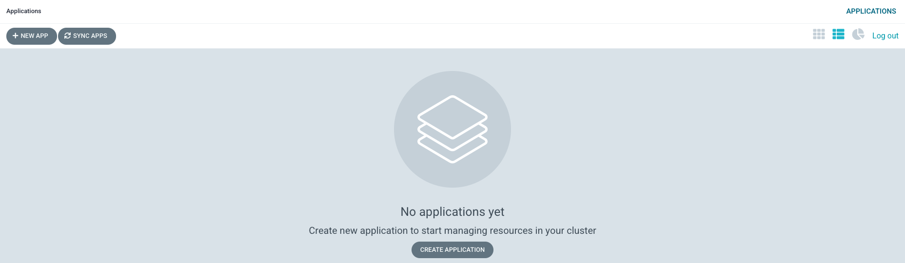

## Installing ArgoCD for GitOps

<!--- cSpell:ignore resynched clusterrole clusterrolebinding consolenotification subfolders rolebindings rolebinding CICD qube cntk autoplay allowfullscreen -->

Now that we've had an initial view of the GitOps repository, let's install
ArgoCD to make use of it.

We will install ArgoCD using the `Red Hat OpenShift GitOps` operator. We
will also configure it with the appropriate access rights to limit the resources
it can create in the cluster. In so doing, we ensure that ArgoCD acts like a
well-governed administrator of the cluster, only doing what it needs to do. Also,
we will customize our ArgoCD instance by adding necessary custom checks.

  1. *Ensure you're logged in to the cluster*

    Start a terminal window and log into your OCP cluster, substituting the
    `--token` and `--server` parameters with your values:

    ```bash
      oc login --token=<token> --server=<server>
    ```

    If you are unsure of these values, click your user ID in the OpenShift web
    console and select "Copy Login Command".

    On successful login, you'll see:

    ```{ .bash .no-copy }
    Logged into "https://c100-e.jp-tok.containers.cloud.ibm.com:30749" as "IAM#hperabat@in.ibm.com" using the token provided.

    You have access to 65 projects, the list has been suppressed. You can list all projects with 'oc projects'

    Using project "default".
    ```

    This shows some basic information about your user within this cluster. (This
    user is different to your GitHub user.)

  2. *Install ArgoCD into the cluster*

    We use the Red Hat GitOps operator to install ArgoCD into the cluster. The
    sample repository contains the YAML necessary to do this. We’ll examine it
    later, but first let’s use it.

    The following command creates the subscription:

    ```bash
    oc apply -f setup/ocp47/
    ```

    The response confirms that the below resources has been created:

    ```{ .text .no-copy }
    clusterrole.rbac.authorization.k8s.io/custom-argocd-cluster-argocd-application-controller created
    clusterrolebinding.rbac.authorization.k8s.io/openshift-gitops-argocd-application-controller created
    clusterrolebinding.rbac.authorization.k8s.io/openshift-gitops-cntk-argocd-application-controller created
    subscription.operators.coreos.com/openshift-gitops-operator created
    ```

  3. *Wait for the ArgoCD installation to complete*

    Installation is an asynchronous process, so we can issue a command that will
    complete when installation is done.

    Wait 30 seconds for the installation to get started, then issue the following
    command:

    ```bash
    sleep 30; oc wait --for condition=available --timeout 60s deployment.apps/gitops-operator-controller-manager -n openshift-operators
    ```

    After a while, you should see the following message informing us that operator
    installation is complete:

    ```{ .text .no-copy }
    deployment.apps/gitops-operator condition met
    ```

    ArgoCD is now installed and ready to use.

    If you see something like:

    ```{ .text .no-copy }
    Error from server (NotFound): deployments.apps "gitops-operator" not found
    ```

    then re-issue the command; the error occurred because the subscription took a
    little longer to create than expected.

    Alternatively, you can also validate as follows:

    ```bash
    while ! oc wait crd applications.argoproj.io --timeout=-1s --for=condition=Established  2>/dev/null; do sleep 30; done
    while ! oc wait pod --timeout=-1s --for=condition=Ready -l '!job-name' -n openshift-gitops > /dev/null; do sleep 30; done
    ```

  4. *ArgoCD `clusterrole` and `clusterrolebinding`*

    ArgoCD runs under a dedicated service account. For good governance, we use a
    custom **clusterrole** and **clusterrolebinding** to control the specific
    operations this service account can perform on different resources in the
    cluster.

    The cluster role and the cluster role binding YAMLs are also setup along with
    the subscription.

    ```bash
    oc get clusterrole custom-argocd-cluster-argocd-application-controller
    oc get clusterrolebinding openshift-gitops-argocd-application-controller
    oc get clusterrolebinding openshift-gitops-cntk-argocd-application-controller
    ```

    You'll see the resources are created in the cluster:

    ```{ .text .no-copy }
    $ oc get clusterrole custom-argocd-cluster-argocd-application-controller
    NAME                                                  CREATED AT
    custom-argocd-cluster-argocd-application-controller   2021-08-27T13:35:13Z

    $ oc get clusterrolebinding openshift-gitops-argocd-application-controller
    NAME                                             ROLE                                                              AGE
    openshift-gitops-argocd-application-controller   ClusterRole/custom-argocd-cluster-argocd-application-controller   8m43s

    $   oc get clusterrolebinding openshift-gitops-cntk-argocd-application-controller
    NAME                                                  ROLE                                                              AGE
    openshift-gitops-cntk-argocd-application-controller   ClusterRole/custom-argocd-cluster-argocd-application-controller   8m45s
    ```

    The clusterrole `custom-argocd-cluster-argocd-application-controller` defines
    a specific set of specific resources that are required by the ArgoCD service
    account and access rights over them.

    The cluster role bindings `openshift-gitops-argocd-application-controller` and
    `openshift-gitops-cntk-argocd-application-controller` binds the ArgoCD service
    account to the cluster role above.

    In combination, these definitions limit ArgoCD to perform the minimum set of
    operations required to manage the cluster. This is important; it means that
    ArgoCD behaves as a well governed administrator of the cluster.

    We'll also see later in the tutorial how ArgoCD creates resource in the cluster.

  5. *Delete default ArgoCD instance*

    Let us now delete the default ArgoCD instance that is created earlier.

    ```bash
    oc delete gitopsservice cluster -n openshift-gitops || true
    ```

    You will see the resources being deleted as follows:

    ```{ .text .no-copy }
    warning: deleting cluster-scoped resources, not scoped to the provided namespace
    gitopsservice.pipelines.openshift.io "cluster" deleted
    ```

    We are deleting the existing default instance and planning to make use of a
    customized ArgoCD instance with additional capabilities.

  6. *Create a custom ArgoCD instance*

    This customized ArgoCD instance implements custom checks. By default ArgoCD
    provides some built-in health checks for validating standard kubernetes
    resources. However, these checks will not be sufficient to validate the custom
    resources that belong to IBM Cloud Pak for Integration. Argo CD supports
    custom health checks that are defined in [Lua](https://www.lua.org/).

    If you want explore more about the ArgoCD Resource Health, check this
    [link](https://argoproj.github.io/argo-cd/operator-manual/health/) out.

    Let us create a custom ArgoCD instance as follows:

    ```bash
    oc apply -f setup/ocp47/argocd-instance/ -n openshift-gitops
    ```

    The response confirms that the below resources has been created:

    ```{ .text .no-copy }
    argocd.argoproj.io/openshift-gitops-cntk created
    ```

    Wait till the ArgoCD instance pod is up and running. Issue the below command
    to verify the same:

    ```bash
    while ! oc wait pod --timeout=-1s --for=condition=ContainersReady -l app.kubernetes.io/name=openshift-gitops-cntk-server -n openshift-gitops > /dev/null; do sleep 30; done
    ```

  7. *Launch ArgoCD*

    ArgoCD can be accessed via an OpenShift route. Using a browser, navigate to
    the URL returned by following command:

    ```bash
    oc get route -n openshift-gitops | grep openshift-gitops-cntk-server | awk '{print "https://"$2}'
    ```

    This will list the route to the ArgoCD we've just installed, for example:

    ```{ .text .no-copy }
    https://openshift-gitops-cntk-server-openshift-gitops.ibmcloud-roks-xxxxx.containers.appdomain.cloud
    ```

    Copy the URL into your browser to launch the ArgoCD web console.

    (*You can safely ignore any browser certificate warnings.*)

  8. *Login to ArgoCD*

    Sign in with user **admin**.

    The **password** is stored in a Kubernetes secret in the cluster. Use the following command to retrieve and format it:

    ```bash
    oc get secret/openshift-gitops-cntk-cluster -n openshift-gitops -o json | jq -r '.data."admin.password"' | base64 -D
    ```

    Once the UI launches, you'll see:

    {: style="max-height:400px"}

    See how there are no ArgoCD applications active at the moment.

    In the next section of the tutorial, we'll configure ArgoCD to create the
    **ArgoCD applications** that will in turn spin up **infrastructure**,
    **service**, and **application** resources to apply to the cluster.
