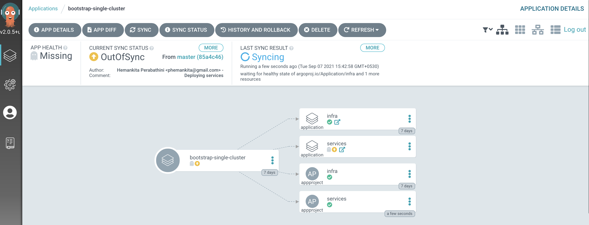
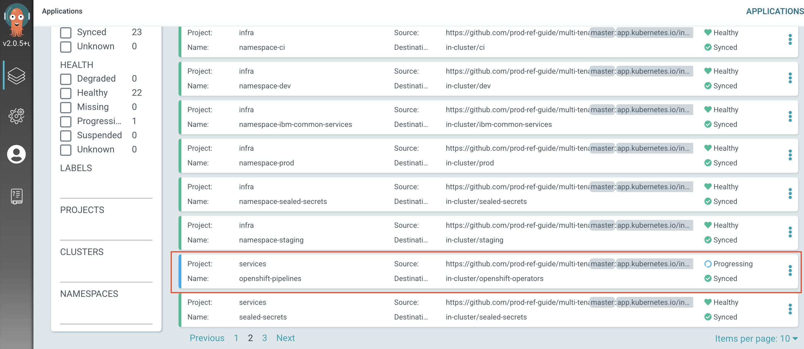

## Installing Tekton for GitOps

<!--- cSpell:ignore resynched resyncs configmaps consolenotification subfolders rolebindings rolebinding CICD qube cntk autoplay allowfullscreen -->

Tekton is made available to your Red Hat OpenShift cluster through the `Red Hat OpenShift Pipelines` operator. Hence, let's see how to get that operator installed on your cluster.

  1. *Ensure you're logged in to the cluster*

      Start a terminal window and log into your OCP cluster, substituting the
      `--token` and `--server` parameters with your values:

      ```bash
        oc login --token=<token> --server=<server>
      ```

      If you are unsure of these values, click your user ID in the OpenShift web
      console and select "Copy Login Command".

  2. *Locate your GitOps repository*

      If necessary, change to the root of your GitOps repository, which is typically
      `$HOME/git`.

      Issue the following command to change to your GitOps repository:

      ```bash
      cd $HOME/git
      cd multi-tenancy-gitops
      ```

  3. *Install Tekton into the cluster*

    We use the Red Hat Pipelines operator to install Tekton into the cluster. The
    sample repository contains the YAML necessary to do this. We’ll examine it
    later, but first let’s use it.

    Open `0-bootstrap/single-cluster/2-services/kustomization.yaml` and
    uncomment the below resources:

    ```{ .yaml .no-copy }
    - argocd/operators/openshift-pipelines.yaml
    ```

    Your `kustomization.yaml` for services should match the following:

    ```{ .yaml .no-copy}
    resources:
    # IBM Software

    ## Cloud Pak for Integration
    #- argocd/operators/ibm-ace-operator.yaml
    #- argocd/operators/ibm-apic-operator.yaml
    #- argocd/instances/ibm-apic-instance.yaml
    #- argocd/instances/ibm-apic-management-portal-instance.yaml
    #- argocd/instances/ibm-apic-gateway-analytics-instance.yaml
    #- argocd/operators/ibm-aspera-operator.yaml
    #- argocd/operators/ibm-assetrepository-operator.yaml
    #- argocd/operators/ibm-cp4i-operators.yaml
    #- argocd/operators/ibm-datapower-operator.yaml
    #- argocd/operators/ibm-eventstreams-operator.yaml
    #- argocd/operators/ibm-mq-operator.yaml
    #- argocd/operators/ibm-opsdashboard-operator.yaml
    #- argocd/operators/ibm-platform-navigator.yaml
    #- argocd/instances/ibm-platform-navigator-instance.yaml

    ## Cloud Pak for Business Automation
    #- argocd/operators/ibm-cp4a-operator.yaml
    #- argocd/operators/ibm-db2u-operator.yaml
    #- argocd/operators/ibm-process-mining-operator.yaml
    #- argocd/instances/ibm-process-mining-instance.yaml

    ## Cloud Pak for Data
    #- argocd/operators/ibm-cp4d-watson-studio-operator.yaml
    #- argocd/instances/ibm-cp4d-watson-studio-instance.yaml
    #- argocd/operators/ibm-cpd-platform-operator.yaml
    #- argocd/operators/ibm-cpd-scheduling-operator.yaml
    #- argocd/instances/ibm-cpd-instance.yaml

    ## Cloud Pak for Security
    #- argocd/operators/ibm-cp4s-operator.yaml
    #- argocd/instances/ibm-cp4sthreatmanagements-instance.yaml

    ## IBM Foundational Services / Common Services
    #- argocd/operators/ibm-foundations.yaml
    #- argocd/instances/ibm-foundational-services-instance.yaml
    #- argocd/operators/ibm-automation-foundation-core-operator.yaml
    #- argocd/operators/ibm-automation-foundation-operator.yaml

    ## IBM Catalogs
    #- argocd/operators/ibm-catalogs.yaml


    # Required for IBM MQ
    #- argocd/instances/openldap.yaml
    # Required for IBM ACE, IBM MQ
    #- argocd/operators/cert-manager.yaml
    #- argocd/instances/cert-manager-instance.yaml

    # Sealed Secrets
    #- argocd/instances/sealed-secrets.yaml

    # CICD
    #- argocd/operators/grafana-operator.yaml
    #- argocd/instances/grafana-instance.yaml
    #- argocd/instances/artifactory.yaml
    #- argocd/instances/chartmuseum.yaml
    #- argocd/instances/developer-dashboard.yaml
    #- argocd/instances/swaggereditor.yaml
    #- argocd/instances/sonarqube.yaml
    #- argocd/instances/pact-broker.yaml
    # In OCP 4.7+ we need to install openshift-pipelines and possibly privileged scc to the pipeline serviceaccount
    - argocd/operators/openshift-pipelines.yaml

    # Service Mesh
    #- argocd/operators/elasticsearch.yaml
    #- argocd/operators/jaeger.yaml
    #- argocd/operators/kiali.yaml
    #- argocd/operators/openshift-service-mesh.yaml
    #- argocd/instances/openshift-service-mesh-instance.yaml

    # Monitoring
    #- argocd/instances/instana-agent.yaml
    #- argocd/instances/instana-robot-shop.yaml

    # Spectrum Protect Plus
    #- argocd/operators/spp-catalog.yaml
    #- argocd/operators/spp-operator.yaml
    #- argocd/instances/spp-instance.yaml
    #- argocd/operators/oadp-operator.yaml
    #- argocd/instances/oadp-instance.yaml
    #- argocd/instances/baas-instance.yaml

    patches:
    - target:
        group: argoproj.io
        kind: Application
        labelSelector: "gitops.tier.layer=services,gitops.tier.source=git"
      patch: |-
        - op: add
          path: /spec/source/repoURL
          value: https://github.com/prod-ref-guide/multi-tenancy-gitops-services.git
        - op: add
          path: /spec/source/targetRevision
          value: master
    - target:
        group: argoproj.io
        kind: Application
        labelSelector: "gitops.tier.layer=applications,gitops.tier.source=git"
      patch: |-
        - op: add
          path: /spec/source/repoURL
          value: https://github.com/prod-ref-guide/multi-tenancy-gitops-apps.git
        - op: add
          path: /spec/source/targetRevision
          value: master
    - target:
        group: argoproj.io
        kind: Application
        labelSelector: "gitops.tier.layer=services,gitops.tier.source=helm"
      patch: |-
        - op: add
          path: /spec/source/repoURL
          value: https://charts.cloudnativetoolkit.dev
    - target:
        name: ibm-automation-foundation-operator
      patch: |-
        - op: add
          path: /spec/source/helm/parameters/-
          value:
            name: spec.channel
            value: v1.1
    ```

    Commit and push changes to your git repository:

    ```bash
    git add .
    git commit -s -m "Install tekton using Red Hat OpenShift Pipelines Operator"
    git push origin $GIT_BRANCH
    ```

    The changes have now been pushed to your GitOps repository:

    ``` { .text .no-copy }
    Enumerating objects: 11, done.
    Counting objects: 100% (11/11), done.
    Delta compression using up to 8 threads
    Compressing objects: 100% (6/6), done.
    Writing objects: 100% (6/6), 524 bytes | 524.00 KiB/s, done.
    Total 6 (delta 5), reused 0 (delta 0)
    remote: Resolving deltas: 100% (5/5), completed with 5 local objects.
    To https://github.com/prod-ref-guide/multi-tenancy-gitops.git
       85a4c46..61e15b0  master -> master
    ```

  4. *Activate the services in the GitOps repo*

    Access the `0-bootstrap/single-cluster/kustomization.yaml`:

    ```bash
    cat 0-bootstrap/single-cluster/kustomization.yaml
    ```

    Let us only deploy `services` resources to the cluster. Open `0-bootstrap/single-cluster/kustomization.yaml` and uncomment `2-services/2-services.yaml` as follows:

    ```{ .yaml .no-copy }
    resources:
    - 1-infra/1-infra.yaml
    - 2-services/2-services.yaml
    # - 3-apps/3-apps.yaml
    patches:
    - target:
        group: argoproj.io
        kind: Application
        labelSelector: "gitops.tier.layer=gitops"
      patch: |-
        - op: add
          path: /spec/source/repoURL
          value: https://github.com/prod-ref-guide/multi-tenancy-gitops.git
        - op: add
          path: /spec/source/targetRevision
          value: master
    - target:
        group: argoproj.io
        kind: AppProject
        labelSelector: "gitops.tier.layer=infra"
      patch: |-
        - op: add
          path: /spec/sourceRepos/-
          value: https://github.com/prod-ref-guide/multi-tenancy-gitops.git
        - op: add
          path: /spec/sourceRepos/-
          value: https://github.com/prod-ref-guide/multi-tenancy-gitops-infra.git
    - target:
        group: argoproj.io
        kind: AppProject
        labelSelector: "gitops.tier.layer=services"
      patch: |-
        - op: add
          path: /spec/sourceRepos/-
          value: https://github.com/prod-ref-guide/multi-tenancy-gitops.git
        - op: add
          path: /spec/sourceRepos/-
          value: https://github.com/prod-ref-guide/multi-tenancy-gitops-services.git
    - target:
        group: argoproj.io
        kind: AppProject
        labelSelector: "gitops.tier.layer=applications"
      patch: |-
        - op: add
          path: /spec/sourceRepos/-
          value: https://github.com/prod-ref-guide/multi-tenancy-gitops.git
        - op: add
          path: /spec/sourceRepos/-
          value: https://github.com/prod-ref-guide/multi-tenancy-gitops-apps.git
    ```

    Once we push this change to GitHub, it will be seen by the
    `bootstrap-single-cluster` application in ArgoCD, and the resources it
    refers to will be applied to the cluster.

  5. *Push GitOps changes to GitHub*

    Let’s make these GitOps changes visible to the ArgoCD
    `bootstrap-single-cluster` application via GitHub.

    Add all changes in the current folder to a git index, commit
    them, and push them to GitHub:

    ```bash
    git add .
    git commit -s -m "Deploying services"
    git push origin $GIT_BRANCH
    ```

    The changes have now been pushed to your GitOps repository:

    ```{ .text .no-copy }
    Enumerating objects: 9, done.
    Counting objects: 100% (9/9), done.
    Delta compression using up to 8 threads
    Compressing objects: 100% (5/5), done.
    Writing objects: 100% (5/5), 431 bytes | 431.00 KiB/s, done.
    Total 5 (delta 4), reused 0 (delta 0)
    remote: Resolving deltas: 100% (4/4), completed with 4 local objects.
    To https://github.com/prod-ref-guide/multi-tenancy-gitops.git
       533602c..85a4c46  master -> master
    ```

    This change to the GitOps repository can now be used by ArgoCD.

  6. *The* `bootstrap-single-cluster` *application detects the change and resyncs*

    Once these changes to our GitOps repository are seen by ArgoCD, it will
    resync the cluster to the desired new state.

    Switch to the ArgoCD UI **Applications** view to see the start of this resync process:

    {: style="max-height:500px"}

    Notice how the `bootstrap-single-cluster` application has detected the
    changes and is automatically synching the cluster.

    (*You can manually* `sync` the `bootstrap-single-cluster` *ArgoCD
    application in the UI if you don't want to wait for ArgoCD to detect the change.*)

  7. *The new ArgoCD applications*

    After a short while, you'll see `openshift-pipelines` ArgoCD application have been
    created as follows:

    {: style="max-height:500px"}

  8. *Wait for the Tekton installation to complete*

    Installation is an asynchronous process, so we can issue a command that will complete when installation is done.

    Wait 30 seconds for the installation to get started, then issue the following command:

    ```bash
    sleep 30; oc wait --for condition=available --timeout 60s deployment.apps/openshift-pipelines-operator -n openshift-operators
    ```

    After a while, you should see the following message informing us that operator installation is complete:

    ```{ .text .no-copy }
    deployment.apps/openshift-pipelines-operator condition met
    ```

    Tekton is now installed and ready to use. We’ll explore Tekton in later topics.

    If you see something like:

    ```{ .text .no-copy }
    Error from server (NotFound): deployments.apps "openshift-pipelines-operator" not found
    ```

    then re-issue the command; the error occurred because the subscription took a little longer to create than expected.
