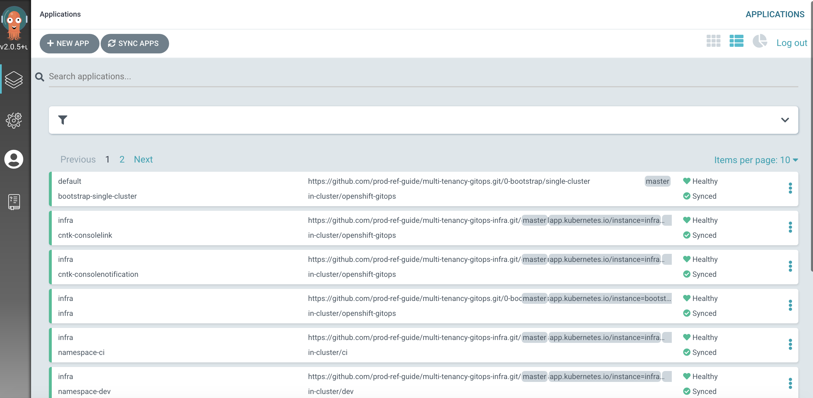
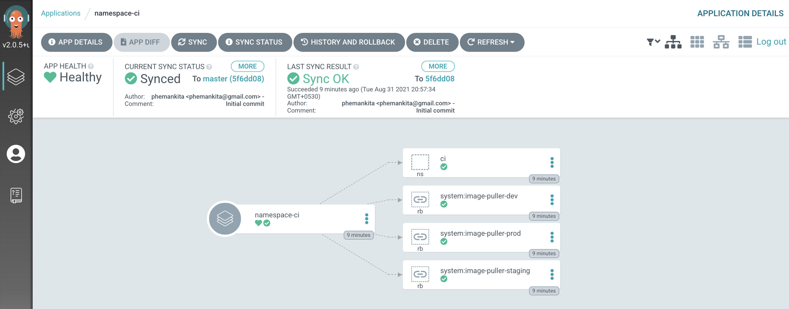
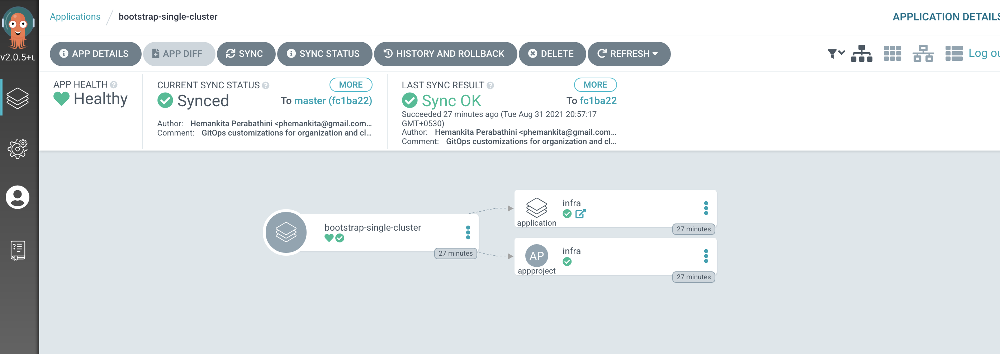
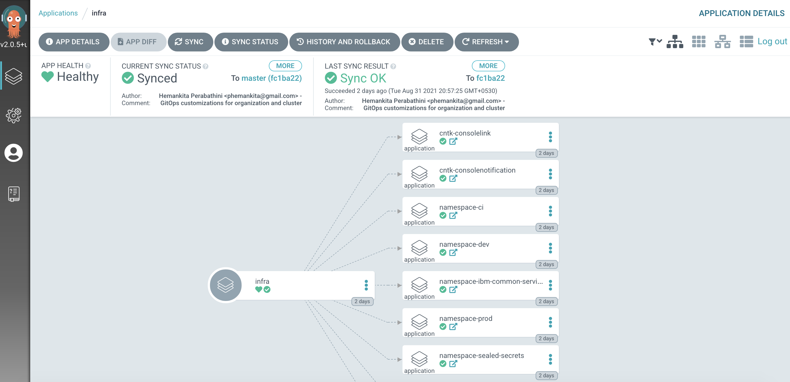

## Connect ArgoCD to the GitOps repository

<!--- cSpell:ignore resynched uncommenting clusterrole clusterrolebinding consolenotification subfolders rolebindings rolebinding CICD qube cntk autoplay allowfullscreen -->

Let's now connect your customized GitOps repository to the instance of ArgoCD
running in the cluster. Once connected, ArgoCD will use the contents of the
repository to create necessary resources.

  1. *Locate your GitOps repository*

    If necessary, change to the root of your GitOps repository, which is typically
    `$HOME/git`.

    Issue the following command to change to your GitOps repository:

    ```bash
    cd $HOME/git
    cd multi-tenancy-gitops
    ```

  2. *Review ArgoCD infrastructure folder*

    Let's examine the `0-bootstrap/single-cluster/1-infra/kustomization.yaml`
    to see how ArgoCD manages the resources deployed to the cluster.

    Issue the following command:

    ```bash
    cat 0-bootstrap/single-cluster/1-infra/kustomization.yaml
    ```

    We can see the contents of the `kustomization.yaml`:

    ```{ .yaml .no-copy }
    resources:
    #- argocd/consolelink.yaml
    #- argocd/consolenotification.yaml
    #- argocd/namespace-ibm-common-services.yaml
    #- argocd/namespace-ci.yaml
    #- argocd/namespace-dev.yaml
    #- argocd/namespace-staging.yaml
    #- argocd/namespace-prod.yaml
    #- argocd/namespace-cloudpak.yaml
    #- argocd/namespace-istio-system.yaml
    #- argocd/namespace-openldap.yaml
    #- argocd/namespace-sealed-secrets.yaml
    #- argocd/namespace-tools.yaml
    #- argocd/namespace-instana-agent.yaml
    #- argocd/namespace-robot-shop.yaml
    #- argocd/namespace-openshift-storage.yaml
    #- argocd/namespace-spp.yaml
    #- argocd/namespace-spp-velero.yaml
    #- argocd/namespace-baas.yaml
    #- argocd/serviceaccounts-tools.yaml
    #- argocd/storage.yaml
    #- argocd/infraconfig.yaml
    #- argocd/machinesets.yaml
    patches:
    - target:
        group: argoproj.io
        kind: Application
        labelSelector: "gitops.tier.layer=infra"
      patch: |-
        - op: add
          path: /spec/source/repoURL
          value: https://github.com/prod-ref-guide/multi-tenancy-gitops-infra.git
        - op: add
          path: /spec/source/targetRevision
          value: master
    ```

    Notice that the resources that needs to be applied to the cluster are all
    `inactivate` and commented out.

    Let us `enable` the resources that are needed by un-commenting them.

  3. *Deploy Kubernetes resources with* `kustomization.yaml`

    Open `0-bootstrap/single-cluster/1-infra/kustomization.yaml` and uncomment the below resources:

    ```{ .yaml .no-copy }
    argocd/namespace-ci.yaml
    argocd/consolenotification.yaml
    argocd/namespace-ibm-common-services.yaml
    argocd/namespace-tools.yaml
    ```

    You will have the following resources un-commented for infrastructure:

    ```{ .yaml .no-copy }
    resources:
    #- argocd/consolelink.yaml
    - argocd/consolenotification.yaml
    - argocd/namespace-ibm-common-services.yaml
    - argocd/namespace-ci.yaml
    #- argocd/namespace-dev.yaml
    #- argocd/namespace-staging.yaml
    #- argocd/namespace-prod.yaml
    #- argocd/namespace-cloudpak.yaml
    #- argocd/namespace-istio-system.yaml
    #- argocd/namespace-openldap.yaml
    #- argocd/namespace-sealed-secrets.yaml
    - argocd/namespace-tools.yaml
    #- argocd/namespace-instana-agent.yaml
    #- argocd/namespace-robot-shop.yaml
    #- argocd/namespace-openshift-storage.yaml
    #- argocd/namespace-spp.yaml
    #- argocd/namespace-spp-velero.yaml
    #- argocd/namespace-baas.yaml
    #- argocd/serviceaccounts-tools.yaml
    #- argocd/storage.yaml
    #- argocd/infraconfig.yaml
    #- argocd/machinesets.yaml
    patches:
    - target:
        group: argoproj.io
        kind: Application
        labelSelector: "gitops.tier.layer=infra"
      patch: |-
        - op: add
          path: /spec/source/repoURL
          value: https://github.com/prod-ref-guide/multi-tenancy-gitops-infra.git
        - op: add
          path: /spec/source/targetRevision
          value: master
    ```

    Commit and push changes to your git repository:

    ```bash
    git add .
    git commit -s -m "Intial boostrap setup for infrastructure"
    git push origin $GIT_BRANCH
    ```

    The changes have now been pushed to your GitOps repository:

    ```{ .text .no-copy }
    Enumerating objects: 11, done.
    Counting objects: 100% (11/11), done.
    Delta compression using up to 8 threads
    Compressing objects: 100% (6/6), done.
    Writing objects: 100% (6/6), 576 bytes | 576.00 KiB/s, done.
    Total 6 (delta 5), reused 0 (delta 0)
    remote: Resolving deltas: 100% (5/5), completed with 5 local objects.
    To https://github.com/prod-ref-guide/multi-tenancy-gitops.git
       a900c39..e3f696d  master -> master
    ```

  4. *Examine* `bootstrap.yaml` residing in `0-bootstrap/single-cluster/`.

    The `bootstrap.yaml` file is used to create our first ArgoCD application
    called `bootstrap-single-cluster`. This initial ArgoCD application will create
    all the other ArgoCD applications that control the application, service, and
    infrastructure resources (such as the ci and dev namespaces) deployed to the
    cluster.

    Examine the YAML that defines the ArgoCD bootstrap application:

    ```bash
    cat 0-bootstrap/single-cluster/bootstrap.yaml
    ```

    Notice also how this ArgoCD application has been customized to use the GitOps
    repository repoURL: `https://github.com/prod-ref-guide/multi-tenancy-gitops.git`.

    ```{ .yaml .no-copy }
    apiVersion: argoproj.io/v1alpha1
    kind: Application
    metadata:
      name: bootstrap-single-cluster
      namespace: openshift-gitops
    spec:
      destination:
        namespace: openshift-gitops
        server: https://kubernetes.default.svc
      project: default
      source:
        path: 0-bootstrap/single-cluster
        repoURL: https://github.com/prod-ref-guide/multi-tenancy-gitops.git
        targetRevision: master
      syncPolicy:
        automated:
          prune: true
          selfHeal: true
    ```

    Most importantly, see how `path: 0-bootstrap/single-cluster` refers to the
    `0-bootstrap/single-cluster` folder within this repository. This will result
    in the creation of individual ArgoCD applications to manage our cluster
    resources.

    Access the `0-bootstrap/single-cluster/kustomization.yaml`:

    ```bash
    cat 0-bootstrap/single-cluster/kustomization.yaml
    ```

    Let us for now only deploy `infra` resources to the cluster. Open `0-bootstrap/single-cluster/kustomization.yaml`
    and comment out the `2-services/2-services.yaml` and `3-apps/3-apps.yaml` as follows:

    ```{ .yaml .no-copy }
    resources:
    - 1-infra/1-infra.yaml
    # - 2-services/2-services.yaml
    # - 3-apps/3-apps.yaml
    patches:
    - target:
        group: argoproj.io
        kind: Application
        labelSelector: "gitops.tier.layer=gitops"
      patch: |-
        - op: add
          path: /spec/source/repoURL
          value: https://github.com/prod-ref-guide/multi-tenancy-gitops.git
        - op: add
          path: /spec/source/targetRevision
          value: master
    - target:
        group: argoproj.io
        kind: AppProject
        labelSelector: "gitops.tier.layer=infra"
      patch: |-
        - op: add
          path: /spec/sourceRepos/-
          value: https://github.com/prod-ref-guide/multi-tenancy-gitops.git
        - op: add
          path: /spec/sourceRepos/-
          value: https://github.com/prod-ref-guide/multi-tenancy-gitops-infra.git
    - target:
        group: argoproj.io
        kind: AppProject
        labelSelector: "gitops.tier.layer=services"
      patch: |-
        - op: add
          path: /spec/sourceRepos/-
          value: https://github.com/prod-ref-guide/multi-tenancy-gitops.git
        - op: add
          path: /spec/sourceRepos/-
          value: https://github.com/prod-ref-guide/multi-tenancy-gitops-services.git
    - target:
        group: argoproj.io
        kind: AppProject
        labelSelector: "gitops.tier.layer=applications"
      patch: |-
        - op: add
          path: /spec/sourceRepos/-
          value: https://github.com/prod-ref-guide/multi-tenancy-gitops.git
        - op: add
          path: /spec/sourceRepos/-
          value: https://github.com/prod-ref-guide/multi-tenancy-gitops-apps.git
    ```

    Commit and push changes to your git repository:

    ```bash
    git add .
    git commit -s -m "Using only infra"
    git push origin $GIT_BRANCH
    ```

    The changes have now been pushed to your GitOps repository:

    ```{ .text .no-copy }
    Enumerating objects: 9, done.
    Counting objects: 100% (9/9), done.
    Delta compression using up to 8 threads
    Compressing objects: 100% (5/5), done.
    Writing objects: 100% (5/5), 456 bytes | 456.00 KiB/s, done.
    Total 5 (delta 4), reused 0 (delta 0)
    remote: Resolving deltas: 100% (4/4), completed with 4 local objects.
    To https://github.com/prod-ref-guide/multi-tenancy-gitops.git
       e3f696d..ea3b43f  master -> master
    ```

  5. *Apply ArgoCD* `bootstrap.yaml`

    Recall that you pushed the customized local copy of the GitOps repository to
    your GitHub account. The repository contains a `bootstrap-single-cluster` ArgoCD application
    that is watching this repository and using its contents to manage the cluster.

    When the `bootstrap-single-cluster` ArgoCD application is applied to the cluster, it will
    **continuously** ensure that all the activated resources are applied to the
    cluster.

    Apply the bootstrap YAML to the cluster:

    ```bash
    oc apply -f 0-bootstrap/single-cluster/bootstrap.yaml
    ```

    Kubernetes will confirm that the `bootstrap` **ArgoCD application** has been
    created:

    ```{ .text .no-copy }
    application.argoproj.io/bootstrap-single-cluster created
    ```

    The `bootstrap` ArgoCD application will watch the `0-bootstrap/single-cluster`
    folder in our GitOps repository on GitHub.

    In this way, as resources are added to the **infrastructure**, **service** and
    **application** folders, they will be deployed to the cluster automatically.

    This is therefore the only direct cluster operation we need to perform; from
    now on, all cluster operations will be performed via Git operations to this
    repository.

  6. *Verify the bootstrap deployment*

    Verify that the bootstrap ArgoCD application is running with the following
    command:

    ```bash
    oc get app/bootstrap-single-cluster -n openshift-gitops
    ```

    You should see that the bootstrap application was recently updated:

    ```{ .text .no-copy }
    NAME                       SYNC STATUS   HEALTH STATUS
    bootstrap-single-cluster   Synced        Healthy
    ```

    `HEALTH_STATUS` may temporarily show `Missing`; simply re-issue the command to
    confirm it moves to `Healthy`.

  7. *Using the UI to view the newly deployed ArgoCD applications*

    In the previous section of this chapter you logged on to the ArgoCD web
    console. Switch back to that console, refresh the page and you should see
    the `bootstrap-single-cluster` ArgoCD application together with many other
    ArgoCD applications:

    {: style="max-height:400px"}

    (You may need to select `List` view rather than the `Tiles` view.)

    We can see that **eleven** ArgoCD applications have been deployed to the
    cluster as a result of applying `bootstrap.yaml`. In the next section of the
    tutorial, we'll examine these applications to see *how and why* they were
    created, but for now let's focus on one of them -- the `namespace-ci` ArgoCD
    application.

  8. *Examining the* `namespace-ci` *ArgoCD application resources*

    Let's examine the Kubernetes resources applied to the cluster by the
    `namespace-ci` ArgoCD application.

    In the ArgoCD application list, click on `namespace-ci`:

    {: style="max-height:400px"}

    (You may need to `clear filters` to see this screenshot.)

    The directed graph shows that the `namespace-ci` ArgoCD app has created 4
    Kubernetes resources; our `ci` namespace and three role bindings.

  9. *Verify the namespace using the* `oc` *CLI*

    We've seen the new namespace definition in the GitOps repository and visually
    in the ArgoCD UI. Let's also verify it via the command line:

    Type the following command:

    ```bash
    oc get namespace ci -o yaml
    ```

    This will list the full details of the `ci` namespace:

    ```{ .yaml .no-copy }
    apiVersion: v1
    kind: Namespace
    metadata:
      annotations:
        kubectl.kubernetes.io/last-applied-configuration: |
          {"apiVersion":"v1","kind":"Namespace","metadata":{"annotations":{},"labels":{"app.kubernetes.io/instance":"namespace-ci"},"name":"ci"},"spec":{}}
        openshift.io/sa.scc.mcs: s0:c27,c9
        openshift.io/sa.scc.supplemental-groups: 1000720000/10000
        openshift.io/sa.scc.uid-range: 1000720000/10000
      creationTimestamp: "2021-08-31T15:27:32Z"
      labels:
        app.kubernetes.io/instance: namespace-ci
      managedFields:
      - apiVersion: v1
        fieldsType: FieldsV1
        fieldsV1:
          f:metadata:
            f:annotations:
              .: {}
              f:kubectl.kubernetes.io/last-applied-configuration: {}
            f:labels:
              .: {}
              f:app.kubernetes.io/instance: {}
          f:status:
            f:phase: {}
        manager: argocd-application-controller
        operation: Update
        time: "2021-08-31T15:27:32Z"
      - apiVersion: v1
        fieldsType: FieldsV1
        fieldsV1:
          f:metadata:
            f:annotations:
              f:openshift.io/sa.scc.mcs: {}
              f:openshift.io/sa.scc.supplemental-groups: {}
              f:openshift.io/sa.scc.uid-range: {}
        manager: cluster-policy-controller
        operation: Update
        time: "2021-08-31T15:27:32Z"
      name: ci
      resourceVersion: "2255607"
      selfLink: /api/v1/namespaces/ci
      uid: fff6b82b-6318-4828-83bb-ade4e8e3c0cf
    spec:
      finalizers:
      - kubernetes
    status:
      phase: Active
    ```

    Notice how `manager: argocd-application-controller` identifies that this
    namespace was created by ArgoCD.

    It's important to understand the sequence of actions. We simply deployed the
    `bootstrap-single-cluster` ArgoCD application, and it ultimately resulted in
    the creation of the `namespace-ci` ArgoCD application which created the `ci`
    namespace.

    We don't directly apply resources to the cluster once the `bootstrap-single-cluster`
    ArgoCD application has been applied; the cluster state is determined by an ArgoCD
    application YAML in the corresponding **application**, **service** or
    **infrastructure** related folders. It's these ArgoCD applications that
    create and manage the underlying Kubernetes resources using the GitOps
    repository as the source of truth.

  10. *Understanding the* `namespace-ci` ArgoCD *application*

    Let's examine the ArgoCD application `namespace-ci` to see how it created the
    `ci` namespace and three role bindings in the cluster.

    Issue the following command to examine its YAML:

    ```bash
    cat 0-bootstrap/single-cluster/1-infra/argocd/namespace-ci.yaml
    ```

    Notice that `apiVersion` and `kind` identify this as an ArgoCD application:

    ```{ .yaml .no-copy }
    apiVersion: argoproj.io/v1alpha1
    kind: Application
    metadata:
      name: namespace-ci
      labels:
        gitops.tier.layer: infra
      annotations:
        argocd.argoproj.io/sync-wave: "100"
    spec:
      destination:
        namespace: ci
        server: https://kubernetes.default.svc
      project: infra
      source:
        path: namespaces/ci
      syncPolicy:
        automated:
          prune: true
          selfHeal: true
    ```

    Most importantly, see how this `namespace-ci` ArgoCD application monitors the
    folder `path: namespaces/ci` in `https://github.com/prod-ref-guide/multi-tenancy-gitops-infra.git`;
    it then applies the contents of this folder to the cluster whenever its content changes.

    Notice the `SyncPolicy` of `automated`; any changes to this folder will
    automatically be applied to the cluster; we do not need to perform a manual
    `Sync` operation from the ArgoCD UI.

  11. *Examine the* `ci` *namespace YAML*

    To examine this, navigate to `multi-tenancy-gitops-infra` repository you cloned previously.

    ```bash
    cd $HOME/git
    cd multi-tenancy-gitops-infra
    ```

    Let's examine the `ci` namespace YAML in the `namespaces/ci` folder:

    ```bash
    cat namespaces/ci/namespace.yaml
    ```

    It's a very simple YAML:

    ```{ .yaml .no-copy }
    apiVersion: v1
    kind: Namespace
    metadata:
      name: ci
    spec: {}
    ```

    This is a YAML that we would normally apply to the cluster manually or via a
    script. However, when we use GitOps, we push the **ArgoCD application** that
    uses this YAML to GitHub, and it applies the `ci` namespace YAML to the
    cluster. This is the essence of GitOps;  we **declare** what we want to appear
    in the cluster using Git and ArgoCD synchronizes the cluster with this
    declaration.

  12. *Examine the* `ci` *rolebinding YAML*

    Now that we've seen how the namespace was created, let's see how the three
    other rolebindings were created by the `namespace-ci` ArgoCD application.

    In the same `namespace/ci` folder as the `ci` namespace YAML, there is a
    `rolebinding.yaml` file. This file will be also applied to the cluster by the
    `namespace-ci` ArgoCD application which is continuously watching this folder.

    Examine this file with the following command:

    ```bash
    cat namespaces/ci/rolebinding.yaml
    ```

    This YAML is slightly more complex than the namespace YAML:

    ```{ .yaml .no-copy }
    apiVersion: rbac.authorization.k8s.io/v1
    kind: RoleBinding
    metadata:
      name: system:image-puller-dev
      namespace: ci
    roleRef:
      apiGroup: rbac.authorization.k8s.io
      kind: ClusterRole
      name: system:image-puller
    subjects:
      - apiGroup: rbac.authorization.k8s.io
        kind: Group
        name: system:serviceaccounts:dev
    ---
    apiVersion: rbac.authorization.k8s.io/v1
    kind: RoleBinding
    metadata:
      name: system:image-puller-staging
      namespace: ci
    roleRef:
      apiGroup: rbac.authorization.k8s.io
      kind: ClusterRole
      name: system:image-puller
    subjects:
      - apiGroup: rbac.authorization.k8s.io
        kind: Group
        name: system:serviceaccounts:staging
    ---
    apiVersion: rbac.authorization.k8s.io/v1
    kind: RoleBinding
    metadata:
      name: system:image-puller-prod
      namespace: ci
    roleRef:
      apiGroup: rbac.authorization.k8s.io
      kind: ClusterRole
      name: system:image-puller
    subjects:
      - apiGroup: rbac.authorization.k8s.io
        kind: Group
        name: system:serviceaccounts:prod
    ---
    ```

    However its structure is quite straightforward; look carefully and you'll see
    that there are indeed **three** rolebindings defined in this YAML. Each of
    these rolebindings binds different roles to different service accounts
    associated with components that will run within the `ci` namespace, such as
    Tekton pipelines for example.

    We'll see later how these rolebindings are important; they limit the
    operations that can be performed by the `ci` namespace, creating a well
    governed cluster.

    This confirms why we saw four resources created by the `namespace-ci`
    ArgoCD application in the ArgoCD UI: one namespace and three rolebindings.

    Again, notice the pattern: a single ArgoCD application manages one or more
    Kubernetes resources in the cluster -- using one or more YAML files in which
    those resources are defined.

  13. *The* `bootstrap-single-cluster` *ArgoCD application in more detail*

    In the ArgoCD UI **Applications** view, click on the `bootstrap-single-cluster` application:

    {: style="max-height:400px"}

    You can see the bootstrap application creates two Kubernetes resources, the
    `infra` ArgoCD application and the `infra` ArgoCD project.

    An ArgoCD **project** is a mechanism by which we can group related resources;
    we keep all our ArgoCD applications that manage infrastructure in the `infra`
    project. Later, we'll create a `services` project for the ArgoCD applications
    that manage the services we want deployed to the cluster such as the CP4S
    application. 

  14. *The* `infra` *ArgoCD application*

    Let's examine the `infra` ArgoCD application in more detail to see how it
    works.

    In the ArgoCD UI **Applications** view, click on the `open application` icon
    for the`infra` application:

    {: style="max-height:400px"}

    We can see that the `infra` ArgoCD application creates 9 ArgoCD applications,
    each of which is responsible for applying specific YAMLs to the cluster
    according to the folder the ArgoCD application is watching.

    It's the `infra` ArgoCD application that watches the
    `0-bootstrap/single-cluster/1-infra/argocd` folder for ArgoCD applications
    that apply infrastructure resources to our cluster. It was the `infra`
    application that created the `namespace-ci` ArgoCD application which manages
    the `ci` namespace that we've been exploring in this section of the tutorial.

    We'll continually reinforce these relationships as we work through the
    tutorial. You might like to spend some time exploring the ArgoCD UI and ArgoCD
    YAMLs before you proceed, though it's not necessary, as you'll get lots of
    practice as we proceed.
