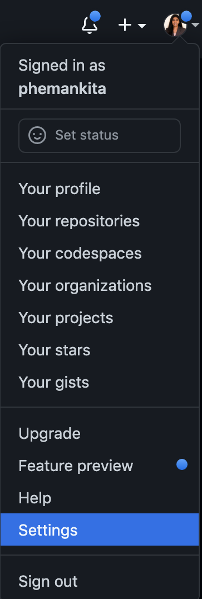
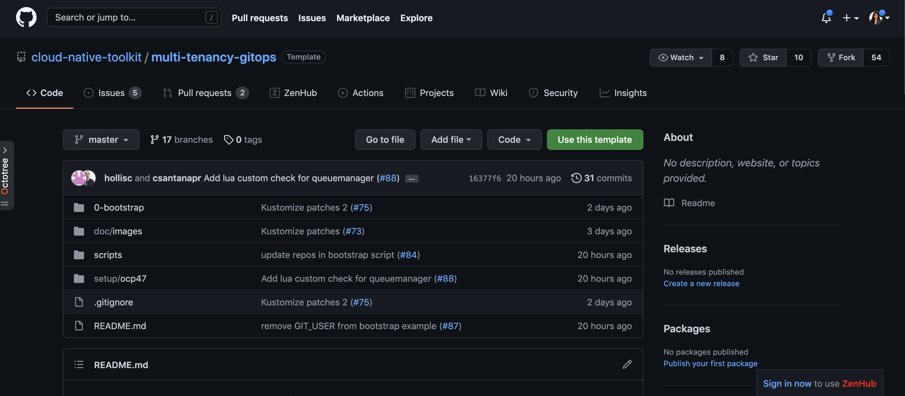
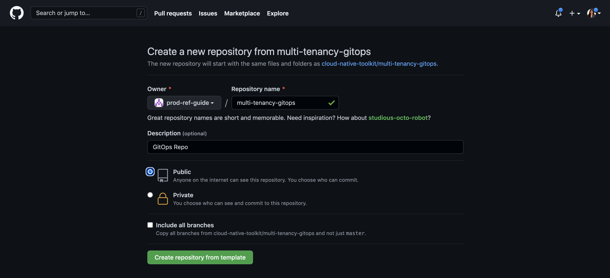
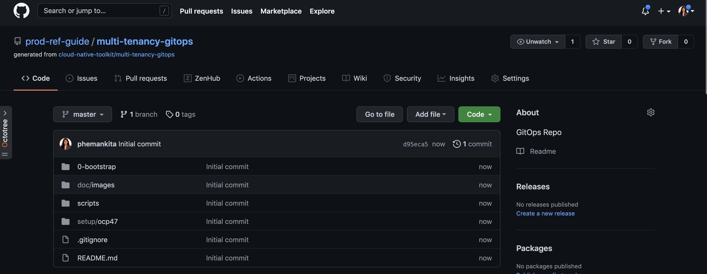

## Downloading the sample GitOps repository

In this topic section, we're going to create the GitOps repository for our cluster.

We'll use a sample GitOps repository as a starting point; we'll make our own
copy and review its contents. Later in the tutorial, we'll customize it for our
organization and cluster.

(*If you'd like to re-familiarize yourself with git, GitHub or managing
repositories, you'll find the following [short
video](https://www.youtube.com/watch?v=wpISo9TNjfU) and [short
read](https://guides.github.com/activities/hello-world/) helpful.*)

  1. *Create a new GitHub organization*

    Let's start by creating our own GitHub organization. In your browser, navigate to [https://github.com/](https://github.com/). In the upper-right corner, click on the profile photo, and then click `Settings`.

    {: style="max-height:600px"}

    In user settings sidebar, click `Organizations`.

    {: style="max-height:150px"}

    In the "Organizations" section, click New organization.

    {: style="max-height:150px"}

    Create a new organization.

    {: style="max-height:400px"}

  2. *Create the GitOps repositories in the new GitHub organization*

    Let's start by making our own copy of the GitOps repository.

    In your browser, navigate to [https://github.com/cloud-native-toolkit/multi-tenancy-gitops](https://github.com/cloud-native-toolkit/multi-tenancy-gitops):

    {: style="max-height:400px"}

    Click on `Use this template` at the top RHS of the screen and you'll be asked where you'd
    like to use this repository:

    {: style="max-height:400px"}

    Select your organization, name the repository and click `Create repository from template`. After a few seconds the repository will be present in your chosen account:

    {: style="max-height:400px"}

    You now have a copy of the sample GitOps repository in your GitHub account.

  3. *Create the infrastructure, services and applications GitOps repositories from the templates into the organization your GitHub organization*

    As shown above, follow similar steps and copy the the repository templates into your organization.

    - [GitOps Infrastructure Repository](https://github.com/cloud-native-toolkit/multi-tenancy-gitops-infra)
    - [GitOps Services Repository](https://github.com/cloud-native-toolkit/multi-tenancy-gitops-services)
    - [GitOps Application Repository](https://github.com/cloud-native-toolkit-demos/multi-tenancy-gitops-apps)

    Your organization now will have the below repositories in it.

    {: style="max-height:400px"}

  4. *Set up environment variable for GitHub Organization*

    This tutorial uses environment variables to save typing and reduce errors.

    Let's set up an environment variable, `$GIT_ORG`, that contains your GitHub
    organization name. We'll use this variable in many subsequent commands.

    Replace `<git-organization>` in the following command:

    ```bash
    export GIT_ORG=<git-organization>
    ```

    You can verify your `$GIT_ORG` as follows:

    ```bash
    echo $GIT_ORG
    ```

  5. *Change to your working git folder*

    Most users keep all of their locally cloned git repositories under a common
    folder, usually a child folder of their home folder, i.e. `$HOME/git`.

    We've used this default in the following command, but you may have a different
    location on your local machine.

    Change to your working `git` folder:

    ```bash
    cd $HOME/git
    ```

    *You may need to create this folder if it's not already created.*

  6. *Clone the GitOps repository*

    We're going to work on a local clone of the four repositories.

    Clone the GitOps repositories to your local machine:

    ```bash
    git clone https://github.com/$GIT_ORG/multi-tenancy-gitops.git
    ```

    A local copy will be made on your machine as follows:

    ```{ .text .no-copy }
    Cloning into 'multi-tenancy-gitops'...
    remote: Enumerating objects: 132, done.
    remote: Counting objects: 100% (132/132), done.
    remote: Compressing objects: 100% (54/54), done.
    remote: Total 132 (delta 72), reused 118 (delta 67), pack-reused 0
    Receiving objects: 100% (132/132), 310.92 KiB | 3.24 MiB/s, done.
    Resolving deltas: 100% (72/72), done.
    ```

    Clone the GitOps Infra repository to your local machine:

    ```bash
    git clone https://github.com/$GIT_ORG/multi-tenancy-gitops-infra.git
    ```

    A local copy will be made on your machine as follows:

    ```{ .text .no-copy }
    Cloning into 'multi-tenancy-gitops-infra'...
    remote: Enumerating objects: 62, done.
    remote: Counting objects: 100% (62/62), done.
    remote: Compressing objects: 100% (44/44), done.
    remote: Total 62 (delta 7), reused 53 (delta 3), pack-reused 0
    Unpacking objects: 100% (62/62), done.
    ```

    Clone the GitOps Services repository to your local machine:

    ```bash
    git clone https://github.com/$GIT_ORG/multi-tenancy-gitops-services.git
    ```

    A local copy will be made on your machine as follows:

    ```{ .text .no-copy }
    Cloning into 'multi-tenancy-gitops-services'...
    remote: Enumerating objects: 137, done.
    remote: Counting objects: 100% (137/137), done.
    remote: Compressing objects: 100% (96/96), done.
    remote: Total 137 (delta 39), reused 122 (delta 33), pack-reused 0
    Receiving objects: 100% (137/137), 30.01 KiB | 5.00 MiB/s, done.
    Resolving deltas: 100% (39/39), done.
    ```

    Clone the GitOps Applications repository to your local machine:

    ```bash
    git clone https://github.com/$GIT_ORG/multi-tenancy-gitops-apps.git
    ```

    A local copy will be made on your machine as follows:

    ```{ .text .no-copy }
    Cloning into 'multi-tenancy-gitops-apps'...
    remote: Enumerating objects: 137, done.
    remote: Counting objects: 100% (137/137), done.
    remote: Compressing objects: 100% (96/96), done.
    remote: Total 137 (delta 39), reused 122 (delta 33), pack-reused 0
    Receiving objects: 100% (137/137), 30.01 KiB | 5.00 MiB/s, done.
    Resolving deltas: 100% (39/39), done.
    ```

    !!! info
        Throughout this tutorial we use the HTTPS URL to clone repositories, however you can also use the SSH option.

  7. *Work on the local copy of the GitOps repository*

    Change to the folder containing the local copy of your new repository:

    ```bash
    cd multi-tenancy-gitops
    ```

  8. *Review the GitOps folder structure*

    Show the folder structure with the following command:

    ```bash
    tree . -L 1
    ```

    This will list all the top level folders and files:

    ```{ .text .no-copy }
    .
    ├── 0-bootstrap
    ├── README.md
    ├── doc
    ├── scripts
    └── setup
    ```

    The main folders perform the following roles:

    * `0-bootstrap` contains different profiles that can be used to initialize the
      cluster ready. We can choose one of the available profiles.
    * `scripts` and `setup` contain useful scripts that we'll use during this
      tutorial.

    Feel free to explore this structure. We'll examine it in much more detail
    throughout this tutorial, and you'll become very familiar with it by trying it
    out.
