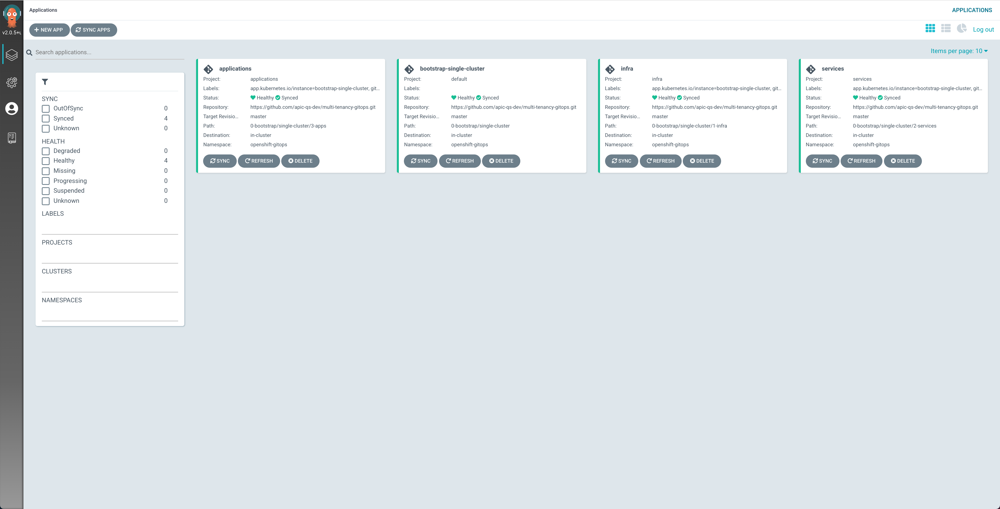

## Select resources to deploy

By now, you should already have a Red Hat OpenShift on IBM Cloud cluster with GitOps Configuration bootstrapped for you.

If you open ArgoCD, which is the GitOps tool being installed by the Red Hat OpenShift GitOps Operator, using the Argo CD URL provided in the email shown in the previous section, you will see that your ArgoCD GitOps application has been bootstrapped to monitor the `multi-tenancy-gitops` repository that has been forked into the GitHub organization you provided when requesting the quickstart environment.

As a result, anything you want to apply/do to your quickstart environment **will be done through code changes on the aforementioned forked GitHub repository**.

{: style="max-height:800px"}

You can see in the image above of your ArgoCD web console that the profile within the `multi-tenancy-gitops` repository ArgoCD has been bootstrapped with is the **`single-cluster`**. As a result, anything you want to apply/do to your quickstart environment will be done within that GitOps profile.

You can also see that the ArgoCD applications for the `infrastructure`, `services` and `applications` layers are already created so that these will pick up any changes done, through code, at their respective layers.