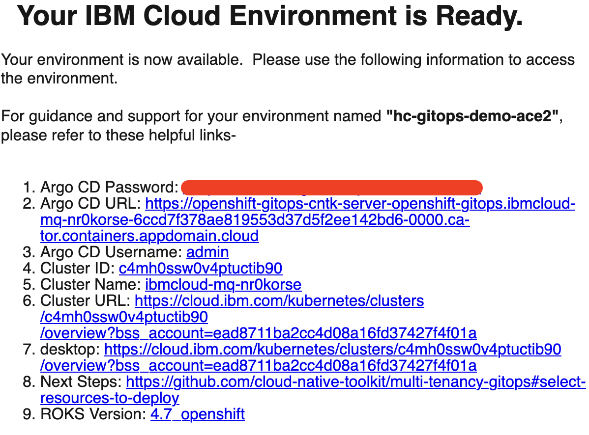

### Use the cluster

You will receive an email once the cluster provisioning is complete.  The email will contain details on the cluster including the ArgoCD Console URL and admin credentials.  This same information can also be found on the [My reservations](https://techzone.ibm.com/my/reservations) from [IBM Technology Zone](https://techzone.ibm.com/).

{: style="max-height:400px"}

Once your cluster is ready, proceed to the next step to select resources to deploy.