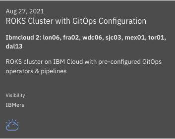
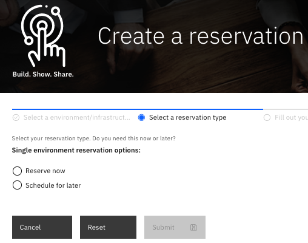
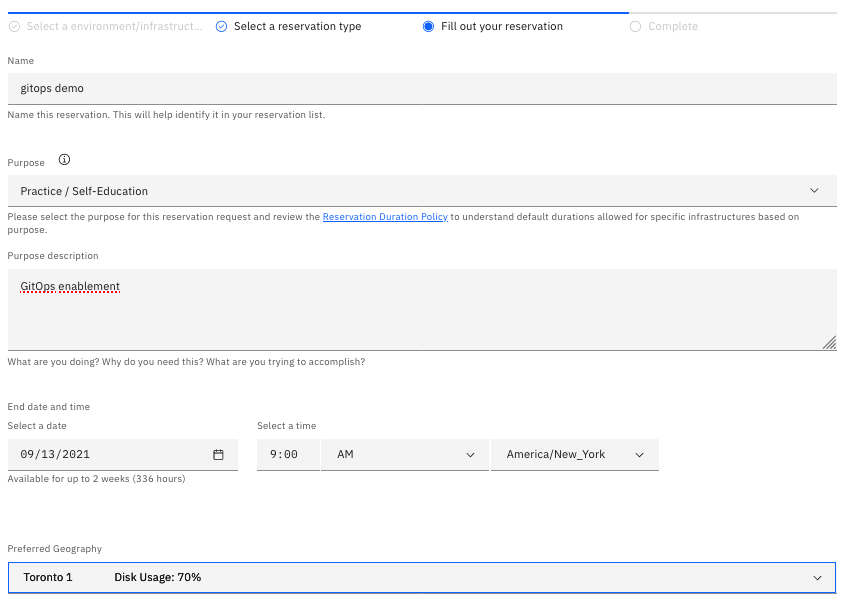
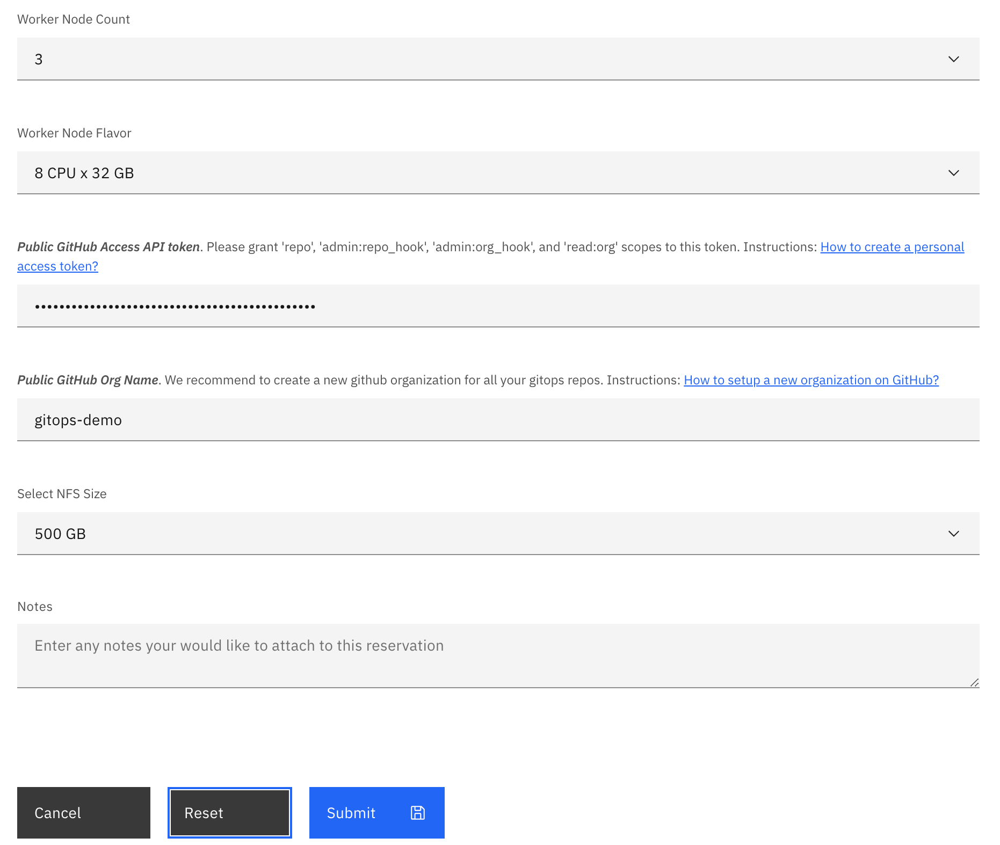

## Red Hat OpenShift on IBM Cloud cluster with GitOps Configuration

### Create the cluster

1. Provision a Red Hat OpenShift on IBM Cloud cluster with GitOps Configuration from [IBM Technology Zone](https://techzone.ibm.com/collection/production-deployment-guides#tab-6).  Select the `ROKS Cluster with GitOps Configuration` tile.

    {: style="max-height:400px"}

2. Click the *Reserve now* radio button.

    {: style="max-height:400px"}

3. Provide a name for the cluster, select *Practice / Self-Education* for the purpose and choose the region to provision the cluster.  

    {: style="max-height:600px"}

4. Once a *Preferred Geography* has been selected, provide the *GitHub Access API Token* and *GitHub Organization* created from the [Pre-requisites](#pre-requisites) section as well as the appropriate *Worker Node Count* and *Worker Node Flavor* values based on the requirements for this quickstart listed in the note below. Finally, click *Submit*.

    {: style="max-height:700px"}